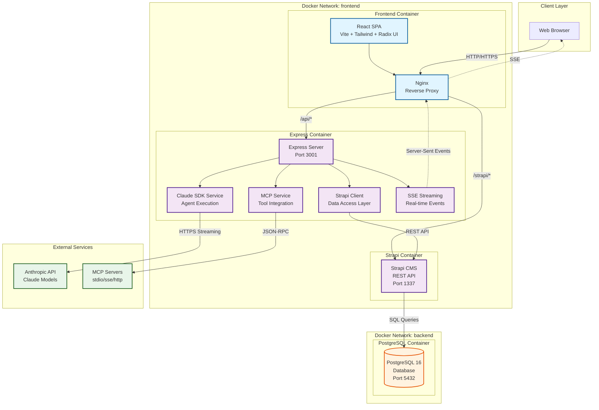

# Claude Agent UI

A comprehensive web-based management interface for Claude agents, skills, slash commands, and MCP (Model Context Protocol) servers. Built with React, Express, and the Claude Agent SDK.

## Features

### 🤖 Agent Management
- **Create & Edit Agents**: Visual interface for creating and configuring Claude agents
- **AI-Powered Agent Creator**: Chat-based agent creation using Claude
- **Execute Agents**: Run agents with real-time streaming output
- **Tool Configuration**: Select and configure tools for each agent
- **MCP Integration**: Connect agents to MCP servers

### 🎯 Skills Management
- **Create Skills**: Build reusable skills with YAML frontmatter
- **Skill References**: Track which agents use specific skills
- **Usage Analytics**: View skill usage across your agent ecosystem
- **Tool Allowlisting**: Configure allowed tools per skill

### ⚡ Slash Commands
- **Browse Commands**: View all available slash commands
- **Command Details**: See command descriptions and usage
- **Quick Access**: Easily reference command syntax

### 🔌 MCP Server Management
- **Server Configuration**: Add, edit, and delete MCP servers
- **Multiple Transport Types**: Support for stdio, SDK, SSE, and HTTP
- **Server Testing**: Validate server connectivity
- **Tool Discovery**: Browse available tools from each server
- **Import/Export**: Backup and restore MCP configurations
- **Bulk Operations**: Manage multiple servers efficiently

### 📋 Task Management
- **Task Execution**: Run and monitor tasks
- **Task History**: View past task executions
- **Status Tracking**: Monitor task progress and completion

## Architecture

The Claude Agent UI is a hybrid full-stack application combining multiple services in a containerized environment to deliver real-time AI agent execution, persistent data storage, and extensible tool integration.

### System Overview



### Key Components

- **React Frontend** - Modern SPA with Vite, Tailwind CSS, and Radix UI for component library
- **Nginx** - Reverse proxy handling routing and SSE connections
- **Express Server** - Business logic, SSE streaming, and service orchestration
- **Strapi CMS** - Headless CMS providing REST API for data persistence
- **PostgreSQL** - Primary database for all application data
- **Claude SDK** - Integration with Anthropic's Claude API for agent execution
- **MCP Servers** - External tool integration via Model Context Protocol

### Architecture Documentation

For detailed architecture information, see:

- **[Architecture Overview](./docs/architecture/README.md)** - Start here for a guided tour (15 min read)
- **[System Overview](./docs/architecture/01-system-overview.md)** - Detailed component breakdown and interactions
- **[Data Flow](./docs/architecture/02-data-flow.md)** - Agent execution, CRUD operations, MCP integration, and chat flows
- **[Deployment](./docs/architecture/03-deployment.md)** - Docker containers, networks, volumes, and operational procedures
- **[Components](./docs/architecture/04-components.md)** - Service layer, frontend hierarchy, and data model
- **[Sequence Diagrams](./docs/architecture/05-sequences.md)** - Detailed flows for key operations
- **[Technology Stack](./docs/architecture/06-tech-stack.md)** - Complete tech stack with version requirements and rationale

## Prerequisites

- Node.js >= 20.19.0
- npm or yarn
- Anthropic API key (for agent execution)
- Claude CLI installed and configured (for project analysis)
- Docker and Docker Compose (for PostgreSQL database)

## Infrastructure Setup (PostgreSQL Migration)

This project is being migrated from SQLite to a production-ready PostgreSQL + Strapi + Express architecture. The infrastructure setup includes:

### Quick Start with Docker

1. **Generate secure secrets**:
```bash
./scripts/generate-secrets.sh
```

2. **Start PostgreSQL**:
```bash
docker-compose up -d postgres
```

3. **Verify setup**:
```bash
# Check container status
docker-compose ps

# Check health
docker inspect --format='{{.State.Health.Status}}' claude-postgres
```

### PostgreSQL Connection Details

- **Host**: localhost
- **Port**: 5432
- **Database**: claude_agent_ui
- **User**: postgres
- **Password**: (generated in .env)

### Docker Services

- **PostgreSQL 16 (Alpine)**: Primary database container
  - Persistent volume: `claude-postgres-data`
  - Health checks configured
  - Automated backups to `./database/backups/`

### Environment Variables

All database credentials and secrets are managed through the `.env` file. Required variables:
- `POSTGRES_DB` - Database name
- `POSTGRES_USER` - Database user
- `POSTGRES_PASSWORD` - Database password (generated)
- `STRAPI_*` - Strapi secrets (for future tasks)

See `.env.example` for the complete list.

### Migration Status

The project is currently undergoing a phased migration:

✅ **Task 01: Infrastructure Setup** (Complete)
- Docker Compose with PostgreSQL
- Environment configuration
- Secrets generation utility
- Network and volume setup

🔄 **Upcoming Tasks**:
- Task 02: PostgreSQL Schema Creation
- Task 03: Strapi CMS Initialization
- Task 04: Content Types Creation
- ... (see `.claude/Project/README.md` for full roadmap)

### Troubleshooting Docker Setup

**Container won't start:**
```bash
# View logs
docker-compose logs postgres

# Restart container
docker-compose restart postgres
```

**Connection refused:**
```bash
# Verify PostgreSQL is healthy
docker-compose exec postgres pg_isready -U postgres

# Test connection
docker-compose exec postgres psql -U postgres -d claude_agent_ui
```

**Reset database:**
```bash
# Stop and remove containers
docker-compose down

# Remove volumes (CAUTION: deletes all data)
docker volume rm claude-postgres-data

# Start fresh
docker-compose up -d postgres
```

## Installation

1. Clone or download this repository:
```bash
cd C:\Users\Ali\Documents\Projects\claude_agent_ui
```

2. Install dependencies:
```bash
npm install
```

3. Configure environment variables:
```bash
cp .env.example .env
```

Edit `.env` and add your Anthropic API key:
```env
ANTHROPIC_API_KEY=your_api_key_here
```

4. Set up your project structure:

Create the following directories in your working project:
```
.claude/
├── agents/      # Agent markdown files
├── skills/      # Skill directories with SKILL.md
└── commands/    # Slash command files
```

## Development

Start the development server (frontend + backend):
```bash
npm run dev
```

Or run them separately:
```bash
# Backend only
npm run dev:server

# Frontend only (in another terminal)
npm run dev:frontend
```

The application will be available at:
- **Manager UI**: http://localhost:3001/manager
- **API**: http://localhost:3001/api/manager
- **Health Check**: http://localhost:3001/health

## Production Build

1. Build the application:
```bash
npm run build
```

2. Start the production server:
```bash
npm start
```

## Project Structure

```
claude_agent_ui/
├── src/
│   ├── server.ts                    # Express server entry point
│   ├── routes/
│   │   └── manager.routes.ts        # Manager API routes
│   ├── services/
│   │   ├── claude-structure-parser.ts  # Parse .claude directory
│   │   ├── claude-sdk-service.ts       # Claude SDK integration
│   │   ├── skill-service.ts            # Skill management
│   │   ├── mcp-service.ts              # MCP server management
│   │   ├── task-storage-service.ts     # Task persistence
│   │   ├── file-system-service.ts      # File operations
│   │   ├── logger.ts                   # Logging service
│   │   └── prompts/
│   │       └── agent-creator-prompt.ts # AI agent creator prompt
│   ├── types/
│   │   ├── index.ts                 # Core type definitions
│   │   ├── mcp-types.ts             # MCP-related types
│   │   ├── task-types.ts            # Task types
│   │   └── sdk-types.ts             # SDK types
│   ├── utils/
│   │   └── env-substitution.ts      # Environment variable helpers
│   └── web/
│       ├── index.html               # HTML entry point
│       ├── main.tsx                 # React entry point
│       └── manager/                 # Manager UI components
│           ├── ManagerApp.tsx       # Main app component
│           ├── components/          # UI components
│           ├── hooks/               # React hooks
│           ├── services/            # Frontend API client
│           ├── types.ts             # Frontend types
│           └── constants.ts         # Configuration constants
├── public/                          # Static assets
├── dist/                            # Build output
├── .mcp.json                        # MCP server configuration
├── package.json
├── tsconfig.json
├── vite.config.ts
└── tailwind.config.js
```

## API Endpoints

### Validation
- `POST /api/manager/validate` - Validate Claude setup

### Agents
- `GET /api/manager/agents` - List all agents
- `GET /api/manager/agents/:id` - Get agent details
- `POST /api/manager/agents` - Create agent
- `PUT /api/manager/agents/:id` - Update agent
- `POST /api/manager/agents/:id/execute` - Execute agent (SSE)
- `POST /api/manager/agents/create-with-claude/message` - AI-guided agent creation

### Skills
- `GET /api/manager/skills` - List all skills
- `GET /api/manager/skills/:id` - Get skill details
- `POST /api/manager/skills` - Create skill
- `PUT /api/manager/skills/:id` - Update skill
- `GET /api/manager/skills-usage` - Get skill usage statistics

### Commands
- `GET /api/manager/commands` - List slash commands
- `GET /api/manager/commands/:id` - Get command details

### MCP Servers
- `GET /api/manager/mcp-servers` - List MCP servers
- `GET /api/manager/mcp-servers/:id` - Get server details
- `POST /api/manager/mcp-servers` - Create server
- `PUT /api/manager/mcp-servers/:id` - Update server
- `DELETE /api/manager/mcp-servers/:id` - Delete server
- `POST /api/manager/mcp-servers/:id/test` - Test server
- `POST /api/manager/mcp-servers/:id/toggle` - Enable/disable server
- `GET /api/manager/mcp-servers/:id/tools` - List server tools
- `GET /api/manager/mcp-servers/export` - Export configuration
- `POST /api/manager/mcp-servers/import` - Import configuration
- `POST /api/manager/mcp-servers/bulk-delete` - Bulk delete servers

### Project Analysis
- `GET /api/manager/analyze` - Full project analysis
- `GET /api/manager/tools` - List available tools
- `GET /api/manager/history-path` - Get Claude history path

## Configuration

### Environment Variables

| Variable | Description | Default |
|----------|-------------|---------|
| `NODE_ENV` | Environment mode | `development` |
| `PORT` | Server port | `3001` |
| `HOST` | Server host | `0.0.0.0` |
| `LOG_LEVEL` | Logging verbosity | `info` |
| `ANTHROPIC_API_KEY` | Claude API key | (required) |
| `PROJECT_DIR` | Project directory | current directory |

### MCP Configuration

MCP servers are configured in `.mcp.json` at the project root:

```json
{
  "mcpServers": {
    "filesystem": {
      "command": "npx",
      "args": ["-y", "@modelcontextprotocol/server-filesystem", "/path/to/allowed/dir"],
      "disabled": false
    },
    "my-server": {
      "command": "node",
      "args": ["path/to/server.js"],
      "env": {
        "API_KEY": "your-key"
      }
    }
  }
}
```

## Technology Stack

- **Frontend**: React 18, React Router, Tailwind CSS, Radix UI
- **Backend**: Express, Node.js
- **AI/SDK**: Claude Agent SDK, Anthropic SDK, MCP SDK
- **Build Tools**: Vite, TypeScript
- **Utilities**: js-yaml, zod, uuid

## Development Tips

### Type Safety
The project uses TypeScript throughout. Run type checking with:
```bash
npm run typecheck
```

### Hot Reload
Both frontend and backend support hot reload in development mode. Changes will automatically reload.

### Logging
Adjust log level in `.env`:
- `silent` - No logs
- `error` - Errors only
- `warn` - Warnings and errors
- `info` - Info, warnings, and errors (default)
- `debug` - All logs including debug info

### Custom MCP Servers
To add a custom MCP server:
1. Go to the MCP Servers page in the UI
2. Click "Add Server"
3. Fill in server details (name, command, args)
4. Test the connection
5. Save and enable

## Troubleshooting

### Port Already in Use
Change the port in `.env`:
```env
PORT=3002
```

### Agent Execution Fails
1. Check your `ANTHROPIC_API_KEY` is valid
2. Ensure `.mcp.json` is properly configured
3. Check logs for detailed error messages

### MCP Server Not Working
1. Test the server using the "Test" button in the UI
2. Check server logs in the console
3. Verify the command and args are correct
4. Ensure any required environment variables are set

### Build Errors
1. Clear build cache: `npm run clean`
2. Reinstall dependencies: `rm -rf node_modules && npm install`
3. Run type check: `npm run typecheck`

## Contributing

This is a standalone project forked from the CUI project. Feel free to customize it for your needs.

## License

MIT

## Credits

Based on the [CUI project](https://github.com/bmpixel/cui) by Wenbo Pan.
