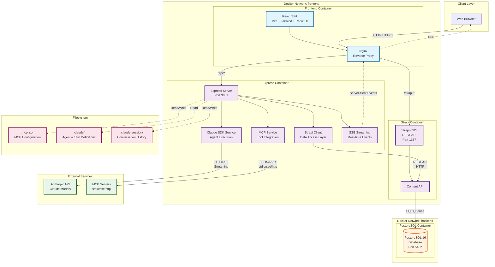

# System Architecture Overview

## Introduction

The Claude Agent UI is a hybrid full-stack application that provides a web interface for creating, managing, and executing AI agents powered by Anthropic's Claude SDK. The architecture combines multiple services in a containerized environment to deliver real-time agent execution, persistent data storage, and extensible tool integration through the Model Context Protocol (MCP).

## High-Level System Architecture

## Component Overview

### 1. Frontend Layer

#### React SPA (Single Page Application)
- **Technology**: React 18 with TypeScript, Vite build tool
- **UI Framework**: Tailwind CSS + Radix UI components
- **Port**: Served via Nginx on port 80/443
- **Responsibilities**:
  - User interface for agent/skill creation and management
  - Real-time display of agent execution via SSE
  - Chat interface for interactive conversations
  - MCP server configuration and management
  - Task tracking and monitoring

#### Nginx Reverse Proxy
- **Version**: Latest stable
- **Port**: 80 (HTTP), 443 (HTTPS in production)
- **Responsibilities**:
  - Serve React static assets
  - Route `/api/*` requests to Express backend
  - Route `/strapi/*` requests to Strapi CMS
  - WebSocket/SSE proxy for real-time streaming
  - Gzip compression and caching

### 2. Backend Layer

#### Express Server
- **Technology**: Node.js with Express.js
- **Port**: 3001 (internal)
- **Responsibilities**:
  - Business logic orchestration
  - RESTful API endpoints (68+ routes)
  - SSE streaming for real-time agent output
  - File system operations (read agents, skills, MCP config)
  - Session management
  - Service coordination between Claude SDK, Strapi, and MCP

**Key Services**:
- **claude-sdk-service**: Orchestrates Claude AI conversations
- **mcp-service**: Manages MCP server lifecycle and tool discovery
- **strapi-client**: Data access layer with caching (5-min TTL)
- **skill-isolation-service**: Isolated skill execution
- **conversation-status-manager**: Real-time status tracking

#### Claude SDK Integration
- **SDK**: `@anthropic-ai/claude-agent-sdk`
- **Responsibilities**:
  - Execute AI agent conversations with Claude models
  - Stream responses in real-time
  - Manage conversation context and history
  - Load and apply MCP tools dynamically
  - Handle skill and prompt injection

### 3. Data Layer

#### Strapi CMS
- **Version**: Strapi v4
- **Port**: 1337 (internal)
- **Responsibilities**:
  - Headless CMS providing REST API
  - Persistent storage for agents, skills, MCP servers/tools
  - Chat session and message history
  - Task management
  - File uploads (media library)

**Content Types**:
- Agents, Skills, MCP Servers, MCP Tools
- Chat Sessions, Chat Messages
- Tasks (for async execution tracking)

#### PostgreSQL Database
- **Version**: PostgreSQL 16 Alpine
- **Port**: 5432 (internal), 5433 (host-exposed)
- **Responsibilities**:
  - Primary data persistence
  - Stores all Strapi content types
  - Relational data with foreign keys
  - Full-text search capabilities

### 4. External Integrations

#### Anthropic API
- **Endpoint**: `https://api.anthropic.com`
- **Protocol**: HTTPS with streaming
- **Models**: Claude 3.5 Sonnet, Claude 3 Opus, Claude 3 Haiku
- **Responsibilities**:
  - Process AI requests from Claude SDK
  - Stream conversation responses
  - Execute tool calls (MCP tools)

#### MCP Servers
- **Protocol**: Model Context Protocol (JSON-RPC)
- **Transport Types**:
  - **stdio**: External processes via stdin/stdout (most common)
  - **sse**: Server-Sent Events over HTTP
  - **http**: HTTP polling
  - **sdk**: In-process TypeScript/JavaScript servers

**Example MCP Servers**:
- `@modelcontextprotocol/server-filesystem`: File system access
- `@modelcontextprotocol/server-brave-search`: Web search
- `@modelcontextprotocol/server-github`: GitHub integration
- Custom MCP servers for specialized tools

### 5. Filesystem

#### Configuration Files
- **`.mcp.json`**: MCP server configuration (SDK-aligned)
- **`.claude/`**: Agent and skill definitions (AGENT.md, SKILL.md)
- **`.claude-session/`**: Conversation history and cache

## Communication Patterns

### REST API
- **Frontend ↔ Express**: HTTP/HTTPS requests for CRUD operations
- **Express ↔ Strapi**: REST API calls with LRU caching
- **Strapi ↔ PostgreSQL**: SQL queries via Knex.js ORM

### Server-Sent Events (SSE)
- **Express → Frontend**: Real-time streaming of:
  - Agent execution output (tool uses, thinking, responses)
  - Task progress updates
  - Chat message streaming
  - Skill execution status

### JSON-RPC
- **MCP Service ↔ MCP Servers**: Bidirectional JSON-RPC protocol
  - Tool discovery (`tools/list`)
  - Tool execution (`tools/call`)
  - Resource access (`resources/read`)

## Docker Networks

### Frontend Network
- **Services**: Frontend (Nginx), Express, Strapi
- **Purpose**: Public-facing services accessible from web browser
- **Isolation**: PostgreSQL is NOT accessible from this network

### Backend Network
- **Services**: PostgreSQL, Strapi, Express
- **Purpose**: Database access restricted to backend services
- **Security**: Database not exposed to frontend network

## Data Flow Examples

### Agent Execution Flow
1. User submits prompt via React UI
2. Frontend sends POST to `/api/agents/:id/execute`
3. Express receives request and starts SSE stream
4. Claude SDK Service loads agent config + MCP tools
5. SDK sends request to Anthropic API
6. Claude processes request, may invoke MCP tools
7. MCP Service executes tools via JSON-RPC to MCP servers
8. Tool results returned to Claude
9. Claude generates response
10. Express streams events to frontend via SSE
11. React UI updates in real-time

### Data Persistence Flow
1. User creates/updates agent via React UI
2. Frontend sends POST/PUT to Express API
3. Express validates and transforms data
4. Strapi Client sends REST request to Strapi
5. Strapi ORM executes SQL query to PostgreSQL
6. Response propagates back through stack
7. Frontend cache updated

## Security Considerations

### Network Isolation
- Database accessible only from backend network
- Environment variable substitution for secrets
- No database credentials in frontend

### API Security
- Strapi authentication tokens
- Rate limiting on Express endpoints
- CORS configuration for frontend origin

### Container Security
- Resource limits (CPU, memory) on all containers
- Health checks for service reliability
- Read-only filesystem mounts where appropriate

## Scalability Considerations

### Caching
- Strapi Client: 5-minute LRU cache
- Nginx: Static asset caching
- PostgreSQL: Query result caching

### Horizontal Scaling (Future)
- Express can scale with load balancer
- Strapi supports horizontal scaling with shared database
- PostgreSQL can use read replicas

## Observability

### Logging
- All containers log to JSON format
- Centralized logging via Docker log driver
- Log rotation (10MB max, 3 files)

### Health Checks
- PostgreSQL: `pg_isready` probe
- Strapi: HTTP `/admin` endpoint
- Express: HTTP `/health` endpoint
- Frontend: HTTP `/ ` endpoint

### Monitoring
- Container resource usage (CPU, memory)
- API response times
- Database connection pool stats
- MCP tool execution metrics

## Technology Stack Summary

| Layer | Technology | Version | Purpose |
|-------|-----------|---------|---------|
| Frontend | React | 18 | UI framework |
| Build Tool | Vite | Latest | Fast development builds |
| Styling | Tailwind CSS | Latest | Utility-first CSS |
| Components | Radix UI | Latest | Accessible component library |
| Proxy | Nginx | Latest | Reverse proxy & static hosting |
| Backend | Express.js | 4.x | HTTP server & API |
| Runtime | Node.js | 20 LTS | JavaScript runtime |
| AI SDK | Claude Agent SDK | Latest | Claude integration |
| CMS | Strapi | 4.x | Headless CMS |
| Database | PostgreSQL | 16 | Relational database |
| ORM | Knex.js | Latest | SQL query builder |
| Orchestration | Docker Compose | Latest | Container management |

## Next Steps

For detailed documentation on specific architecture aspects, see:

- [Data Flow Diagrams](./02-data-flow.md) - Detailed flows for agent execution, MCP tools, and chat
- [Deployment Topology](./03-deployment.md) - Docker infrastructure and resource configuration
- [Component Details](./04-components.md) - Service layer architecture and frontend components
- [Sequence Diagrams](./05-sequences.md) - Step-by-step interaction flows
- [Technology Stack](./06-tech-stack.md) - Detailed technology choices and rationale
