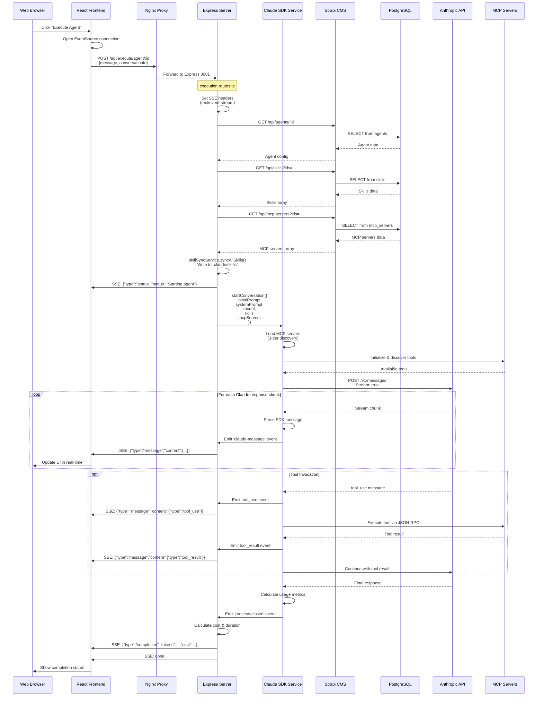
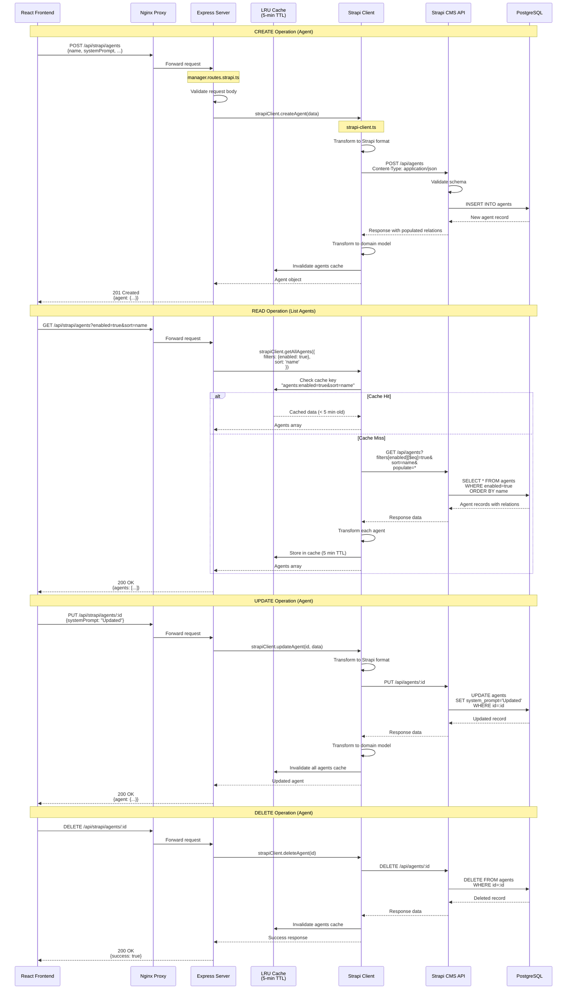
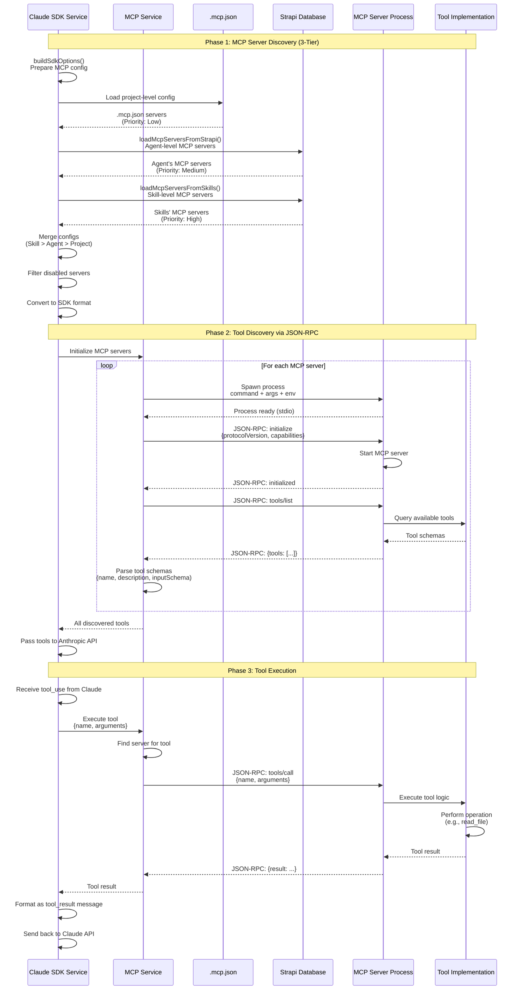

# Data Flow Architecture

## Introduction

This document provides detailed diagrams and explanations of the major data flows within the Claude Agent UI system. Understanding these flows is crucial for debugging, optimization, and feature development.

## Overview

The system has four primary data flow patterns:

1. **Agent Execution Flow** - Real-time SSE streaming from agent execution
2. **CRUD Operations Flow** - Data persistence through Strapi CMS
3. **MCP Tool Invocation Flow** - External tool integration via MCP protocol
4. **Chat/Conversation Flow** - Interactive chat sessions with streaming

---

## 1. Agent Execution Flow with SSE Streaming

This flow shows how an agent executes a task and streams results back to the frontend in real-time using Server-Sent Events (SSE).



### Key Points

- **SSE Headers**: `Content-Type: text/event-stream`, `Cache-Control: no-cache`, `Connection: keep-alive`
- **Keep-Alive**: 30-second ping intervals to maintain connection
- **Event Types**: `status`, `message`, `completion`, `error`, `done`
- **Tool Execution**: Synchronous within the conversation flow
- **Error Handling**: Errors sent as SSE events if stream started, otherwise JSON response

### SSE Event Format

```typescript
// Status event
data: {"type":"status","status":"Starting agent: MyAgent","timestamp":"..."}

// Message event (assistant text)
data: {"type":"message","content":{"type":"assistant","message":{"content":[{"type":"text","text":"..."}]}}}

// Tool use event
data: {"type":"message","content":{"type":"tool_use","id":"...","name":"read_file","input":{...}}}

// Tool result event
data: {"type":"message","content":{"type":"tool_result","tool_use_id":"...","content":"..."}}

// Completion event
data: {"type":"completion","tokens":{"input":100,"output":50},"cost":0.0025,"duration":5.2}

// Done event
data: done
```

---

## 2. CRUD Operations Flow Through Strapi

This flow shows how data is created, read, updated, and deleted through the Strapi CMS layer.



### Strapi Content Types

The following content types are managed through this CRUD flow:

| Content Type | Endpoints | Relations |
|-------------|-----------|-----------|
| **Agents** | `/api/strapi/agents` | skills (M2M), mcpServers (M2M) |
| **Skills** | `/api/strapi/skills` | agents (M2M), mcpConfig (component) |
| **MCP Servers** | `/api/strapi/mcp-servers` | agents (M2M), tools (1-to-M) |
| **MCP Tools** | `/api/strapi/mcp-tools` | mcpServer (M-to-1) |
| **Chat Sessions** | `/api/strapi/chat-sessions` | messages (1-to-M) |
| **Chat Messages** | `/api/strapi/chat-messages` | session (M-to-1) |
| **Tasks** | `/api/strapi/tasks` | agent (M-to-1) |

### Caching Strategy

- **Cache Type**: LRU (Least Recently Used) with 5-minute TTL
- **Cache Keys**: Generated from query parameters
- **Invalidation**: On all CREATE, UPDATE, DELETE operations
- **Benefits**: Reduces Strapi API calls by ~70% for read-heavy operations

---

## 3. MCP Tool Invocation Flow

This flow shows how MCP (Model Context Protocol) tools are discovered and executed.



### MCP Server Configuration Examples

**stdio Server (Most Common)**
```json
{
  "filesystem": {
    "command": "npx",
    "args": ["-y", "@modelcontextprotocol/server-filesystem", "/path/to/dir"],
    "env": {
      "ALLOWED_PATHS": "${HOME}/Documents"
    }
  }
}
```

**SSE Server (Remote)**
```json
{
  "remote-search": {
    "type": "sse",
    "url": "https://search-api.example.com/sse",
    "headers": {
      "Authorization": "Bearer ${API_KEY}"
    }
  }
}
```

**SDK Server (In-Process)**
```typescript
// Registered in code
mcpService.registerSdkServer('my-server', {
  name: 'My Custom Server',
  version: '1.0.0',
  tools: [...]
});
```

### JSON-RPC Protocol Messages

**Initialize Request**
```json
{
  "jsonrpc": "2.0",
  "id": 1,
  "method": "initialize",
  "params": {
    "protocolVersion": "2024-11-05",
    "capabilities": {},
    "clientInfo": {
      "name": "claude-agent-ui",
      "version": "1.0.0"
    }
  }
}
```

**Tools List Request**
```json
{
  "jsonrpc": "2.0",
  "id": 2,
  "method": "tools/list",
  "params": {}
}
```

**Tools List Response**
```json
{
  "jsonrpc": "2.0",
  "id": 2,
  "result": {
    "tools": [
      {
        "name": "read_file",
        "description": "Read the contents of a file",
        "inputSchema": {
          "type": "object",
          "properties": {
            "path": {"type": "string"}
          },
          "required": ["path"]
        }
      }
    ]
  }
}
```

**Tool Call Request**
```json
{
  "jsonrpc": "2.0",
  "id": 3,
  "method": "tools/call",
  "params": {
    "name": "read_file",
    "arguments": {
      "path": "/home/user/document.txt"
    }
  }
}
```

**Tool Call Response**
```json
{
  "jsonrpc": "2.0",
  "id": 3,
  "result": {
    "content": [
      {
        "type": "text",
        "text": "File contents here..."
      }
    ]
  }
}
```

### MCP Server Transport Types

| Type | Connection | Use Case | Example |
|------|-----------|----------|---------|
| **stdio** | Process stdin/stdout | CLI tools, local servers | `npx @modelcontextprotocol/server-filesystem` |
| **sse** | HTTP Server-Sent Events | Remote services | API endpoints with SSE |
| **http** | HTTP polling | Remote services | RESTful APIs |
| **sdk** | In-process TypeScript | Custom tools | Directly imported modules |

---

## 4. Chat/Conversation Data Flow

This flow shows how interactive chat sessions work with real-time streaming.

```mermaid
sequenceDiagram
    participant User as Web Browser
    participant React as React Frontend
    participant Express as Express Server
    participant ChatSvc as Chat Service
    participant Strapi as Strapi Client
    participant SDK as Claude SDK Service
    participant DB as PostgreSQL
    participant Claude as Anthropic API

    Note over User,Claude: Session Creation
    User->>React: Click "New Chat"
    React->>Express: POST /api/chat/sessions<br/>{title, skillIds, agentId}
    Express->>ChatSvc: createChatSession(data)
    ChatSvc->>Strapi: createChatSession(data)
    Strapi->>DB: INSERT INTO chat_sessions
    DB-->>Strapi: New session record
    Strapi-->>ChatSvc: Session object
    ChatSvc-->>Express: Session
    Express-->>React: 201 Created<br/>{session: {...}}
    React->>User: Show empty chat UI

    Note over User,Claude: Send Message with Streaming
    User->>React: Type message & send
    React->>React: Open EventSource<br/>/api/chat/sessions/:id/messages
    React->>Express: POST /api/chat/sessions/:id/messages<br/>{message, attachments}

    Note over Express: Set SSE headers
    Express->>ChatSvc: sendMessage(sessionId, data)<br/>Returns async generator

    ChatSvc->>Strapi: getChatSession(sessionId)
    Strapi->>DB: SELECT from chat_sessions<br/>with relations
    DB-->>Strapi: Session data
    Strapi-->>ChatSvc: Session config

    ChatSvc->>Strapi: createChatMessage({<br/>  session: sessionId,<br/>  role: 'user',<br/>  content: message<br/>})
    Strapi->>DB: INSERT INTO chat_messages
    DB-->>Strapi: User message record
    Strapi-->>ChatSvc: Message saved

    ChatSvc->>Express: yield {type: 'user_message_saved'}
    Express->>React: SSE: user_message_saved
    React->>User: Show user message

    ChatSvc->>ChatSvc: Load skills from session
    ChatSvc->>ChatSvc: skillSyncService.syncAllSkills()

    ChatSvc->>SDK: query({<br/>  prompt: message,<br/>  systemPrompt,<br/>  skills,<br/>  model,<br/>  conversationId<br/>})<br/>Returns async generator

    SDK->>Claude: POST /v1/messages<br/>Stream: true<br/>Previous messages as context

    ChatSvc->>Express: yield {type: 'stream_id', streamId}
    Express->>React: SSE: stream_id event

    ChatSvc->>Strapi: createChatMessage({<br/>  session: sessionId,<br/>  role: 'assistant',<br/>  content: '',<br/>  streamId<br/>})
    Strapi->>DB: INSERT INTO chat_messages<br/>(empty content initially)
    DB-->>Strapi: Assistant message record
    Strapi-->>ChatSvc: Message ID

    ChatSvc->>Express: yield {type: 'assistant_message_start'}
    Express->>React: SSE: assistant_message_start
    React->>User: Show typing indicator

    loop For each Claude chunk
        Claude-->>SDK: Stream chunk
        SDK->>SDK: Parse SDK message
        SDK->>ChatSvc: yield message event
        ChatSvc->>ChatSvc: Accumulate content
        ChatSvc->>Express: yield {type: 'assistant_message_delta'}
        Express->>React: SSE: delta event
        React->>User: Append text incrementally
    end

    opt Tool Usage in Chat
        Claude-->>SDK: tool_use message
        SDK->>ChatSvc: yield tool_use event
        ChatSvc->>Express: yield SDK message
        Express->>React: SSE: tool_use event
        React->>User: Show tool execution

        Note over SDK: Execute tool via MCP
        SDK->>ChatSvc: yield tool_result event
        ChatSvc->>Express: yield SDK message
        Express->>React: SSE: tool_result event
        React->>User: Show tool result
    end

    ChatSvc->>Strapi: updateChatMessage(messageId, {<br/>  content: fullContent,<br/>  metadata: {tokens, model}<br/>})
    Strapi->>DB: UPDATE chat_messages<br/>SET content=...
    DB-->>Strapi: Updated record
    Strapi-->>ChatSvc: Success

    ChatSvc->>Express: yield {type: 'assistant_message_saved'}
    Express->>React: SSE: message_saved event

    ChatSvc->>Express: yield {type: 'done'}
    Express->>React: SSE: done event
    Express->>Express: Close SSE stream
    React->>User: Hide typing indicator

    Note over User,Claude: Load Chat History
    User->>React: Click on chat session
    React->>Express: GET /api/chat/sessions/:id/messages
    Express->>ChatSvc: getChatMessages(sessionId)
    ChatSvc->>Strapi: getChatMessages(sessionId)
    Strapi->>DB: SELECT from chat_messages<br/>WHERE session_id=:id<br/>ORDER BY created_at
    DB-->>Strapi: Message records
    Strapi-->>ChatSvc: Messages array
    ChatSvc-->>Express: Messages
    Express-->>React: 200 OK<br/>{messages: [...]}
    React->>User: Display conversation history

    Note over User,Claude: Cancel Ongoing Stream
    User->>React: Click "Cancel"
    React->>Express: POST /api/chat/sessions/:sessionId/messages/:streamId/cancel
    Express->>ChatSvc: cancelMessage(streamId)
    ChatSvc->>ChatSvc: AbortController.abort()
    ChatSvc->>SDK: Abort SDK query
    SDK->>SDK: Stop streaming
    ChatSvc-->>Express: {success: true}
    Express-->>React: 200 OK
    Express->>Express: Close SSE stream
    React->>User: Show "Cancelled" status
```



### Chat Message Structure

```typescript
interface ChatMessage {
  id: string;
  session: string; // Session ID
  role: 'user' | 'assistant' | 'system';
  content: string;
  attachments?: Array<{
    filename: string;
    mimeType: string;
    data: string; // base64
  }>;
  metadata?: {
    model?: string;
    tokens?: {
      input: number;
      output: number;
    };
    streamId?: string;
    toolUses?: Array<{
      name: string;
      input: any;
      result: any;
    }>;
  };
  createdAt: string;
  updatedAt: string;
}
```

### Chat Session Configuration

```typescript
interface ChatSession {
  id: string;
  title: string;
  agentId?: string;
  skillIds: string[];
  customSystemPrompt?: string;
  workingDirectory?: string;
  permissionMode?: 'default' | 'bypassPermissions' | 'denyAll';
  isArchived: boolean;
  conversationId?: string; // For SDK history
  messageCount: number;
  lastMessageAt?: string;
  createdAt: string;
  updatedAt: string;
}
```

### SSE Events in Chat Flow

| Event Type | Description | Data |
|-----------|-------------|------|
| `user_message_saved` | User message saved to DB | `{messageId, content}` |
| `stream_id` | Stream identifier for cancellation | `{streamId}` |
| `assistant_message_start` | Assistant begins responding | `{messageId}` |
| `assistant_message_delta` | Incremental content chunk | `{delta: string}` |
| `sdk_message` | Raw SDK message (tool_use, result, etc.) | `{content: {...}}` |
| `assistant_message_saved` | Full response saved to DB | `{messageId, content}` |
| `done` | Stream complete | `{}` |
| `error` | Error occurred | `{error: string}` |

---

## Data Flow Patterns Summary

### Request-Response Pattern
- Used for: CRUD operations, session management
- Benefits: Simple, reliable, cacheable
- Example: GET /api/strapi/agents

### Server-Sent Events (SSE) Pattern
- Used for: Agent execution, chat streaming, task execution
- Benefits: Real-time updates, unidirectional, HTTP-compatible
- Example: POST /api/execute/agent/:id (with SSE response)

### Event-Driven Pattern
- Used for: Internal service communication
- Benefits: Loose coupling, extensibility
- Example: claude-sdk-service emits events → route handlers consume

### Async Generator Pattern
- Used for: Streaming data transformation
- Benefits: Backpressure handling, memory efficient
- Example: chatService.sendMessage() yields events

---

## Performance Considerations

### Caching
- **Strapi Client**: 5-minute LRU cache reduces database load
- **Nginx**: Static asset caching with long TTL
- **PostgreSQL**: Query result caching at database level

### Streaming
- **SSE Keep-Alive**: 30-second ping prevents connection timeout
- **Backpressure**: Async generators handle slow consumers
- **Chunked Transfer**: Large responses streamed incrementally

### Database Optimization
- **Indexes**: On frequently queried fields (agent.name, session.conversationId)
- **Populate Strategy**: Only load relations when needed
- **Connection Pooling**: Reuse database connections

---

## Error Handling

### SSE Error Handling
```typescript
// If stream started
res.write(`data: ${JSON.stringify({type: 'error', error: 'Message'})}\n\n`);
res.end();

// If stream not started
res.status(500).json({error: 'Message'});
```

### Database Error Handling
```typescript
try {
  await strapiClient.createAgent(data);
} catch (error) {
  if (error.response?.status === 400) {
    // Validation error
  } else if (error.response?.status === 404) {
    // Not found
  } else {
    // Server error
  }
}
```

### MCP Error Handling
```typescript
// MCP server fails to start
catch (error) {
  console.error(`Failed to start MCP server: ${error.message}`);
  // Continue with other servers
}

// Tool execution fails
{
  "jsonrpc": "2.0",
  "id": 3,
  "error": {
    "code": -32603,
    "message": "Internal error",
    "data": {...}
  }
}
```

---

## Security Considerations

### Data Flow Security

1. **Authentication**
   - Strapi API requires authentication tokens
   - Tokens passed in `Authorization: Bearer ${token}` header

2. **Input Validation**
   - Request body validation at Express route level
   - Strapi schema validation at CMS level
   - SQL injection prevention via ORM

3. **Environment Variables**
   - Sensitive credentials (API keys, DB passwords) in `.env`
   - Environment variable substitution in MCP configs
   - Never exposed to frontend

4. **Network Isolation**
   - Database only accessible from backend network
   - Express validates origin for SSE connections
   - CORS configured for trusted origins

---

## Next Steps

For more detailed information, see:

- [System Overview](./01-system-overview.md) - High-level architecture
- [Deployment Topology](./03-deployment.md) - Docker infrastructure
- [Component Details](./04-components.md) - Service layer architecture
- [Sequence Diagrams](./05-sequences.md) - Step-by-step interaction flows
