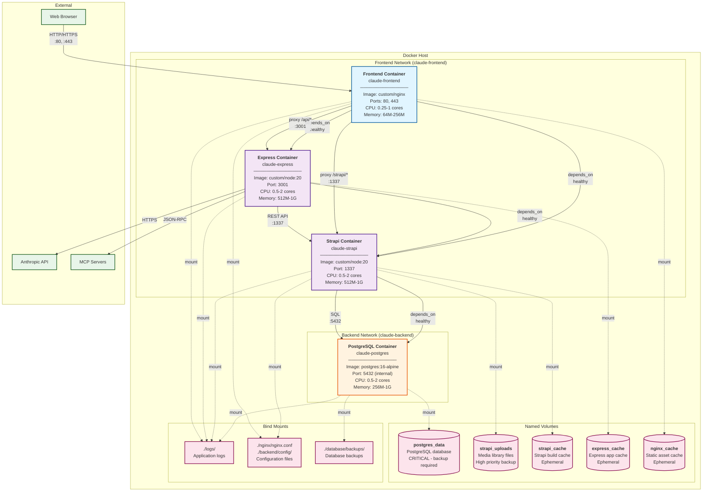
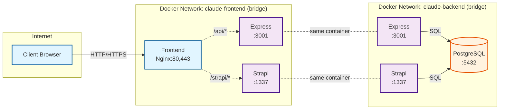
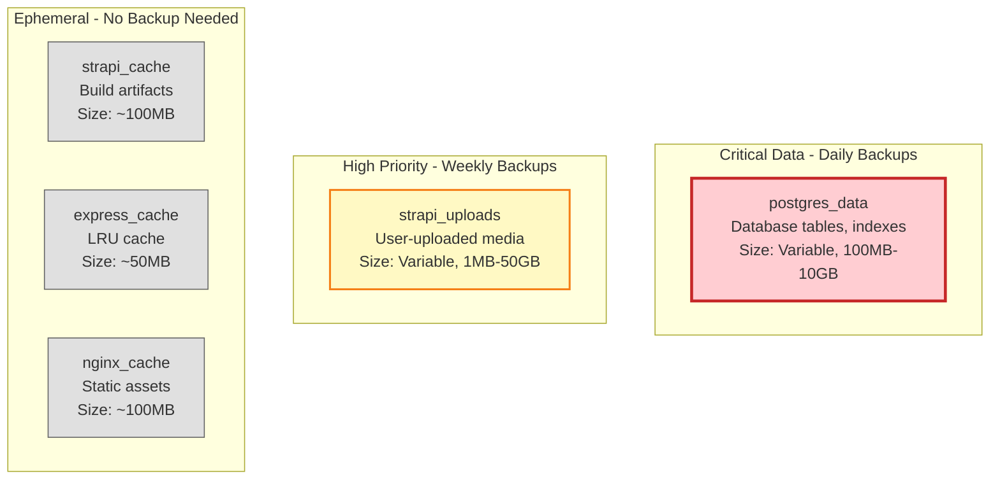
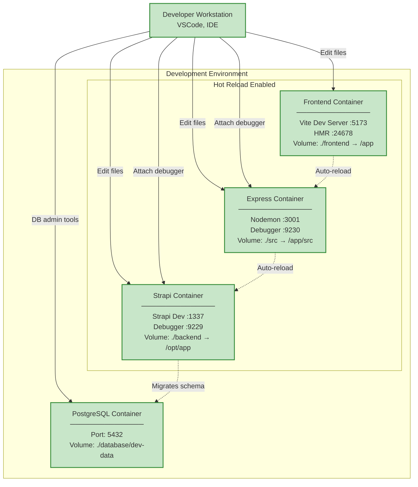
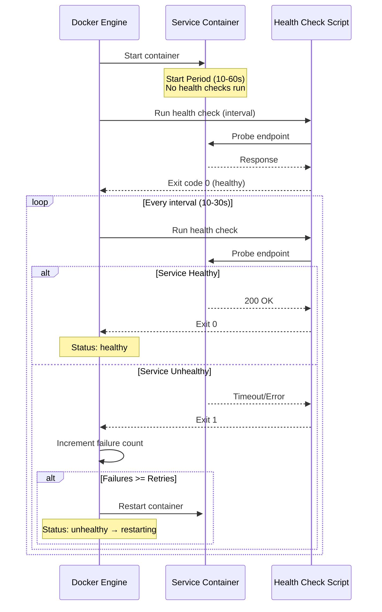
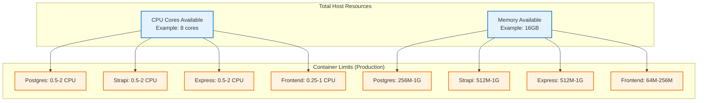
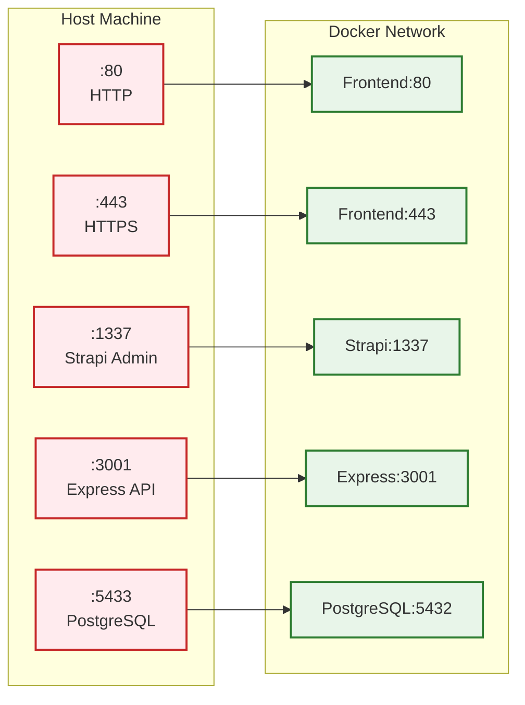
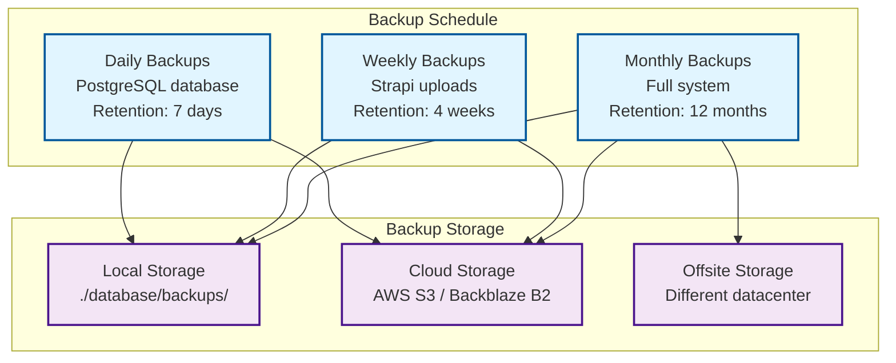

# Docker Deployment Architecture

## Introduction

This document provides a comprehensive view of the Claude Agent UI Docker deployment architecture, including container orchestration, networking, storage, resource management, and operational considerations. The deployment supports both production and development environments with different configurations optimized for each use case.

## Overview

The system uses Docker Compose to orchestrate a multi-container application with:
- **4 Services**: PostgreSQL, Strapi CMS, Express Backend, Frontend (Nginx)
- **2 Networks**: Backend (database tier), Frontend (application tier)
- **5 Volumes**: 2 persistent data volumes, 3 ephemeral cache volumes
- **Health Checks**: All services monitored for availability
- **Resource Limits**: CPU and memory constraints for stability

---

## Production Deployment Architecture

### Container Topology



---

## Network Architecture

### Network Segmentation



### Network Details

| Network | Driver | Services | Purpose | Isolation |
|---------|--------|----------|---------|-----------|
| **claude-frontend** | bridge | Frontend, Express, Strapi | HTTP/HTTPS routing and API access | Database is NOT accessible |
| **claude-backend** | bridge | PostgreSQL, Strapi, Express | Database access | NOT exposed to internet |

**Security Benefits:**
- **Frontend Network**: Allows web traffic to reach application services without database exposure
- **Backend Network**: Isolates database from direct internet access
- **Multi-homing**: Express and Strapi bridge both networks to facilitate data flow

---

## Service Specifications

### 1. PostgreSQL Database

```yaml
Service: postgres
Image: postgres:16-alpine
Container Name: claude-postgres
```

**Port Mappings:**
- Internal: `5432` (PostgreSQL default)
- External: `5433:5432` (host-exposed for admin tools)

**Environment Variables:**
- `POSTGRES_DB`: Database name (default: `claude_agent_ui`)
- `POSTGRES_USER`: Database user (default: `postgres`)
- `POSTGRES_PASSWORD`: **Required** - Database password
- `POSTGRES_INITDB_ARGS`: Encoding and locale settings
- `PGDATA`: Data directory path

**Volumes:**
- `postgres_data:/var/lib/postgresql/data` - **Persistent data** (critical)
- `./database/init:/docker-entrypoint-initdb.d:ro` - Initialization scripts
- `./database/backups:/backups` - Backup storage
- `./logs/postgres:/var/log/postgresql` - Log files

**Health Check:**
```bash
pg_isready -U postgres -d claude_agent_ui
Interval: 10s | Timeout: 5s | Retries: 5 | Start Period: 10s
```

**Resource Limits:**
- CPU: 0.5-2 cores
- Memory: 256M reserved, 1G limit

**Logging:**
- Driver: JSON file
- Max size: 10MB
- Max files: 3
- Label: `service=postgres`

**Restart Policy:** `unless-stopped`

---

### 2. Strapi CMS (Data Layer)

```yaml
Service: strapi
Build: ./backend (Dockerfile)
Container Name: claude-strapi
```

**Port Mappings:**
- Internal: `1337` (Strapi default)
- External: `1337:1337`

**Environment Variables:**
- `NODE_ENV`: `production`
- `HOST`: `0.0.0.0`
- `PORT`: `1337`
- Database: `DATABASE_CLIENT=postgres`, `DATABASE_HOST=postgres`
- Secrets: `APP_KEYS`, `API_TOKEN_SALT`, `ADMIN_JWT_SECRET`, etc. (**Required**)
- `STRAPI_CORS_ORIGIN`: CORS allowed origins
- `MAX_FILE_SIZE`: Upload size limit (default: 50MB)

**Volumes:**
- `strapi_uploads:/opt/app/public/uploads` - **Uploaded files** (high priority backup)
- `strapi_cache:/opt/app/.cache` - Build cache (ephemeral)
- `./backend/config:/opt/app/config:ro` - Configuration (read-only)
- `./logs/strapi:/opt/app/logs` - Log files

**Health Check:**
```bash
wget --no-verbose --tries=1 --spider http://localhost:1337/_health
Interval: 30s | Timeout: 10s | Retries: 3 | Start Period: 60s
```

**Dependencies:**
- Requires: `postgres` (healthy)

**Resource Limits:**
- CPU: 0.5-2 cores
- Memory: 512M reserved, 1G limit

**Networks:**
- `backend` (database access)
- `frontend` (API access)

---

### 3. Express Backend (Business Logic)

```yaml
Service: express
Build: . (Dockerfile.express)
Container Name: claude-express
```

**Port Mappings:**
- Internal: `3001`
- External: `3001:3001`

**Environment Variables:**
- `NODE_ENV`: `production`
- `PORT`: `3001`
- `STRAPI_URL`: `http://strapi:1337`
- `STRAPI_API_TOKEN`: **Required** - Strapi authentication
- `ANTHROPIC_API_KEY`: **Required** - Claude API key
- `LOG_LEVEL`: Logging verbosity (default: `info`)
- `MAX_WORKERS`: Worker processes (default: 4)
- `REQUEST_TIMEOUT`: Request timeout in ms (default: 300000)

**Volumes:**
- `express_cache:/app/.cache` - Application cache (ephemeral)
- `./logs/express:/app/logs` - Log files

**Health Check:**
```bash
wget --no-verbose --tries=1 --spider http://localhost:3001/health
Interval: 30s | Timeout: 10s | Retries: 3 | Start Period: 30s
```

**Dependencies:**
- Requires: `strapi` (healthy)

**Resource Limits:**
- CPU: 0.5-2 cores
- Memory: 512M reserved, 1G limit

**Networks:**
- `backend` (database access via Strapi)
- `frontend` (API access from Nginx)

---

### 4. Frontend (React + Nginx)

```yaml
Service: frontend
Build: . (Dockerfile.frontend)
Container Name: claude-frontend
```

**Port Mappings:**
- HTTP: `80:80`
- HTTPS: `443:443`

**Build Arguments:**
- `VITE_STRAPI_URL`: Strapi API endpoint
- `VITE_EXPRESS_URL`: Express API endpoint

**Volumes:**
- `./nginx/nginx.conf:/etc/nginx/nginx.conf:ro` - Nginx config (read-only)
- `./nginx/conf.d:/etc/nginx/conf.d:ro` - Additional config (read-only)
- `nginx_cache:/var/cache/nginx` - Asset cache (ephemeral)
- `./logs/nginx:/var/log/nginx` - Access/error logs
- `./ssl:/etc/nginx/ssl:ro` - SSL certificates (read-only)

**Health Check:**
```bash
wget --no-verbose --tries=1 --spider http://localhost:80/health
Interval: 30s | Timeout: 10s | Retries: 3 | Start Period: 10s
```

**Dependencies:**
- Requires: `strapi` (healthy)
- Requires: `express` (healthy)

**Resource Limits:**
- CPU: 0.25-1 cores
- Memory: 64M reserved, 256M limit

**Network:**
- `frontend` (proxy to backend services)

---

## Volume Management

### Volume Types and Backup Strategy



### Volume Specifications

| Volume Name | Type | Mount Point | Backup Priority | Description |
|-------------|------|-------------|-----------------|-------------|
| **postgres_data** | Named | `/var/lib/postgresql/data` | **Critical** | PostgreSQL database files, indexes, WAL logs |
| **strapi_uploads** | Named | `/opt/app/public/uploads` | **High** | User-uploaded media and files |
| **strapi_cache** | Named | `/opt/app/.cache` | None | Strapi build cache, regenerated on build |
| **express_cache** | Named | `/app/.cache` | None | LRU cache for API responses |
| **nginx_cache** | Named | `/var/cache/nginx` | None | Proxy cache for static assets |

### Backup Procedures

**Automated Backup (Production):**
```bash
# PostgreSQL backup (daily at 2 AM)
docker exec claude-postgres pg_dump -U postgres claude_agent_ui \
  | gzip > ./database/backups/backup-$(date +%Y%m%d).sql.gz

# Strapi uploads backup (weekly)
docker run --rm -v claude-strapi-uploads:/data -v $(pwd)/backups:/backup \
  alpine tar czf /backup/strapi-uploads-$(date +%Y%m%d).tar.gz /data
```

**Restore Procedures:**
```bash
# Restore PostgreSQL
gunzip < ./database/backups/backup-20260102.sql.gz | \
  docker exec -i claude-postgres psql -U postgres claude_agent_ui

# Restore Strapi uploads
docker run --rm -v claude-strapi-uploads:/data -v $(pwd)/backups:/backup \
  alpine tar xzf /backup/strapi-uploads-20260102.tar.gz -C /
```

---

## Development vs Production Configurations

### Configuration Comparison

| Aspect | Production (`docker-compose.yml`) | Development (`docker-compose.dev.yml`) |
|--------|----------------------------------|---------------------------------------|
| **Build Target** | `production` | `development` |
| **Node Environment** | `NODE_ENV=production` | `NODE_ENV=development` |
| **Hot Reload** | ❌ No | ✅ Yes (volume mounts) |
| **Debugger** | ❌ Disabled | ✅ Ports 9229 (Strapi), 9230 (Express) |
| **Logging** | `info` level, JSON format | `debug` level, human-readable |
| **Optimization** | ✅ Minified, tree-shaken | ❌ Source maps, unminified |
| **Port Exposure** | Minimal (80, 443, 3001, 1337) | All ports exposed including debug |
| **Volume Mounts** | Named volumes + logs only | Source code bind mounts |
| **Resource Limits** | ✅ Enforced | ⚠️ Relaxed |
| **Restart Policy** | `unless-stopped` | `unless-stopped` |

### Development Configuration Details



**Development Override (`docker-compose.dev.yml`):**

```yaml
# PostgreSQL - Direct port exposure
postgres:
  ports:
    - "5432:5432"  # No port mapping needed
  volumes:
    - ./database/dev-data:/var/lib/postgresql/data  # Local directory

# Strapi - Development mode with debugger
strapi:
  build:
    target: development
  environment:
    NODE_ENV: development
    STRAPI_LOG_LEVEL: debug
  volumes:
    - ./backend:/opt/app:delegated  # Source code hot reload
    - /opt/app/node_modules         # Prevent overwrite
  ports:
    - "9229:9229"  # Node.js debugger
  command: npm run develop

# Express - Development mode with nodemon
express:
  build:
    target: development
  environment:
    NODE_ENV: development
    LOG_LEVEL: debug
  volumes:
    - ./src:/app/src:delegated
    - /app/node_modules
  ports:
    - "9230:9230"  # Node.js debugger
  command: npm run dev

# Frontend - Vite dev server
frontend:
  build:
    target: development
  volumes:
    - .:/app:delegated
    - /app/node_modules
  ports:
    - "5173:5173"   # Vite dev server
    - "24678:24678" # HMR (Hot Module Replacement)
  command: npm run dev -- --host 0.0.0.0
  environment:
    VITE_STRAPI_URL: http://localhost:1337/api
    VITE_EXPRESS_URL: http://localhost:3001/api
```

**Starting Development Environment:**
```bash
# Use both compose files
docker-compose -f docker-compose.yml -f docker-compose.dev.yml up

# Rebuild with changes
docker-compose -f docker-compose.yml -f docker-compose.dev.yml up --build
```

---

## Health Checks and Monitoring

### Health Check Configuration

All services implement health checks to ensure:
- **Automated recovery**: Unhealthy containers automatically restart
- **Dependency management**: Services wait for dependencies to be healthy
- **Load balancer integration**: Health status can be used for routing decisions



### Health Check Summary

| Service | Endpoint | Interval | Timeout | Retries | Start Period |
|---------|----------|----------|---------|---------|--------------|
| PostgreSQL | `pg_isready` | 10s | 5s | 5 | 10s |
| Strapi | `GET /_health` | 30s | 10s | 3 | 60s |
| Express | `GET /health` | 30s | 10s | 3 | 30s |
| Frontend | `GET /health` | 30s | 10s | 3 | 10s |

### Monitoring Commands

```bash
# Check health status of all services
docker-compose ps

# View detailed health status
docker inspect --format='{{json .State.Health}}' claude-postgres | jq

# Monitor logs for health check failures
docker-compose logs -f --tail=100 | grep -i health

# Restart unhealthy service
docker-compose restart <service>
```

---

## Resource Management

### Resource Allocation Strategy



### Resource Limits Table

| Service | CPU Reservation | CPU Limit | Memory Reservation | Memory Limit | Rationale |
|---------|-----------------|-----------|-------------------|--------------|-----------|
| **PostgreSQL** | 0.5 cores | 2 cores | 256M | 1G | Database operations are CPU-intensive during queries |
| **Strapi** | 0.5 cores | 2 cores | 512M | 1G | CMS requires memory for ORM, content processing |
| **Express** | 0.5 cores | 2 cores | 512M | 1G | Real-time SSE streaming, Claude SDK operations |
| **Frontend** | 0.25 cores | 1 core | 64M | 256M | Static file serving, minimal processing |

**Total Reservations:** 1.75 CPU cores, 1.34GB RAM
**Total Limits:** 7 CPU cores, 3.25GB RAM

### Resource Tuning Guidelines

**Low-resource environments (4 cores, 8GB RAM):**
```yaml
# Reduce limits for all services
postgres:
  deploy:
    resources:
      limits:
        cpus: '1'
        memory: 512M
      reservations:
        cpus: '0.25'
        memory: 128M

strapi:
  deploy:
    resources:
      limits:
        cpus: '1'
        memory: 512M
      reservations:
        cpus: '0.25'
        memory: 256M

express:
  deploy:
    resources:
      limits:
        cpus: '1'
        memory: 512M
      reservations:
        cpus: '0.25'
        memory: 256M
```

**High-traffic environments (16+ cores, 32GB+ RAM):**
```yaml
# Increase limits and reservations
postgres:
  deploy:
    resources:
      limits:
        cpus: '4'
        memory: 4G
      reservations:
        cpus: '1'
        memory: 1G

strapi:
  deploy:
    resources:
      limits:
        cpus: '4'
        memory: 2G
      reservations:
        cpus: '1'
        memory: 1G

express:
  deploy:
    resources:
      limits:
        cpus: '4'
        memory: 2G
      reservations:
        cpus: '1'
        memory: 1G
```

---

## Port Mapping and Exposure

### Port Allocation



### Port Table

| Service | Internal Port | External Port | Protocol | Public? | Notes |
|---------|--------------|---------------|----------|---------|-------|
| Frontend | 80 | 80 | HTTP | ✅ Yes | Main web interface |
| Frontend | 443 | 443 | HTTPS | ✅ Yes | SSL/TLS (production) |
| Express | 3001 | 3001 | HTTP | ⚠️ Optional | API endpoint (can proxy via Nginx) |
| Strapi | 1337 | 1337 | HTTP | ⚠️ Optional | Admin panel (restrict in production) |
| PostgreSQL | 5432 | 5433 | PostgreSQL | ❌ No | Database (for admin tools only) |

**Security Recommendations:**

1. **Production Firewall Rules:**
   ```bash
   # Allow only HTTP/HTTPS
   ufw allow 80/tcp
   ufw allow 443/tcp

   # Block direct API access (proxy through Nginx)
   ufw deny 3001/tcp
   ufw deny 1337/tcp

   # Restrict database to specific IPs
   ufw allow from <admin-ip> to any port 5433
   ```

2. **Nginx Reverse Proxy Configuration:**
   ```nginx
   # Proxy Express API
   location /api/ {
       proxy_pass http://express:3001/;
   }

   # Proxy Strapi (admin only from specific IPs)
   location /strapi/ {
       allow <admin-ip>;
       deny all;
       proxy_pass http://strapi:1337/;
   }
   ```

---

## Operational Procedures

### Starting the System

```bash
# Production
docker-compose up -d

# Development
docker-compose -f docker-compose.yml -f docker-compose.dev.yml up -d

# Rebuild and start
docker-compose up -d --build

# View startup logs
docker-compose logs -f
```

### Stopping the System

```bash
# Stop all services (containers remain)
docker-compose stop

# Stop and remove containers
docker-compose down

# Stop, remove containers, and remove volumes (DATA LOSS!)
docker-compose down -v
```

### Scaling Services

```bash
# Scale Express to 3 instances (requires load balancer)
docker-compose up -d --scale express=3

# Note: Scaling frontend/strapi requires additional configuration
```

### Viewing Logs

```bash
# All services
docker-compose logs -f

# Specific service
docker-compose logs -f express

# Tail last 100 lines
docker-compose logs --tail=100 strapi

# Follow logs with timestamps
docker-compose logs -f -t
```

### Database Operations

```bash
# Access PostgreSQL CLI
docker exec -it claude-postgres psql -U postgres -d claude_agent_ui

# Backup database
docker exec claude-postgres pg_dump -U postgres claude_agent_ui > backup.sql

# Restore database
cat backup.sql | docker exec -i claude-postgres psql -U postgres claude_agent_ui

# View database size
docker exec claude-postgres psql -U postgres -d claude_agent_ui \
  -c "SELECT pg_size_pretty(pg_database_size('claude_agent_ui'));"
```

### Troubleshooting

**Container won't start:**
```bash
# Check container status
docker-compose ps

# View container logs
docker-compose logs <service>

# Inspect container
docker inspect claude-<service>

# Check health status
docker inspect --format='{{json .State.Health}}' claude-<service> | jq
```

**Out of memory:**
```bash
# Check resource usage
docker stats

# View memory limits
docker inspect --format='{{.HostConfig.Memory}}' claude-<service>

# Increase memory limit in docker-compose.yml
```

**Network connectivity issues:**
```bash
# List networks
docker network ls

# Inspect network
docker network inspect claude-frontend

# Test connectivity between containers
docker exec claude-express ping -c 3 claude-postgres

# Test service availability
docker exec claude-express wget -O- http://strapi:1337/_health
```

**Volume issues:**
```bash
# List volumes
docker volume ls

# Inspect volume
docker volume inspect claude-postgres-data

# Locate volume on host
docker volume inspect claude-postgres-data --format='{{.Mountpoint}}'

# Backup volume
docker run --rm -v claude-postgres-data:/data -v $(pwd):/backup \
  alpine tar czf /backup/postgres-data.tar.gz /data
```

---

## Security Considerations

### Container Security

1. **Run as non-root user** (where possible):
   ```dockerfile
   USER node  # For Node.js services
   USER postgres  # PostgreSQL already uses postgres user
   ```

2. **Read-only filesystem mounts**:
   ```yaml
   volumes:
     - ./nginx/nginx.conf:/etc/nginx/nginx.conf:ro  # Read-only
     - ./backend/config:/opt/app/config:ro
   ```

3. **Secret management**:
   ```bash
   # Use .env file (DO NOT commit to git)
   POSTGRES_PASSWORD=<strong-password>
   STRAPI_APP_KEYS=<random-keys>
   ANTHROPIC_API_KEY=<api-key>

   # Or use Docker secrets (Swarm mode)
   docker secret create postgres_password ./secrets/postgres_password.txt
   ```

4. **Network isolation**:
   - PostgreSQL only accessible from backend network
   - No direct internet access to database

### Environment Variable Security

```bash
# .env file (NEVER commit to git)
# Add to .gitignore

# Required secrets
POSTGRES_PASSWORD=<generate-strong-password>
STRAPI_APP_KEYS=<generate-random-keys>
STRAPI_API_TOKEN_SALT=<generate-random-salt>
STRAPI_ADMIN_JWT_SECRET=<generate-random-secret>
STRAPI_TRANSFER_TOKEN_SALT=<generate-random-salt>
STRAPI_JWT_SECRET=<generate-random-secret>
STRAPI_API_TOKEN=<generate-api-token>
ANTHROPIC_API_KEY=<anthropic-api-key>

# Generate random secrets:
openssl rand -base64 32
```

### SSL/TLS Configuration

```nginx
# nginx/conf.d/ssl.conf
server {
    listen 443 ssl http2;
    server_name example.com;

    ssl_certificate /etc/nginx/ssl/fullchain.pem;
    ssl_certificate_key /etc/nginx/ssl/privkey.pem;

    ssl_protocols TLSv1.2 TLSv1.3;
    ssl_ciphers HIGH:!aNULL:!MD5;
    ssl_prefer_server_ciphers on;

    # Security headers
    add_header Strict-Transport-Security "max-age=31536000" always;
    add_header X-Frame-Options "SAMEORIGIN" always;
    add_header X-Content-Type-Options "nosniff" always;

    # Proxy configuration
    location / {
        proxy_pass http://frontend;
    }
}
```

---

## Performance Optimization

### Nginx Caching

```nginx
# nginx/nginx.conf
http {
    proxy_cache_path /var/cache/nginx levels=1:2
                     keys_zone=api_cache:10m
                     max_size=1g
                     inactive=60m;

    server {
        location /api/ {
            proxy_cache api_cache;
            proxy_cache_valid 200 5m;
            proxy_cache_use_stale error timeout http_500 http_502 http_503;
            add_header X-Cache-Status $upstream_cache_status;

            proxy_pass http://express:3001;
        }
    }
}
```

### Database Connection Pooling

Strapi configuration (`backend/config/database.js`):
```javascript
module.exports = {
  connection: {
    client: 'postgres',
    connection: {
      // Connection pool settings
      pool: {
        min: 2,
        max: 10,
        acquireTimeoutMillis: 30000,
        idleTimeoutMillis: 30000,
        createTimeoutMillis: 30000,
        reapIntervalMillis: 1000,
      },
    },
  },
};
```

### Express Caching

LRU cache configuration (already implemented):
```javascript
// src/services/strapi-client.ts
const cache = new LRUCache({
  max: 500,          // Max 500 entries
  ttl: 1000 * 60 * 5 // 5 minute TTL
});
```

---

## Disaster Recovery

### Backup Strategy



### Automated Backup Script

```bash
#!/bin/bash
# backup.sh - Automated backup script

DATE=$(date +%Y%m%d-%H%M%S)
BACKUP_DIR="./database/backups"

# PostgreSQL backup
echo "Backing up PostgreSQL database..."
docker exec claude-postgres pg_dump -U postgres claude_agent_ui \
  | gzip > "$BACKUP_DIR/postgres-$DATE.sql.gz"

# Strapi uploads backup
echo "Backing up Strapi uploads..."
docker run --rm \
  -v claude-strapi-uploads:/data \
  -v $(pwd)/backups:/backup \
  alpine tar czf "/backup/strapi-uploads-$DATE.tar.gz" /data

# Cleanup old backups (keep last 7 days)
find "$BACKUP_DIR" -name "postgres-*.sql.gz" -mtime +7 -delete
find "$BACKUP_DIR" -name "strapi-uploads-*.tar.gz" -mtime +30 -delete

echo "Backup completed: $DATE"
```

### Recovery Procedures

**Full System Recovery:**
```bash
# 1. Stop all services
docker-compose down

# 2. Restore PostgreSQL
gunzip < ./database/backups/postgres-20260102.sql.gz | \
  docker exec -i claude-postgres psql -U postgres claude_agent_ui

# 3. Restore Strapi uploads
docker run --rm \
  -v claude-strapi-uploads:/data \
  -v $(pwd)/backups:/backup \
  alpine tar xzf /backup/strapi-uploads-20260102.tar.gz -C /

# 4. Restart services
docker-compose up -d

# 5. Verify health
docker-compose ps
```

---

## Next Steps

For more detailed documentation on specific architecture aspects, see:

- [System Overview](./01-system-overview.md) - High-level architecture and component overview
- [Data Flow Diagrams](./02-data-flow.md) - Agent execution, MCP tools, and chat flows
- [Component Details](./04-components.md) - Service layer architecture and frontend components
- [Sequence Diagrams](./05-sequences.md) - Step-by-step interaction flows
- [Technology Stack](./06-tech-stack.md) - Detailed technology choices and rationale

---

## Summary

The Claude Agent UI uses a well-architected Docker Compose deployment with:

✅ **Multi-container orchestration** - 4 services working together
✅ **Network isolation** - Frontend and backend networks for security
✅ **Persistent storage** - Named volumes with backup strategies
✅ **Health monitoring** - Automated health checks and recovery
✅ **Resource management** - CPU and memory limits for stability
✅ **Development support** - Hot reload and debugging capabilities
✅ **Production-ready** - Security hardening and performance optimization

This architecture supports both development and production environments with appropriate configurations for each use case.
