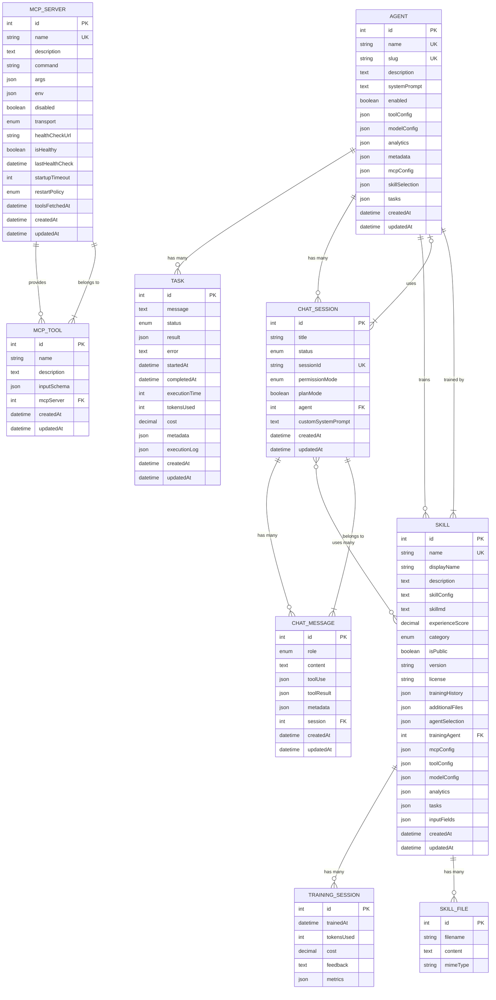

# Component Architecture

## Introduction

This document provides detailed component diagrams for all three layers of the Claude Agent UI system: the Express service layer, the React frontend component hierarchy, and the Strapi CMS content types with their relationships. Understanding these components is essential for development, debugging, and extending the system.

## Overview

The system has three primary component layers:

1. **Express Service Layer** - Business logic and integration services
2. **Frontend Component Hierarchy** - React UI components and structure
3. **Strapi Content Types** - Database schema and relationships

---

## 1. Express Service Layer

This diagram shows all services in the Express backend, organized by category and showing their dependencies and interactions.

```mermaid
graph TB
    subgraph "Core AI Services"
        ClaudeSDK[claude-sdk-service.ts<br/>Agent Execution Engine]
        ClaudeRouter[claude-router-service.ts<br/>Model Selection & Routing]
        ClaudeHistoryReader[claude-history-reader.ts<br/>Session History Loading]
        SDKHistoryWriter[sdk-history-writer.ts<br/>Session History Persistence]
        ClaudeStructureParser[claude-structure-parser.ts<br/>Parse Agent Responses]
    end

    subgraph "Data Layer Services"
        StrapiClient[strapi-client.ts<br/>Data Access Layer<br/>LRU Cache + REST API]
    end

    subgraph "MCP Integration Services"
        MCPService[mcp-service.ts<br/>MCP Server Management<br/>Tool Discovery & Execution]
    end

    subgraph "Chat Services"
        ChatService[chat-service.ts<br/>Chat Session Management<br/>SSE Streaming]
        ChatLogService[chat-log-service.ts<br/>Message Logging & Formatting]
    end

    subgraph "Skill Services"
        SkillService[skill-service.ts<br/>Skill Execution & Management]
        SkillSyncService[skill-sync-service.ts<br/>Filesystem Synchronization]
    end

    subgraph "Infrastructure Services"
        ConfigService[config-service.ts<br/>Environment & Config Management]
        FileSystemService[file-system-service.ts<br/>File I/O Operations]
        Logger[logger.ts<br/>Pino Logging]
        NotificationService[notification-service.ts<br/>System Notifications]
        WebPushService[web-push-service.ts<br/>Push Notification Delivery]
        SessionInfoService[session-info-service.ts<br/>Session Metadata]
        TaskStorageService[task-storage-service.ts<br/>Task Persistence]
    end

    subgraph "Utilities"
        ConversationCache[conversation-cache.ts<br/>In-Memory Cache]
        ConversationStatusManager[conversation-status-manager.ts<br/>Status Tracking]
        MessageFilter[message-filter.ts<br/>Message Filtering]
        LogFormatter[log-formatter.ts<br/>Log Formatting]
        LogStreamBuffer[log-stream-buffer.ts<br/>Stream Buffering]
        ToolMetricsService[ToolMetricsService.ts<br/>Tool Usage Analytics]
    end

    subgraph "Training & Selection"
        TrainingAgentSelector[training-agent-selector.ts<br/>Select Training Agent]
    end

    %% Core AI Dependencies
    ClaudeSDK --> MCPService
    ClaudeSDK --> ClaudeHistoryReader
    ClaudeSDK --> SDKHistoryWriter
    ClaudeSDK --> ClaudeStructureParser
    ClaudeRouter --> ClaudeSDK

    %% Data Access
    ClaudeSDK -.->|Data Access| StrapiClient
    ChatService -.->|Data Access| StrapiClient
    SkillService -.->|Data Access| StrapiClient
    MCPService -.->|Data Access| StrapiClient
    TaskStorageService -.->|Data Access| StrapiClient

    %% Skill Integration
    SkillService --> SkillSyncService
    SkillSyncService --> FileSystemService
    ClaudeSDK --> SkillService

    %% Chat Flow
    ChatService --> ClaudeSDK
    ChatService --> ChatLogService
    ChatService --> MessageFilter
    ChatLogService --> LogFormatter

    %% MCP Integration
    MCPService --> ConfigService
    MCPService --> FileSystemService

    %% Infrastructure
    ClaudeSDK --> Logger
    ChatService --> Logger
    MCPService --> Logger
    StrapiClient --> ConversationCache
    ChatService --> ConversationStatusManager
    ChatService --> SessionInfoService

    %% Notifications
    ChatService --> NotificationService
    NotificationService --> WebPushService

    %% Metrics
    ClaudeSDK --> ToolMetricsService

    %% Training
    SkillService --> TrainingAgentSelector
    TrainingAgentSelector -.->|Data Access| StrapiClient

    %% Styling
    classDef coreAI fill:#e1f5ff,stroke:#01579b,stroke-width:2px
    classDef data fill:#fff3e0,stroke:#e65100,stroke-width:2px
    classDef mcp fill:#f3e5f5,stroke:#4a148c,stroke-width:2px
    classDef chat fill:#e8f5e9,stroke:#1b5e20,stroke-width:2px
    classDef skill fill:#fce4ec,stroke:#880e4f,stroke-width:2px
    classDef infra fill:#e0f2f1,stroke:#004d40,stroke-width:2px
    classDef util fill:#fff9c4,stroke:#f57f17,stroke-width:2px
    classDef training fill:#ede7f6,stroke:#311b92,stroke-width:2px

    class ClaudeSDK,ClaudeRouter,ClaudeHistoryReader,SDKHistoryWriter,ClaudeStructureParser coreAI
    class StrapiClient data
    class MCPService mcp
    class ChatService,ChatLogService chat
    class SkillService,SkillSyncService skill
    class ConfigService,FileSystemService,Logger,NotificationService,WebPushService,SessionInfoService,TaskStorageService infra
    class ConversationCache,ConversationStatusManager,MessageFilter,LogFormatter,LogStreamBuffer,ToolMetricsService util
    class TrainingAgentSelector training
```

### Service Categories

#### Core AI Services (5 services)
- **claude-sdk-service**: Main agent execution engine using Anthropic's Claude SDK
- **claude-router-service**: Routes requests to appropriate Claude models based on requirements
- **claude-history-reader**: Loads conversation history from filesystem
- **sdk-history-writer**: Persists conversation history to filesystem
- **claude-structure-parser**: Parses and structures Claude API responses

#### Data Layer (1 service)
- **strapi-client**: Single gateway to Strapi CMS with LRU caching for performance

#### MCP Integration (1 service)
- **mcp-service**: Manages MCP server connections, tool discovery, and execution

#### Chat Services (2 services)
- **chat-service**: Manages chat sessions with SSE streaming support
- **chat-log-service**: Handles message logging and formatting

#### Skill Services (2 services)
- **skill-service**: Manages skill execution and lifecycle
- **skill-sync-service**: Synchronizes skills between database and filesystem

#### Infrastructure Services (7 services)
- **config-service**: Central configuration management
- **file-system-service**: File I/O operations wrapper
- **logger**: Structured logging using Pino
- **notification-service**: System notification management
- **web-push-service**: Browser push notification delivery
- **session-info-service**: Session metadata tracking
- **task-storage-service**: Task execution persistence

#### Utilities (6 services)
- **conversation-cache**: In-memory LRU cache for conversations
- **conversation-status-manager**: Tracks conversation execution status
- **message-filter**: Filters and validates messages
- **log-formatter**: Formats log output
- **log-stream-buffer**: Buffers streaming logs
- **ToolMetricsService**: Tracks tool usage metrics

#### Training & Selection (1 service)
- **training-agent-selector**: Selects appropriate agent for skill training

### Key Service Patterns

1. **Single Data Gateway**: `strapi-client` is the only service that communicates with Strapi
2. **Caching Strategy**: LRU caching in `strapi-client` and `conversation-cache`
3. **Event-Driven**: Services use EventEmitter for real-time updates
4. **Filesystem Sync**: Skills and MCP configs synchronized between DB and filesystem
5. **Logging**: Centralized structured logging via Pino logger

---

## 2. Frontend Component Hierarchy

This diagram shows the React component structure, organized by feature and responsibility.

```mermaid
graph TB
    subgraph "Application Root"
        Main[main.tsx<br/>React Entry Point]
        Router[BrowserRouter<br/>React Router]
        ManagerApp[ManagerApp.tsx<br/>Main Application]
    end

    subgraph "Layout Components"
        Layout[Layout.tsx<br/>App Shell]
        Sidebar[Sidebar.tsx<br/>Navigation Menu]
    end

    subgraph "Page Components"
        LandingPage[LandingPage.tsx<br/>Home Dashboard]
        AgentsPage[AgentsPage.tsx<br/>Agent Management]
        SkillsPage[SkillsPage.tsx<br/>Skill Management]
        MCPServersPage[MCPServersPage.tsx<br/>MCP Server Management]
        CommandsPage[CommandsPage.tsx<br/>Slash Commands]
        SettingsPage[SettingsPage.tsx<br/>App Settings]
    end

    subgraph "Agent Components"
        AgentConfigModal[AgentConfigModal.tsx<br/>Agent Configuration]
        AgentCreatorForm[AgentCreatorForm.tsx<br/>Create/Edit Agent]
        AgentCreatorChatPanel[AgentCreatorChatPanel.tsx<br/>Agent Chat Interface]
        TaskExecutionModal[TaskExecutionModal.tsx<br/>Execute Agent Task]
    end

    subgraph "Skill Components"
        SkillCreationModal[SkillCreationModal.tsx<br/>Create/Edit Skill]
        SkillCreatorChatPanel[SkillCreatorChatPanel.tsx<br/>Skill Training Chat]
    end

    subgraph "Chat Components"
        ChatSessionModal[ChatSessionModal.tsx<br/>Chat Session Manager]
        ComposerArea[ComposerArea.tsx<br/>Message Input Area]
        MessageBubble[MessageBubble.tsx<br/>Message Display]
        SystemMessageDisplay[SystemMessageDisplay.tsx<br/>System Message]
        ToolUseDisplay[ToolUseDisplay.tsx<br/>Tool Execution Display]
    end

    subgraph "UI Components (Radix UI)"
        Button[Button.tsx]
        Input[Input.tsx]
        Textarea[Textarea.tsx]
        Select[Select.tsx]
        Dialog[Dialog.tsx]
        Switch[Switch.tsx]
        Card[Card.tsx]
        Icons[Icons.tsx]
        ProgressBar[ProgressBar.tsx]
    end

    subgraph "Form Components"
        KeyValueEditor[KeyValueEditor.tsx<br/>Edit Key-Value Pairs]
        ArrayEditor[ArrayEditor.tsx<br/>Edit Arrays]
    end

    subgraph "Contexts"
        ChatDisplayContext[ChatDisplayContext.tsx<br/>Chat State Management]
    end

    subgraph "Services"
        APIService[API Service Layer<br/>Axios HTTP Client]
        SSEService[SSE Service<br/>EventSource Streaming]
    end

    subgraph "Hooks"
        CustomHooks[Custom React Hooks<br/>State & Effects]
    end

    %% App Structure
    Main --> Router
    Router --> ManagerApp
    ManagerApp --> Layout
    Layout --> Sidebar
    Layout --> LandingPage
    Layout --> AgentsPage
    Layout --> SkillsPage
    Layout --> MCPServersPage
    Layout --> CommandsPage
    Layout --> SettingsPage

    %% Agent Flow
    AgentsPage --> AgentConfigModal
    AgentConfigModal --> AgentCreatorForm
    AgentCreatorForm --> AgentCreatorChatPanel
    AgentsPage --> TaskExecutionModal

    %% Skill Flow
    SkillsPage --> SkillCreationModal
    SkillCreationModal --> SkillCreatorChatPanel

    %% Chat Flow
    AgentCreatorChatPanel --> ChatSessionModal
    SkillCreatorChatPanel --> ChatSessionModal
    ChatSessionModal --> ComposerArea
    ChatSessionModal --> MessageBubble
    MessageBubble --> SystemMessageDisplay
    MessageBubble --> ToolUseDisplay

    %% Context Usage
    ChatSessionModal -.->|uses| ChatDisplayContext
    MessageBubble -.->|uses| ChatDisplayContext

    %% UI Component Usage
    AgentCreatorForm --> Button
    AgentCreatorForm --> Input
    AgentCreatorForm --> Textarea
    AgentCreatorForm --> Select
    AgentConfigModal --> Dialog
    SettingsPage --> Switch
    LandingPage --> Card
    TaskExecutionModal --> ProgressBar
    AgentsPage --> Icons

    %% Form Components
    AgentCreatorForm --> KeyValueEditor
    AgentCreatorForm --> ArrayEditor
    SkillCreationModal --> KeyValueEditor

    %% Service Layer
    AgentsPage -.->|HTTP| APIService
    SkillsPage -.->|HTTP| APIService
    MCPServersPage -.->|HTTP| APIService
    TaskExecutionModal -.->|SSE| SSEService
    ChatSessionModal -.->|SSE| SSEService

    %% Hooks
    AgentsPage -.->|uses| CustomHooks
    SkillsPage -.->|uses| CustomHooks
    ChatSessionModal -.->|uses| CustomHooks

    %% Styling
    classDef root fill:#e1f5ff,stroke:#01579b,stroke-width:2px
    classDef layout fill:#f3e5f5,stroke:#4a148c,stroke-width:2px
    classDef page fill:#e8f5e9,stroke:#1b5e20,stroke-width:2px
    classDef agent fill:#fff3e0,stroke:#e65100,stroke-width:2px
    classDef skill fill:#fce4ec,stroke:#880e4f,stroke-width:2px
    classDef chat fill:#e0f2f1,stroke:#004d40,stroke-width:2px
    classDef ui fill:#fff9c4,stroke:#f57f17,stroke-width:2px
    classDef form fill:#ede7f6,stroke:#311b92,stroke-width:2px
    classDef context fill:#fbe9e7,stroke:#bf360c,stroke-width:2px
    classDef service fill:#e8eaf6,stroke:#1a237e,stroke-width:2px
    classDef hooks fill:#f1f8e9,stroke:#33691e,stroke-width:2px

    class Main,Router,ManagerApp root
    class Layout,Sidebar layout
    class LandingPage,AgentsPage,SkillsPage,MCPServersPage,CommandsPage,SettingsPage page
    class AgentConfigModal,AgentCreatorForm,AgentCreatorChatPanel,TaskExecutionModal agent
    class SkillCreationModal,SkillCreatorChatPanel skill
    class ChatSessionModal,ComposerArea,MessageBubble,SystemMessageDisplay,ToolUseDisplay chat
    class Button,Input,Textarea,Select,Dialog,Switch,Card,Icons,ProgressBar ui
    class KeyValueEditor,ArrayEditor form
    class ChatDisplayContext context
    class APIService,SSEService service
    class CustomHooks hooks
```

### Component Organization

#### Application Root (3 components)
- **main.tsx**: Application entry point, renders React root
- **BrowserRouter**: React Router setup for navigation
- **ManagerApp**: Main application component with routing

#### Layout Components (2 components)
- **Layout**: App shell with sidebar and main content area
- **Sidebar**: Navigation menu with links to all pages

#### Page Components (6 components)
- **LandingPage**: Dashboard with overview and quick actions
- **AgentsPage**: List and manage AI agents
- **SkillsPage**: List and manage skills
- **MCPServersPage**: Configure MCP servers
- **CommandsPage**: Manage slash commands
- **SettingsPage**: Application settings and preferences

#### Agent Components (4 components)
- **AgentConfigModal**: Configure agent settings (model, tools, etc.)
- **AgentCreatorForm**: Form to create/edit agents
- **AgentCreatorChatPanel**: Interactive chat for testing agents
- **TaskExecutionModal**: Execute and monitor agent tasks

#### Skill Components (2 components)
- **SkillCreationModal**: Create/edit skill definitions
- **SkillCreatorChatPanel**: Chat interface for training skills

#### Chat Components (5 components)
- **ChatSessionModal**: Main chat interface
- **ComposerArea**: Message input with formatting
- **MessageBubble**: Display individual messages
- **SystemMessageDisplay**: Show system messages
- **ToolUseDisplay**: Visualize tool executions

#### UI Components (9 components)
- Built on **Radix UI** primitives
- Styled with **Tailwind CSS**
- Reusable across the application

#### Form Components (2 components)
- **KeyValueEditor**: Edit environment variables and metadata
- **ArrayEditor**: Edit array values (MCP args, etc.)

### Frontend Patterns

1. **Component Composition**: Small, reusable components composed into features
2. **Context API**: ChatDisplayContext for cross-component state
3. **Custom Hooks**: Encapsulate stateful logic and effects
4. **SSE Streaming**: Real-time updates via EventSource
5. **REST API**: Axios for CRUD operations
6. **Radix UI**: Accessible, unstyled component primitives
7. **Tailwind CSS**: Utility-first styling approach

---

## 3. Strapi Content Types and Relationships

This diagram shows the Strapi database schema with all content types and their relationships.

### Content Type Details

#### Agent
Core content type representing an AI agent with its configuration.

**Key Fields:**
- `name`: Unique agent name
- `slug`: URL-friendly identifier
- `systemPrompt`: Agent's system instructions
- `toolConfig`: Tool configuration (computer use, bash, editor)
- `modelConfig`: Model settings (model name, temperature, max tokens)
- `mcpConfig`: MCP server selections
- `skillSelection`: Associated skills
- `analytics`: Usage metrics and statistics

**Components:**
- `agent.tool-configuration`: Tool settings
- `agent.model-configuration`: Model parameters
- `agent.analytics`: Usage analytics
- `shared.metadata`: Custom metadata
- `mcp.server-selection`: MCP server bindings
- `skill.skill-selection`: Skill associations
- `task.task-selection`: Task associations

**Relationships:**
- Has many `TASK` records (execution history)
- Has many `CHAT_SESSION` records
- Trains many `SKILL` records (as training agent)

#### Skill
Represents a Claude Agent SDK skill with training history.

**Key Fields:**
- `name`: Unique skill identifier (uid)
- `displayName`: Human-readable name
- `description`: Skill description
- `skillConfig`: Forced execution mode prompt
- `skillmd`: Markdown skill definition
- `experienceScore`: Training quality metric (0-100)
- `category`: Skill category (general-purpose, code-analysis, etc.)
- `version`: Semantic version
- `trainingHistory`: Training session records

**Components:**
- `skill.training-session`: Training history entries
- `skill.skill-file`: Additional skill files
- `agent.agent-selection`: Agent associations
- `skill.input-field`: Dynamic input fields

**Relationships:**
- Belongs to `AGENT` (training agent)
- Many-to-many with `CHAT_SESSION`
- Has many `TRAINING_SESSION` components
- Has many `SKILL_FILE` components

#### MCP Server
Configuration for Model Context Protocol servers.

**Key Fields:**
- `name`: Unique server name
- `command`: Executable command
- `args`: Command arguments (JSON array)
- `env`: Environment variables (JSON object)
- `transport`: Communication protocol (stdio, sse, http)
- `healthCheckUrl`: Health check endpoint (for http/sse)
- `isHealthy`: Current health status
- `restartPolicy`: Restart behavior (always, on-failure, never)

**Relationships:**
- Has many `MCP_TOOL` records (discovered tools)

#### MCP Tool
Tools discovered from MCP servers.

**Key Fields:**
- `name`: Tool name
- `description`: Tool description
- `inputSchema`: JSON Schema for tool parameters

**Relationships:**
- Belongs to `MCP_SERVER`

#### Chat Session
Represents a chat conversation session.

**Key Fields:**
- `title`: Session title
- `sessionId`: Unique session identifier
- `status`: Session status (active, archived)
- `permissionMode`: Permission handling (default, bypass, auto)
- `planMode`: Whether plan mode is enabled
- `customSystemPrompt`: Optional custom system prompt

**Relationships:**
- Belongs to `AGENT` (optional, can use custom prompt)
- Many-to-many with `SKILL`
- Has many `CHAT_MESSAGE` records

#### Chat Message
Individual messages within a chat session.

**Key Fields:**
- `role`: Message role (user, assistant, system)
- `content`: Message text
- `toolUse`: Tool invocation data
- `toolResult`: Tool execution result
- `metadata`: Additional metadata

**Relationships:**
- Belongs to `CHAT_SESSION`

#### Task
Agent execution task with results and metrics.

**Key Fields:**
- `message`: Task description/prompt
- `status`: Execution status (pending, running, completed, failed, cancelled)
- `result`: Execution result (JSON)
- `error`: Error message if failed
- `executionTime`: Time taken (milliseconds)
- `tokensUsed`: Total tokens consumed
- `cost`: Execution cost (USD)
- `executionLog`: Detailed execution log

**Relationships:**
- Belongs to `AGENT` (implicitly through agent selection at execution time)

### Database Schema Patterns

1. **Component-Based Fields**: Reusable components for common structures (toolConfig, modelConfig, analytics)
2. **Many-to-Many Relationships**: Skills can be used by multiple chat sessions
3. **Composition Pattern**: Tasks and metadata stored as JSON for flexibility
4. **Audit Fields**: All content types have `createdAt` and `updatedAt` timestamps
5. **Enumeration Types**: Status fields use enums for data integrity
6. **JSON Storage**: Complex configurations stored as JSON for flexibility
7. **Unique Constraints**: Names and slugs enforced at database level

### Content Type Interactions

#### Agent Execution Flow
1. User selects `AGENT` with associated `SKILL` records
2. Agent configuration loaded (systemPrompt, toolConfig, modelConfig)
3. `MCP_SERVER` connections established, `MCP_TOOL` records discovered
4. `TASK` record created with status "pending"
5. Execution begins, status updated to "running"
6. On completion, `TASK` updated with result, tokens, cost

#### Chat Session Flow
1. User creates `CHAT_SESSION` with optional `AGENT`
2. Session can select multiple `SKILL` records
3. `CHAT_MESSAGE` records created for each interaction
4. Messages reference tool use and results
5. Session can be archived (status: "archived")

#### Skill Training Flow
1. User creates `SKILL` record
2. Training `AGENT` selected (or default)
3. Training sessions create `TRAINING_SESSION` components
4. `experienceScore` updated based on training feedback
5. Additional files stored in `SKILL_FILE` components

---

## Component Integration Patterns

### Express → Strapi Integration
- **Single Gateway**: `strapi-client` service is the only Express service that communicates with Strapi
- **Caching**: LRU cache in strapi-client reduces database load
- **REST API**: All communication via Strapi's REST API endpoints
- **Error Handling**: Graceful degradation when Strapi is unavailable

### Frontend → Express Integration
- **REST API**: CRUD operations via Axios HTTP client
- **SSE Streaming**: Real-time updates via EventSource
- **Error Boundaries**: React error boundaries catch rendering errors
- **Loading States**: Progressive loading with skeleton screens

### Express → Claude SDK Integration
- **Event-Driven**: Claude SDK emits events consumed by Express services
- **Streaming**: SSE streaming for real-time agent responses
- **Tool Integration**: MCP tools injected into Claude SDK context
- **History Management**: Conversation history loaded/saved to filesystem

### Express → MCP Integration
- **JSON-RPC**: Communication via JSON-RPC 2.0 protocol
- **Transport Abstraction**: Supports stdio, SSE, and HTTP transports
- **Tool Discovery**: Dynamic tool discovery on server connection
- **3-Tier Discovery**: Project-level, agent-level, and skill-level MCP configs

---

## Summary

The component architecture consists of:

- **26 Express Services** organized into 8 categories
- **48+ React Components** organized by feature
- **7 Strapi Content Types** with relationships

### Key Architectural Principles

1. **Separation of Concerns**: Clear boundaries between layers
2. **Single Responsibility**: Each component has one primary purpose
3. **Dependency Injection**: Services receive dependencies, not global state
4. **Event-Driven Communication**: Real-time updates via events
5. **Caching Strategy**: Multiple caching layers for performance
6. **Type Safety**: TypeScript throughout the stack
7. **Component Reusability**: Shared components across features

### Related Documentation

- [System Overview](./01-system-overview.md) - High-level architecture
- [Data Flow](./02-data-flow.md) - Data flow patterns
- [Deployment](./03-deployment.md) - Docker deployment topology
- [Sequences](./05-sequences.md) - Sequence diagrams for key flows

---

*Last Updated: 2026-01-02*
