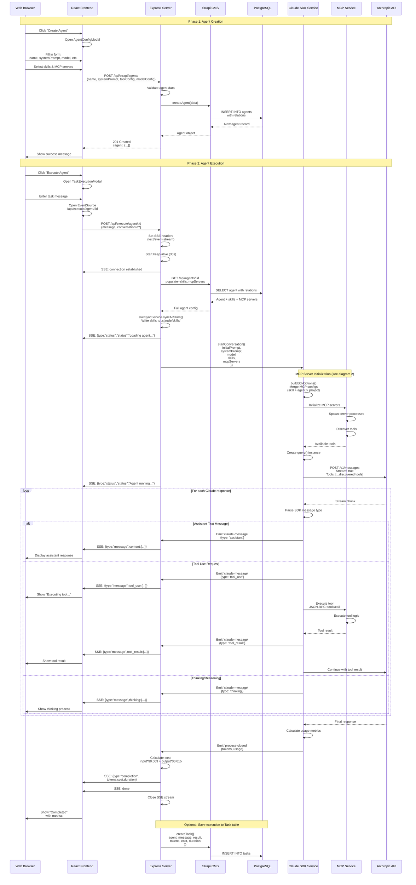

# Sequence Diagrams

## Introduction

This document provides detailed sequence diagrams showing the step-by-step interactions between components for critical system operations. These diagrams illustrate the temporal flow of messages, method calls, and data transformations across the entire stack.

## Overview

The system has four critical operational flows documented here:

1. **Agent Creation and Execution** - Complete flow from agent configuration to task execution
2. **MCP Server Connection and Tool Discovery** - How MCP servers are initialized and tools discovered
3. **Skill Management Flow** - Skill synchronization from database to filesystem
4. **Real-time SSE Communication** - Server-Sent Events streaming architecture

---

## 1. Agent Creation and Execution Flow

This sequence diagram shows the complete lifecycle of creating an agent and executing it with a task, including MCP tool integration and SSE streaming.



### Key Points

- **Three-phase flow**: Create agent → Configure execution → Stream results
- **SSE Stream Lifecycle**: Connection established → Status updates → Messages → Completion → Close
- **MCP Integration**: Tools discovered during SDK initialization, executed synchronously during conversation
- **Error Handling**: Errors sent as SSE events if stream started, otherwise JSON response
- **Cost Calculation**: Based on Claude 3.5 Sonnet pricing (input: $3/MTok, output: $15/MTok)

### SSE Event Types

| Event Type | Description | Data |
|-----------|-------------|------|
| `status` | Agent status update | `{status: string, timestamp: string}` |
| `message` | Claude SDK message | `{type: 'assistant'|'tool_use'|'tool_result', content: {...}}` |
| `completion` | Execution complete | `{tokens: {...}, cost: number, duration: number}` |
| `error` | Error occurred | `{error: string, details?: any}` |
| `done` | Stream finished | `{}` (just the string "done") |

---

## 2. MCP Server Connection and Tool Discovery

This sequence diagram details the Model Context Protocol (MCP) server initialization, connection, and tool discovery process using JSON-RPC.

```mermaid
sequenceDiagram
    participant SDK as Claude SDK Service
    participant MCP as MCP Service
    participant FileSystem as File System
    participant StrapiDB as Strapi Database
    participant Process as MCP Server Process
    participant Tool as Tool Implementation

    Note over SDK,Tool: Phase 1: Three-Tier MCP Configuration Discovery

    SDK->>SDK: buildSdkOptions()
    SDK->>FileSystem: Read .mcp.json<br/>(project root)
    FileSystem-->>SDK: Project-level config<br/>(Priority: Low)

    SDK->>StrapiDB: Load agent's MCP servers<br/>WHERE agent.id = :agentId
    StrapiDB-->>SDK: Agent-level MCP servers<br/>(Priority: Medium)

    SDK->>StrapiDB: Load skills' MCP servers<br/>WHERE skill.id IN :skillIds
    StrapiDB-->>SDK: Skill-level MCP servers<br/>(Priority: High)

    SDK->>SDK: Merge configs with precedence:<br/>Skill > Agent > Project
    SDK->>SDK: Filter out disabled servers
    SDK->>SDK: Apply env var substitution:<br/>${HOME}, ${API_KEY}, etc.

    Note over SDK,Tool: Phase 2: MCP Server Initialization

    SDK->>MCP: Initialize servers<br/>(converted to SDK format)

    loop For each MCP server config
        MCP->>MCP: Validate config<br/>(command, args, env)

        alt stdio transport (most common)
            MCP->>Process: spawn(command, args, {<br/>  stdio: ['pipe','pipe','inherit'],<br/>  env: {...process.env, ...config.env}<br/>})
            Process-->>MCP: Child process started<br/>PID: xxxxx
            MCP->>MCP: Set up stdin/stdout pipes
        else sse transport (remote)
            MCP->>Process: Connect to SSE endpoint<br/>URL: config.url
            Process-->>MCP: SSE connection established
        else http transport (polling)
            MCP->>Process: Set up HTTP polling<br/>URL: config.url
            Process-->>MCP: HTTP endpoint ready
        end

        Note over MCP,Process: JSON-RPC Initialization Handshake

        MCP->>Process: JSON-RPC Request:<br/>{<br/>  method: "initialize",<br/>  params: {<br/>    protocolVersion: "2024-11-05",<br/>    capabilities: {},<br/>    clientInfo: {name, version}<br/>  }<br/>}

        Process->>Process: Start MCP server<br/>Initialize resources

        Process-->>MCP: JSON-RPC Response:<br/>{<br/>  result: {<br/>    protocolVersion: "2024-11-05",<br/>    capabilities: {<br/>      tools: {},<br/>      resources: {}<br/>    },<br/>    serverInfo: {name, version}<br/>  }<br/>}

        MCP->>MCP: Validate protocol version
        MCP->>MCP: Store server capabilities
    end

    Note over MCP,Tool: Phase 3: Tool Discovery

    loop For each initialized server
        MCP->>Process: JSON-RPC Request:<br/>{<br/>  method: "tools/list",<br/>  params: {}<br/>}

        Process->>Tool: Query available tools
        Tool-->>Process: Tool definitions array

        Process-->>MCP: JSON-RPC Response:<br/>{<br/>  result: {<br/>    tools: [<br/>      {<br/>        name: "read_file",<br/>        description: "...",<br/>        inputSchema: {<br/>          type: "object",<br/>          properties: {...},<br/>          required: [...]<br/>        }<br/>      },<br/>      ...<br/>    ]<br/>  }<br/>}

        MCP->>MCP: Parse tool schemas
        MCP->>MCP: Validate JSON schemas
        MCP->>MCP: Store tool metadata:<br/>server name → tool mappings
    end

    MCP->>SDK: Return all discovered tools<br/>(formatted for Anthropic API)
    SDK->>SDK: Include tools in<br/>Claude API request

    Note over SDK,Tool: Phase 4: Tool Execution (during conversation)

    SDK->>SDK: Receive tool_use from Claude:<br/>{name, id, input}
    SDK->>MCP: executeTool(serverName, toolName, args)

    MCP->>MCP: Find server for tool
    MCP->>Process: JSON-RPC Request:<br/>{<br/>  method: "tools/call",<br/>  params: {<br/>    name: "read_file",<br/>    arguments: {<br/>      path: "/path/to/file"<br/>    }<br/>  }<br/>}

    Process->>Tool: Execute tool logic<br/>with arguments
    Tool->>Tool: Perform operation<br/>(e.g., read file, search, API call)

    alt Success
        Tool-->>Process: Tool result data
        Process-->>MCP: JSON-RPC Response:<br/>{<br/>  result: {<br/>    content: [<br/>      {<br/>        type: "text",<br/>        text: "File contents..."<br/>      }<br/>    ]<br/>  }<br/>}
        MCP-->>SDK: Tool result
        SDK->>SDK: Format as tool_result message
    else Error
        Tool-->>Process: Error
        Process-->>MCP: JSON-RPC Error:<br/>{<br/>  error: {<br/>    code: -32603,<br/>    message: "Internal error",<br/>    data: {...}<br/>  }<br/>}
        MCP-->>SDK: Tool error
        SDK->>SDK: Format as error message
    end

    SDK->>SDK: Send tool_result to Claude
```



### MCP Configuration Priority

1. **Skill-level** (Highest priority) - Skills can specify required MCP servers
2. **Agent-level** (Medium priority) - Agent configuration can add MCP servers
3. **Project-level** (Lowest priority) - `.mcp.json` provides default servers

When the same server name appears in multiple configs, higher priority takes precedence.

### MCP Transport Types

| Transport | Connection Method | Use Case | Example |
|-----------|------------------|----------|---------|
| **stdio** | Process stdin/stdout | Local CLI tools | `npx @modelcontextprotocol/server-filesystem` |
| **sse** | Server-Sent Events | Remote APIs | `https://api.example.com/sse` |
| **http** | HTTP polling | Remote APIs | `https://api.example.com/mcp` |
| **sdk** | In-process TypeScript | Custom tools | Direct module import |

### JSON-RPC Protocol Version

Current protocol version: `2024-11-05` (as of Claude Agent SDK)

---

## 3. Skill Management Flow

This sequence diagram shows how skills are created in Strapi, synchronized to the filesystem, and made available to the Claude Agent SDK.

```mermaid
sequenceDiagram
    participant User as Web Browser
    participant React as React Frontend
    participant Express as Express Server
    participant Strapi as Strapi CMS
    participant DB as PostgreSQL
    participant SkillSync as Skill Sync Service
    participant FileSystem as File System (.claude/skills/)
    participant SDK as Claude SDK

    Note over User,SDK: Phase 1: Skill Creation

    User->>React: Click "Create Skill"
    React->>React: Open SkillCreationModal
    User->>React: Fill skill form:<br/>name, description,<br/>category, SKILL.md content
    User->>React: Optional: Select training agent
    User->>React: Optional: Add MCP servers

    React->>Express: POST /api/strapi/skills<br/>{<br/>  name,<br/>  displayName,<br/>  description,<br/>  skillmd,<br/>  category,<br/>  version,<br/>  trainingAgent?,<br/>  mcpConfig?<br/>}

    Express->>Express: Validate skill data
    Express->>Strapi: createSkill(data)
    Strapi->>DB: INSERT INTO skills<br/>with components
    DB-->>Strapi: New skill record
    Strapi-->>Express: Skill object
    Express-->>React: 201 Created<br/>{skill: {...}}
    React->>User: Show "Skill created"

    Note over User,SDK: Phase 2: Skill Training (Optional)

    User->>React: Click "Train Skill"
    React->>React: Open SkillCreatorChatPanel
    User->>React: Provide training examples
    React->>Express: POST /api/chat/sessions<br/>{skillIds: [skillId]}
    Express->>Express: Create training session<br/>with selected agent

    loop Training iterations
        User->>React: Send training message
        React->>Express: POST /api/chat/sessions/:id/messages
        Express->>SDK: Execute with skill
        SDK-->>Express: Skill performance data
        Express->>React: Stream training results
        React->>User: Show skill execution

        User->>React: Provide feedback
        React->>Express: POST /api/strapi/skills/:id<br/>{trainingHistory: [...]}
        Express->>Strapi: Update training history
        Strapi->>DB: UPDATE skills<br/>SET training_history=...
    end

    Express->>Strapi: Update experienceScore<br/>based on training quality
    Strapi->>DB: UPDATE skills<br/>SET experience_score=X

    Note over User,SDK: Phase 3: Skill Synchronization to Filesystem

    User->>React: Execute agent with skills
    React->>Express: POST /api/execute/agent/:id<br/>or POST /api/chat/sessions

    Express->>Strapi: GET /api/agents/:id<br/>populate=skills
    Strapi->>DB: SELECT agent<br/>JOIN skills
    DB-->>Strapi: Agent with skills array
    Strapi-->>Express: [{skill1}, {skill2}, ...]

    Express->>SkillSync: syncAllSkills(skills, parameters?)

    loop For each skill
        SkillSync->>SkillSync: Validate skill data
        SkillSync->>SkillSync: Sanitize skill name<br/>(prevent path traversal)
        SkillSync->>SkillSync: Inject parameters<br/>{{param}} → actual value

        SkillSync->>SkillSync: Build YAML frontmatter:<br/>---<br/>name: skill-name<br/>description: ...<br/>version: 1.0.0<br/>category: custom<br/>---

        SkillSync->>SkillSync: Combine frontmatter + skillmd

        SkillSync->>FileSystem: mkdir .claude/skills/{skill-name}
        FileSystem-->>SkillSync: Directory created

        SkillSync->>FileSystem: writeFile<br/>.claude/skills/{skill-name}/SKILL.md
        FileSystem-->>SkillSync: File written

        SkillSync->>SkillSync: Log: ✅ Synced skill: {name}
    end

    SkillSync-->>Express: All skills synced

    Note over Express,SDK: Phase 4: SDK Skill Discovery

    Express->>SDK: startConversation({<br/>  skills: [...],<br/>  settingSources: ['project']<br/>})

    SDK->>SDK: Build SDK options:<br/>{<br/>  settingSources: ['project'],<br/>  tools: {...},<br/>  model: {...}<br/>}

    SDK->>FileSystem: Scan .claude/skills/**/SKILL.md
    FileSystem-->>SDK: Found skill files

    loop For each SKILL.md
        SDK->>FileSystem: Read SKILL.md content
        FileSystem-->>SDK: File content
        SDK->>SDK: Parse YAML frontmatter
        SDK->>SDK: Parse skill markdown
        SDK->>SDK: Register skill in SDK context
    end

    SDK->>SDK: Skills available for agent:<br/>- Skill name (from frontmatter)<br/>- Description<br/>- Version<br/>- Category

    Note over SDK: Skills can be invoked by Claude<br/>using /skill command or auto-invoked

    Note over User,SDK: Phase 5: Skill Usage in Conversation

    SDK->>SDK: Claude receives prompt

    alt Skill auto-invoked by agent
        SDK->>SDK: Agent determines skill needed
        SDK->>SDK: Load skill context from SKILL.md
        SDK->>SDK: Execute with skill instructions
        SDK->>SDK: Return skill result to Claude
    else User explicitly invokes skill
        SDK->>SDK: Parse /skill command
        SDK->>SDK: Load skill by name
        SDK->>SDK: Execute skill with provided input
        SDK->>SDK: Return result
    end

    Note over User,SDK: Phase 6: Skill Update Propagation

    User->>React: Edit skill in UI
    React->>Express: PUT /api/strapi/skills/:id<br/>{skillmd: "updated content"}
    Express->>Strapi: updateSkill(id, data)
    Strapi->>DB: UPDATE skills
    DB-->>Strapi: Updated record
    Strapi-->>Express: Updated skill
    Express-->>React: 200 OK

    Note over Express: Next execution will re-sync

    User->>React: Execute agent again
    Express->>SkillSync: syncAllSkills(skills)
    SkillSync->>FileSystem: Overwrite .claude/skills/{name}/SKILL.md
    FileSystem-->>SkillSync: Updated
    SkillSync-->>Express: Synced

    Express->>SDK: startConversation(...)
    SDK->>FileSystem: Re-read SKILL.md files
    FileSystem-->>SDK: Updated skill content
    SDK->>SDK: Use updated skill
```



### Skill Directory Structure

```
.claude/
└── skills/
    ├── code-analysis/
    │   └── SKILL.md          # Code analysis skill
    ├── bug-finder/
    │   └── SKILL.md          # Bug detection skill
    └── documentation-writer/
        └── SKILL.md          # Documentation generation skill
```

### SKILL.md Format

```markdown
---
name: code-analysis
description: Analyze code for patterns, quality, and potential improvements
version: 1.0.0
category: code-analysis
---

# Code Analysis Skill

This skill analyzes source code to identify:
- Code patterns and anti-patterns
- Potential bugs and issues
- Performance optimization opportunities
- Code quality metrics

## Usage

Provide the code to analyze and specify:
- Language (e.g., TypeScript, Python, Go)
- Focus areas (e.g., performance, security, readability)

## Example

[Tool use examples...]
```

### Parameter Injection

Skills support parameter templating:

```markdown
# Database Query Skill

Database: {{database_name}}
Table: {{table_name}}
```

Parameters provided at execution time:
```typescript
syncSkillToFilesystem(skill, {
  database_name: 'production',
  table_name: 'users'
});
```

Result:
```markdown
# Database Query Skill

Database: production
Table: users
```

---

## 4. Real-time SSE Communication

This sequence diagram illustrates the Server-Sent Events (SSE) streaming architecture used for real-time communication between Express backend and React frontend.

```mermaid
sequenceDiagram
    participant Browser as Web Browser
    participant React as React Frontend
    participant EventSource as EventSource API
    participant Nginx as Nginx Proxy
    participant Express as Express Server
    participant SDK as Claude SDK
    participant Claude as Anthropic API

    Note over Browser,Claude: Phase 1: SSE Connection Establishment

    Browser->>React: User triggers action<br/>(Execute agent, Send chat message)
    React->>React: Create EventSource instance

    React->>EventSource: new EventSource(<br/>  '/api/execute/agent/:id',<br/>  {withCredentials: true}<br/>)

    EventSource->>Nginx: GET /api/execute/agent/:id<br/>Accept: text/event-stream
    Nginx->>Express: Forward request to :3001

    Express->>Express: Route handler:<br/>execution.routes.ts
    Express->>Express: Create SSEStream instance
    Express->>Express: Set headers:<br/>Content-Type: text/event-stream<br/>Cache-Control: no-cache<br/>Connection: keep-alive<br/>X-Accel-Buffering: no

    Express->>EventSource: : SSE stream initialized\n\n<br/>(initial comment)
    Express->>Express: Start keep-alive timer<br/>(30 second interval)

    EventSource-->>React: onopen event fired
    React->>Browser: Show "Connecting..." → "Connected"

    Note over Express,Claude: Phase 2: Request Processing & SDK Initialization

    Express->>Express: Load agent configuration
    Express->>SDK: startConversation({...})
    SDK->>SDK: Initialize MCP servers
    SDK->>SDK: Discover tools

    Express->>EventSource: event: status\n<br/>data: {"type":"status","status":"Loading agent..."}\n\n
    EventSource-->>React: onmessage event<br/>{type: 'status', ...}
    React->>Browser: Update status UI

    SDK->>Claude: POST /v1/messages<br/>Stream: true

    Express->>EventSource: event: status\n<br/>data: {"type":"status","status":"Agent running..."}\n\n
    EventSource-->>React: onmessage event
    React->>Browser: Update status

    Note over Express,Claude: Phase 3: Streaming Claude Responses

    loop For each Claude stream chunk
        Claude-->>SDK: Stream chunk<br/>(content delta)
        SDK->>SDK: Parse and emit event
        SDK->>Express: EventEmitter: 'claude-message'<br/>{type: 'assistant', content: ...}

        Express->>Express: Transform to SSE format
        Express->>EventSource: event: message\n<br/>data: {"type":"message","content":{...}}\n\n

        EventSource-->>React: onmessage event<br/>{type: 'message', ...}
        React->>React: Parse message type

        alt Assistant text message
            React->>Browser: Append text to chat bubble<br/>(incremental rendering)
        else Tool use message
            React->>Browser: Show "Executing: tool_name"<br/>with input parameters
        else Tool result message
            React->>Browser: Show tool output<br/>(formatted/syntax highlighted)
        else Thinking message
            React->>Browser: Show thinking indicator<br/>with reasoning text
        end
    end

    Note over Express,EventSource: Phase 4: Keep-Alive Mechanism

    loop Every 30 seconds (while stream active)
        Express->>Express: keep-alive timer fires
        Express->>EventSource: : keep-alive\n\n<br/>(comment, not data)
        EventSource->>EventSource: Reset connection timeout

        Note over Express,EventSource: Prevents proxy/browser<br/>from closing idle connection
    end

    Note over Express,Claude: Phase 5: Stream Completion

    Claude-->>SDK: Final response<br/>(stream complete)
    SDK->>SDK: Calculate usage metrics:<br/>- Input tokens<br/>- Output tokens<br/>- Cache read/write

    SDK->>Express: EventEmitter: 'process-closed'<br/>{tokens: {...}, cost: ...}

    Express->>Express: Calculate metrics:<br/>- Total cost<br/>- Duration<br/>- Tokens used

    Express->>EventSource: event: completion\n<br/>data: {<br/>  "type":"completion",<br/>  "tokens":{"input":100,"output":50},<br/>  "cost":0.0025,<br/>  "duration":5.2<br/>}\n\n

    EventSource-->>React: onmessage event<br/>{type: 'completion', ...}
    React->>Browser: Show completion metrics

    Express->>EventSource: data: done\n\n<br/>(done signal)
    EventSource-->>React: onmessage: "done"

    Express->>Express: Clear keep-alive timer
    Express->>EventSource: res.end()<br/>(close stream)

    EventSource-->>React: onclose event
    React->>React: eventSource.close()
    React->>Browser: Update UI: "Completed"

    Note over Browser,Express: Phase 6: Error Handling

    alt Error before stream starts
        Express->>Express: Catch error
        Express->>EventSource: HTTP 500<br/>Content-Type: application/json<br/>{"error": "message"}
        EventSource-->>React: onerror event
        React->>Browser: Show error dialog
    else Error after stream starts
        Express->>Express: Catch error
        Express->>EventSource: event: error\n<br/>data: {"type":"error","error":"message"}\n\n
        EventSource-->>React: onmessage: {type: 'error'}
        React->>Browser: Show inline error
        Express->>EventSource: res.end()
        EventSource-->>React: onclose event
    end

    Note over Browser,React: Phase 7: User-Initiated Cancellation

    Browser->>React: User clicks "Cancel"
    React->>Express: POST /api/chat/sessions/:id/cancel<br/>(separate HTTP request)
    Express->>SDK: abortController.abort()
    SDK->>SDK: Stop processing
    SDK->>Claude: Cancel stream

    Express->>EventSource: event: cancelled\n<br/>data: {"type":"cancelled"}\n\n
    EventSource-->>React: onmessage: cancelled
    React->>React: eventSource.close()
    React->>Browser: Show "Cancelled by user"

    Note over Browser,Express: Phase 8: Connection Cleanup

    alt Normal completion
        Express->>Express: Stream ended gracefully
        Express->>Express: Clean up resources:<br/>- Clear timers<br/>- Remove from active streams<br/>- Close SDK query
    else Network error
        EventSource-->>React: onerror event
        React->>React: Auto-retry (3 attempts)<br/>with exponential backoff
        alt Retry succeeds
            React->>EventSource: Reconnect
        else Retry fails
            React->>Browser: Show "Connection lost"
        end
    else Client closes tab
        Browser->>EventSource: Close connection
        EventSource->>Express: Connection closed
        Express->>Express: Detect client disconnect
        Express->>SDK: Abort ongoing operations
        Express->>Express: Clean up resources
    end
```



### SSE Message Format

```
event: status
data: {"type":"status","status":"Loading agent...","timestamp":"2024-01-02T10:30:00Z"}

event: message
data: {"type":"message","content":{"type":"assistant","message":{"content":[{"type":"text","text":"Hello!"}]}}}

event: message
data: {"type":"message","content":{"type":"tool_use","id":"toolu_123","name":"read_file","input":{"path":"file.txt"}}}

event: message
data: {"type":"message","content":{"type":"tool_result","tool_use_id":"toolu_123","content":"file contents..."}}

event: completion
data: {"type":"completion","tokens":{"input":100,"output":50},"cost":0.0025,"duration":5.2}

data: done

```

### SSE Headers

**Request Headers (Client → Server):**
```
GET /api/execute/agent/123 HTTP/1.1
Accept: text/event-stream
Cache-Control: no-cache
Connection: keep-alive
```

**Response Headers (Server → Client):**
```
HTTP/1.1 200 OK
Content-Type: text/event-stream
Cache-Control: no-cache, no-transform
Connection: keep-alive
X-Accel-Buffering: no
Transfer-Encoding: chunked
```

### EventSource Lifecycle

```typescript
// React frontend SSE handling
const eventSource = new EventSource('/api/execute/agent/123', {
  withCredentials: true
});

// Connection opened
eventSource.onopen = () => {
  console.log('SSE connection established');
  setStatus('connected');
};

// Message received
eventSource.onmessage = (event) => {
  const data = JSON.parse(event.data);

  switch (data.type) {
    case 'status':
      setStatus(data.status);
      break;
    case 'message':
      appendMessage(data.content);
      break;
    case 'completion':
      showMetrics(data.tokens, data.cost);
      break;
  }

  if (event.data === 'done') {
    eventSource.close();
  }
};

// Error occurred
eventSource.onerror = (error) => {
  console.error('SSE error:', error);
  setStatus('error');
  // EventSource automatically reconnects (up to browser limit)
};

// Manual cleanup
const cleanup = () => {
  eventSource.close();
};
```

### Keep-Alive Mechanism

```typescript
// Express backend keep-alive
class SSEStream {
  private keepAliveInterval: NodeJS.Timeout | null = null;

  startKeepAlive(): void {
    this.keepAliveInterval = setInterval(() => {
      this.sendComment('keep-alive');
    }, 30000); // 30 seconds
  }

  sendComment(comment: string): void {
    this.res.write(`: ${comment}\n\n`);
  }

  close(): void {
    if (this.keepAliveInterval) {
      clearInterval(this.keepAliveInterval);
    }
    this.res.end();
  }
}
```

### Error Handling Patterns

**Before Stream Starts (No SSE headers sent):**
```typescript
try {
  // ... validation
} catch (error) {
  res.status(500).json({ error: error.message });
  return;
}

res.setHeader('Content-Type', 'text/event-stream');
// Stream started - now use SSE for errors
```

**After Stream Starts (SSE active):**
```typescript
try {
  // ... processing
} catch (error) {
  sseStream.send('error', {
    type: 'error',
    error: error.message,
    details: error.stack
  });
  sseStream.close();
}
```

### Connection Timeout & Retry

- **Browser EventSource**: Automatically reconnects on connection loss (typically 3-5 seconds)
- **Keep-Alive**: Prevents 60-second idle timeout (common in proxies/browsers)
- **Custom Retry Logic**: React can implement exponential backoff for failed connections
- **Maximum Duration**: No hard limit, but consider 5-10 minute timeout for long operations

---

## Summary

These sequence diagrams illustrate the four critical flows in the Claude Agent UI system:

1. **Agent Creation and Execution** - End-to-end flow from configuration to streaming results with SSE
2. **MCP Server Connection and Tool Discovery** - Three-tier config merging, JSON-RPC initialization, and tool execution
3. **Skill Management** - Database → Filesystem synchronization and SDK discovery
4. **Real-time SSE Communication** - Connection lifecycle, streaming, keep-alive, and error handling

### Common Patterns Across Flows

- **Event-Driven Architecture**: Services communicate via EventEmitter
- **Streaming**: SSE for real-time updates, async generators for backpressure
- **Three-Tier Config**: Skill > Agent > Project precedence
- **Error Handling**: Graceful degradation, retry logic, detailed error events
- **Cleanup**: Proper resource disposal (timers, connections, processes)

### Technology Stack

| Component | Technology | Purpose |
|-----------|-----------|---------|
| **Real-time Streaming** | Server-Sent Events (SSE) | Unidirectional server→client updates |
| **MCP Protocol** | JSON-RPC 2.0 | Tool discovery and execution |
| **Filesystem Sync** | Node.js fs/promises | Skill persistence |
| **Database** | PostgreSQL + Strapi ORM | Persistent data storage |
| **AI Integration** | Anthropic Claude SDK | Agent conversations |

---

## Related Documentation

- [System Overview](./01-system-overview.md) - High-level architecture
- [Data Flow](./02-data-flow.md) - Data flow patterns with additional sequence diagrams
- [Deployment](./03-deployment.md) - Docker infrastructure
- [Components](./04-components.md) - Service and component details

---

*Last Updated: 2026-01-02*
