# Technology Stack

## Introduction

The Claude Agent UI is built on a carefully selected technology stack that prioritizes developer experience, performance, scalability, and maintainability. This document details every technology choice, version requirements, rationale, and how each component fits into the overall architecture.

The stack follows a hybrid multi-service architecture pattern with clear separation between:
- **Frontend** (React + Vite + Tailwind)
- **Backend** (Node.js + Express + TypeScript)
- **Data Layer** (Strapi CMS + PostgreSQL)
- **Infrastructure** (Docker + Nginx)
- **AI/ML Integration** (Claude SDK + MCP)

---

## Technology Stack Summary

```mermaid
graph TB
    subgraph "Frontend Layer"
        React[React 18.2.0<br/>UI Framework]
        Vite[Vite 7.0.6<br/>Build Tool]
        TypeScript1[TypeScript 5.3.3<br/>Type Safety]
        Tailwind[Tailwind CSS 4.1.11<br/>Styling]
        RadixUI[Radix UI<br/>Component Primitives]
    end

    subgraph "Backend Layer"
        Node[Node.js 20.19.0 LTS<br/>JavaScript Runtime]
        Express[Express 4.18.2<br/>HTTP Server]
        TypeScript2[TypeScript 5.3.3<br/>Type Safety]
        ClaudeSDK[Claude Agent SDK 0.1.42<br/>AI Integration]
        MCPSDK[MCP SDK 1.20.2<br/>Tool Protocol]
    end

    subgraph "Data Layer"
        Strapi[Strapi 5.30.0<br/>Headless CMS]
        PostgreSQL[PostgreSQL 16<br/>Database]
        Knex[Knex.js<br/>Query Builder]
    end

    subgraph "Infrastructure"
        Docker[Docker<br/>Containerization]
        DockerCompose[Docker Compose<br/>Orchestration]
        Nginx[Nginx Latest<br/>Reverse Proxy]
    end

    subgraph "Development Tools"
        TSX[TSX 4.6.2<br/>TypeScript Execution]
        Pino[Pino 8.17.1<br/>Logging]
        LRU[LRU Cache 11.2.2<br/>Caching]
    end

    React --> Vite
    Vite --> TypeScript1
    React --> Tailwind
    React --> RadixUI

    Express --> Node
    Express --> TypeScript2
    Express --> ClaudeSDK
    Express --> MCPSDK
    Express --> Pino
    Express --> LRU

    Strapi --> Node
    Strapi --> PostgreSQL
    Strapi --> Knex

    Docker --> DockerCompose
    DockerCompose --> Nginx

    classDef frontend fill:#e1f5ff,stroke:#01579b,stroke-width:2px
    classDef backend fill:#f3e5f5,stroke:#4a148c,stroke-width:2px
    classDef data fill:#fff3e0,stroke:#e65100,stroke-width:2px
    classDef infra fill:#e8f5e9,stroke:#1b5e20,stroke-width:2px
    classDef tools fill:#fce4ec,stroke:#880e4f,stroke-width:2px

    class React,Vite,TypeScript1,Tailwind,RadixUI frontend
    class Node,Express,TypeScript2,ClaudeSDK,MCPSDK backend
    class Strapi,PostgreSQL,Knex data
    class Docker,DockerCompose,Nginx infra
    class TSX,Pino,LRU tools
```



---

## Core Technologies

### 1. Runtime & Language

#### Node.js 20.19.0 LTS
**Version:** `>=20.19.0` (LTS - Long Term Support)

**Why Node.js?**
- **Unified Language**: JavaScript/TypeScript across frontend and backend simplifies development
- **Event-Driven Architecture**: Perfect for real-time features (SSE streaming, chat)
- **Rich Ecosystem**: Access to 2M+ npm packages including Claude SDK and MCP SDK
- **Performance**: V8 engine provides excellent performance for I/O-bound operations
- **LTS Support**: 20.x is LTS until April 2026, providing stability and security updates

**Why Version 20.19.0?**
- Latest LTS release with critical security patches
- Required by Strapi 5.x (minimum 20.0.0)
- Native support for ES2022 features
- Improved fetch API (native HTTP client)
- Better TypeScript integration

**Role in Architecture:**
- Powers both Express backend and Strapi CMS
- Executes MCP servers via stdio transport
- Handles async I/O for database and API calls
- Streams responses from Claude API via SDK

**Version Compatibility:**
```json
"engines": {
  "node": ">=20.19.0"
}
```

---

#### TypeScript 5.3.3
**Version:** `5.3.3` (latest stable)

**Why TypeScript?**
- **Type Safety**: Catch errors at compile time, not runtime
- **Better IDE Support**: IntelliSense, autocomplete, and refactoring tools
- **Self-Documenting Code**: Types serve as inline documentation
- **Safer Refactoring**: Confidence when making large-scale changes
- **Framework Support**: React, Express, and Strapi all have excellent TypeScript support

**Why Version 5.3.3?**
- Latest stable release with all recent features
- Full support for ES2022+ features
- Improved type inference and narrowing
- Better error messages
- Decorator support for Strapi

**TypeScript Configuration:**
```json
{
  "compilerOptions": {
    "target": "ES2022",
    "module": "ES2022",
    "moduleResolution": "node",
    "jsx": "react-jsx",
    "strict": true,
    "esModuleInterop": true,
    "declaration": true,
    "sourceMap": true
  }
}
```

**Role in Architecture:**
- Primary language for all custom code (frontend + backend)
- Type definitions for Claude SDK, MCP SDK, Strapi
- Interfaces for API contracts between layers
- Strong typing for database models

---

## Frontend Technologies

### 2. UI Framework

#### React 18.2.0
**Version:** `^18.2.0`

**Why React?**
- **Component-Based**: Reusable UI components align with our modular architecture
- **Virtual DOM**: Efficient updates for real-time streaming UI
- **Rich Ecosystem**: Vast library ecosystem (Radix UI, React Router, etc.)
- **Concurrent Features**: Supports Suspense, transitions, and streaming rendering
- **Strong Community**: Large developer community, extensive documentation

**Why Version 18.2.0?**
- Concurrent rendering features for better UX during streaming
- Automatic batching for better performance
- New hooks (useId, useTransition) useful for our use cases
- SSR improvements (though we use SPA mode)
- Stable release with all 18.x features

**Key Features Used:**
- **Hooks**: useState, useEffect, useContext, useCallback, useMemo
- **Context API**: ChatDisplayContext for cross-component state
- **Suspense**: Lazy loading for code splitting
- **React Router**: Client-side routing with react-router-dom 6.22.0

**Role in Architecture:**
- Powers entire frontend UI (48+ components)
- Manages client-side state and routing
- Renders real-time SSE updates from Express
- Communicates with backend via Axios and EventSource

---

### 3. Build Tools

#### Vite 7.0.6
**Version:** `^7.0.6` (latest major version)

**Why Vite?**
- **Lightning Fast**: ESBuild-based dev server starts instantly
- **Hot Module Replacement (HMR)**: Instant updates during development
- **Optimized Builds**: Rollup-based production builds with tree-shaking
- **Native ES Modules**: No bundling during development
- **Better DX**: Faster than Webpack for our use case

**Why Version 7.0.6?**
- Latest stable release
- Native support for TypeScript without additional plugins
- Improved build performance over Vite 6.x
- Better CSS handling (supports Tailwind 4.x)
- Smaller bundle sizes

**Vite Configuration Highlights:**
```javascript
{
  root: 'src/web',
  plugins: [react(), tailwindcss()],
  build: {
    outDir: '../../dist/web',
    rollupOptions: { /* ... */ }
  },
  server: {
    port: 3000,
    proxy: {
      '/api': 'http://localhost:3001'
    }
  }
}
```

**Role in Architecture:**
- Development server with HMR for rapid iteration
- Production build optimization and code splitting
- Proxy API requests to Express during development
- Asset optimization (images, fonts, etc.)

---

#### TSX 4.6.2
**Version:** `^4.6.2`

**Why TSX?**
- **Fast TypeScript Execution**: ESBuild-based TypeScript execution without compilation
- **Watch Mode**: Auto-restart on file changes during development
- **Simple**: Drop-in replacement for `ts-node` with better performance
- **No Config**: Works out of the box with our TypeScript setup

**Role in Architecture:**
- Runs Express backend in development mode (`npm run dev:server`)
- Executes migration scripts and utilities
- Used in npm scripts for TypeScript file execution

---

### 4. Styling & UI Components

#### Tailwind CSS 4.1.11
**Version:** `^4.1.11` (latest v4)

**Why Tailwind CSS?**
- **Utility-First**: Rapid UI development without writing custom CSS
- **Consistency**: Design system built into utility classes
- **Responsive**: Mobile-first responsive design made easy
- **Performance**: PurgeCSS removes unused styles in production
- **Customization**: Fully configurable via tailwind.config.js

**Why Version 4.1.11?**
- New Oxide engine (Rust-based) for 10x faster builds
- Better TypeScript support
- Improved JIT compiler
- Native CSS layers support
- Container queries support

**Tailwind Configuration:**
```javascript
export default {
  content: [
    "./src/web/**/*.{js,ts,jsx,tsx}",
    "./src/web/index.html"
  ]
}
```

**Key Features Used:**
- Utility classes for spacing, colors, typography
- Responsive breakpoints (sm, md, lg, xl, 2xl)
- Dark mode support (class-based)
- Custom animations and transitions
- Typography plugin for markdown rendering

**Role in Architecture:**
- Primary styling solution for all React components
- Ensures visual consistency across the application
- Responsive design for all screen sizes
- Integrated with Vite for optimal build performance

---

#### Radix UI (Multiple Packages)
**Versions:**
- `@radix-ui/react-dialog`: `^1.1.14`
- `@radix-ui/react-select`: `^2.2.5`
- `@radix-ui/react-checkbox`: `^1.3.2`
- `@radix-ui/react-switch`: `^1.2.5`
- `@radix-ui/react-tooltip`: `^1.2.7`
- `@radix-ui/react-popover`: `^1.1.14`
- `@radix-ui/react-tabs`: `^1.1.12`
- `@radix-ui/react-label`: `^2.1.7`
- `@radix-ui/react-slot`: `^1.2.3`

**Why Radix UI?**
- **Accessibility**: WCAG 2.1 compliant, keyboard navigation, screen reader support
- **Unstyled**: Headless components that we style with Tailwind
- **Composable**: Building blocks for complex UI patterns
- **Production Ready**: Used by companies like Vercel, Linear, and Supabase
- **Well Maintained**: Regular updates and excellent documentation

**Components Used:**
- **Dialog**: Agent configuration modals, skill creation modals
- **Select**: Model selection, MCP server selection, dropdown menus
- **Checkbox**: Multi-select options, feature toggles
- **Switch**: Boolean settings (enabled/disabled agents)
- **Tooltip**: Contextual help and information
- **Popover**: Contextual menus and additional information
- **Tabs**: Organize settings and configuration panels
- **Label**: Form field labels with proper associations

**Role in Architecture:**
- Foundation for all complex UI components
- Ensures accessibility compliance
- Provides consistent interaction patterns
- Styled with Tailwind for visual customization

---

#### Lucide React 0.536.0
**Version:** `^0.536.0`

**Why Lucide Icons?**
- **Consistent Design**: Clean, modern icon set
- **Tree-Shakeable**: Only icons you use are bundled
- **React Native**: Components, not SVG files
- **Customizable**: Size, color, stroke width all configurable
- **Large Library**: 1000+ icons covering all use cases

**Role in Architecture:**
- Icons throughout the UI (navigation, buttons, status indicators)
- Visual feedback for actions and states
- Improves UX with visual cues

---

## Backend Technologies

### 5. HTTP Server & API Framework

#### Express.js 4.18.2
**Version:** `^4.18.2`

**Why Express?**
- **Minimalist**: Unopinionated framework allows custom architecture
- **Middleware Ecosystem**: Rich ecosystem for auth, logging, compression, etc.
- **SSE Support**: Native support for Server-Sent Events (critical for our use case)
- **Performance**: Fast and lightweight
- **Mature**: Battle-tested in production for over a decade

**Why Version 4.18.2?**
- Latest stable 4.x release
- Security patches for vulnerabilities
- Better TypeScript support via @types/express
- Compatible with all our middleware

**Key Middleware Used:**
- **CORS** (`cors` 2.8.5): Cross-origin resource sharing
- **Multer** (`multer` 2.0.2): File upload handling
- **Body Parser**: JSON and URL-encoded request parsing (built-in)

**Express Architecture:**
```
src/
├── server.ts              # Express app initialization
├── routes/                # 68+ API route handlers
│   ├── agents.ts
│   ├── skills.ts
│   ├── mcp-servers.ts
│   ├── chat.ts
│   └── ...
├── services/              # 26 business logic services
│   ├── claude-sdk-service.ts
│   ├── mcp-service.ts
│   ├── strapi-client.ts
│   └── ...
└── middleware/            # Custom middleware
    ├── error-handler.ts
    └── ...
```

**Role in Architecture:**
- HTTP server handling all API requests from frontend
- Business logic orchestration between services
- SSE streaming for real-time agent output
- File system operations (read agents, skills, MCP configs)
- Middleware pipeline for logging, CORS, error handling

---

### 6. AI & ML Integration

#### Anthropic Claude Agent SDK 0.1.42
**Version:** `^0.1.42`

**Why Claude Agent SDK?**
- **Official SDK**: Built and maintained by Anthropic
- **Agent Execution**: High-level abstraction for agent conversations
- **Tool Integration**: Native support for Claude's tool use (MCP)
- **Streaming**: Built-in streaming support for real-time responses
- **Type Safety**: Full TypeScript definitions

**Why Version 0.1.42?**
- Latest stable release with bug fixes
- Improved MCP tool integration
- Better error handling
- Performance improvements

**Claude Models Supported:**
- **Claude 3.5 Sonnet**: Primary model (balanced performance/cost)
- **Claude 3 Opus**: High-capability tasks
- **Claude 3 Haiku**: Fast, cost-effective tasks

**Key Features Used:**
- Conversation management with context
- Streaming responses
- MCP tool integration
- Skill injection
- Agent configuration (system prompts, tools, model settings)

**Role in Architecture:**
- Core AI engine powering all agent conversations
- Interfaces with Anthropic API (HTTPS streaming)
- Loads MCP tools dynamically via MCP Service
- Streams responses to Express SSE endpoints
- Manages conversation history and context

---

#### Model Context Protocol (MCP) SDK 1.20.2
**Version:** `^1.20.2`

**Why MCP SDK?**
- **Standardized Protocol**: Industry-standard for AI tool integration
- **Transport Agnostic**: Supports stdio, SSE, HTTP, and SDK transports
- **Tool Discovery**: Dynamic tool discovery from MCP servers
- **JSON-RPC 2.0**: Standard protocol for request/response
- **Extensible**: Easy to add custom MCP servers

**Why Version 1.20.2?**
- Latest stable release
- Bug fixes for stdio transport
- Improved error handling
- Better TypeScript definitions

**MCP Transports Supported:**
1. **stdio**: External processes via stdin/stdout (most common)
   - Example: `@modelcontextprotocol/server-filesystem`
2. **sse**: Server-Sent Events over HTTP
   - Example: Remote MCP servers
3. **http**: HTTP polling
   - Example: REST-based MCP servers
4. **sdk**: In-process TypeScript/JavaScript servers
   - Example: Custom Node.js MCP servers

**MCP Servers Used:**
- `@modelcontextprotocol/server-filesystem`: File system access
- `@modelcontextprotocol/server-brave-search`: Web search
- `@modelcontextprotocol/server-github`: GitHub integration
- Custom MCP servers per user configuration

**Role in Architecture:**
- Manages MCP server connections and lifecycle
- Discovers available tools from connected servers
- Executes tool calls via JSON-RPC
- Three-tier configuration (project, agent, skill levels)
- Integrates with Claude SDK for tool use

---

### 7. Logging & Monitoring

#### Pino 8.17.1
**Version:** `^8.17.1`

**Why Pino?**
- **Performance**: One of the fastest Node.js loggers (10x faster than Winston)
- **Structured Logging**: JSON-formatted logs for easy parsing
- **Low Overhead**: Minimal impact on application performance
- **Child Loggers**: Contextual logging with inherited properties
- **Production Ready**: Used by Fastify, Strapi, and other major frameworks

**Why Version 8.17.1?**
- Latest stable v8 release
- Better error serialization
- Improved log levels
- Node.js 20 compatibility

**Logging Configuration:**
```javascript
{
  level: process.env.LOG_LEVEL || 'info',
  transport: {
    target: 'pino-pretty',
    options: { colorize: true }
  }
}
```

**Log Levels Used:**
- **trace**: Debugging information
- **debug**: Development diagnostics
- **info**: General information (default)
- **warn**: Warnings and potential issues
- **error**: Error conditions
- **fatal**: Critical failures

**Role in Architecture:**
- Structured logging throughout Express backend
- Request/response logging
- Error tracking and debugging
- Performance monitoring
- Audit trail for operations

---

### 8. Caching & Performance

#### LRU Cache 11.2.2
**Version:** `^11.2.2`

**Why LRU Cache?**
- **Memory Efficient**: Least Recently Used eviction policy
- **TTL Support**: Time-to-live for cache entries
- **Size Limits**: Configurable max size and max age
- **Performance**: O(1) get/set operations
- **Simple API**: Easy to integrate

**Why Version 11.2.2?**
- Latest major version
- Better TypeScript support
- Improved memory management
- Bug fixes

**Cache Configuration:**
```javascript
{
  max: 500,           // Max 500 items
  ttl: 1000 * 60 * 5, // 5-minute TTL
  updateAgeOnGet: true
}
```

**Caching Strategy:**
- **Strapi Client Cache**: Reduce database load for frequently accessed data
  - Agents, skills, MCP servers cached for 5 minutes
  - Invalidation on updates
- **Conversation Cache**: In-memory conversation state

**Role in Architecture:**
- Reduces load on Strapi and PostgreSQL
- Improves API response times
- Caches agent configurations, skills, MCP tools
- TTL ensures data freshness

---

## Data Layer Technologies

### 9. Headless CMS

#### Strapi 5.30.0
**Version:** `^5.30.0` (latest v5)

**Why Strapi?**
- **Headless CMS**: REST API out of the box for all content types
- **Admin Panel**: Built-in admin UI for content management
- **Customizable**: Flexible content types and relationships
- **Plugin Ecosystem**: Rich ecosystem for extending functionality
- **PostgreSQL Support**: Native support for our database choice
- **Auto-Generated API**: CRUD endpoints automatically created

**Why Version 5.30.0?**
- Latest stable v5 release
- Better performance than v4
- Improved TypeScript support
- New content API features
- Better security defaults

**Content Types Defined:**
1. **Agent**: AI agent configurations
2. **Skill**: Reusable skills and training data
3. **MCP Server**: MCP server configurations
4. **MCP Tool**: Discovered tools from MCP servers
5. **Chat Session**: Chat conversation sessions
6. **Chat Message**: Individual chat messages
7. **Task**: Agent execution tasks and results

**Strapi Architecture:**
```
backend/
├── src/
│   ├── api/                    # Content types
│   │   ├── agent/
│   │   ├── skill/
│   │   ├── mcp-server/
│   │   ├── mcp-tool/
│   │   ├── chat-session/
│   │   ├── chat-message/
│   │   └── task/
│   ├── components/             # Reusable components
│   └── extensions/             # Custom extensions
├── config/                     # Strapi configuration
└── database/                   # Database config
```

**Role in Architecture:**
- Provides REST API for all data access
- Admin panel for manual data management
- Handles authentication and authorization
- Manages database schema and migrations
- Serves as single source of truth for all data

---

### 10. Database

#### PostgreSQL 16 (Alpine)
**Version:** `16-alpine` (Docker image: `postgres:16-alpine`)

**Why PostgreSQL?**
- **Reliability**: ACID compliance, data integrity
- **Performance**: Excellent query performance with indexes
- **Scalability**: Handles millions of records efficiently
- **JSON Support**: Native JSONB for flexible schema fields
- **Full-Text Search**: Built-in text search capabilities
- **Mature**: 30+ years of development and optimization

**Why Version 16?**
- Latest major release (September 2023)
- Improved query performance
- Better JSON/JSONB performance
- Logical replication improvements
- Better monitoring and observability

**Why Alpine Image?**
- Smaller image size (~200MB vs ~300MB)
- Faster container startup
- Same PostgreSQL functionality
- Security: Minimal attack surface

**Database Configuration:**
```yaml
environment:
  POSTGRES_DB: claude_agent_ui
  POSTGRES_USER: postgres
  POSTGRES_PASSWORD: ${POSTGRES_PASSWORD}
  POSTGRES_INITDB_ARGS: "--encoding=UTF8 --locale=en_US.UTF-8"
  PGDATA: /var/lib/postgresql/data/pgdata
```

**Database Schema:**
- 7 main tables (via Strapi content types)
- Multiple component tables (via Strapi components)
- Relationships with foreign keys
- Indexes on frequently queried fields
- JSONB columns for flexible metadata

**Role in Architecture:**
- Primary data persistence layer
- Stores all agents, skills, MCP servers, chat data
- Queried by Strapi via Knex.js ORM
- Backup and restore via pg_dump/pg_restore
- Exposed on port 5433 for development access

---

#### Knex.js (via Strapi)
**Version:** Latest (managed by Strapi)

**Why Knex.js?**
- **Query Builder**: SQL query builder for Node.js
- **Database Agnostic**: Supports PostgreSQL, MySQL, SQLite
- **Migrations**: Schema migration support
- **Type Safety**: TypeScript definitions available
- **Used by Strapi**: Strapi's default ORM

**Role in Architecture:**
- Strapi uses Knex.js for all database queries
- Handles connection pooling
- Executes migrations for schema changes
- Provides transaction support

---

## Infrastructure Technologies

### 11. Containerization & Orchestration

#### Docker
**Version:** Latest stable Docker Engine

**Why Docker?**
- **Consistency**: Same environment across dev, staging, production
- **Isolation**: Each service runs in its own container
- **Portability**: Deploy anywhere Docker runs
- **Resource Management**: CPU and memory limits per container
- **Easy Scaling**: Scale services independently

**Docker Images Used:**
- **PostgreSQL**: `postgres:16-alpine`
- **Strapi**: Custom build from `./backend/Dockerfile`
- **Express**: Custom build from `./Dockerfile.express`
- **Frontend**: Custom build from `./Dockerfile.frontend` (Nginx + React build)

**Dockerfile Best Practices:**
- Multi-stage builds for smaller images
- Non-root users for security
- Layer caching optimization
- .dockerignore for faster builds

**Role in Architecture:**
- Containerizes all services for consistent deployment
- Provides resource isolation
- Simplifies deployment and scaling
- Enables local development environment identical to production

---

#### Docker Compose
**Version:** Latest stable Docker Compose

**Why Docker Compose?**
- **Multi-Container Apps**: Defines all services in one file
- **Networking**: Automatic service discovery and networking
- **Volume Management**: Persistent data storage
- **Environment Variables**: Centralized configuration
- **Development Workflow**: One command to start entire stack

**Docker Compose Services:**
1. **postgres**: PostgreSQL 16 database
2. **strapi**: Strapi CMS on Node.js 20
3. **express**: Express backend on Node.js 20
4. **frontend**: Nginx + React SPA

**Docker Networks:**
- **backend**: PostgreSQL, Strapi, Express (database access)
- **frontend**: Frontend, Strapi, Express (public-facing)

**Docker Volumes:**
- **postgres_data**: PostgreSQL data (persistent, critical)
- **strapi_uploads**: Uploaded files (persistent)
- **strapi_cache**: Strapi cache (ephemeral)
- **express_cache**: Express cache (ephemeral)
- **nginx_cache**: Nginx cache (ephemeral)

**Role in Architecture:**
- Orchestrates all containers in development and production
- Manages service dependencies and startup order
- Configures networking between services
- Manages persistent volumes for data storage

---

#### Nginx
**Version:** Latest stable (Alpine-based in production)

**Why Nginx?**
- **High Performance**: Can handle 10,000+ concurrent connections
- **Reverse Proxy**: Routes requests to Express and Strapi
- **Static File Serving**: Efficient serving of React build files
- **SSL/TLS Termination**: HTTPS support in production
- **Gzip Compression**: Reduces bandwidth usage
- **Caching**: Static asset caching for performance

**Nginx Configuration:**
```nginx
server {
  listen 80;

  # Serve React SPA
  location / {
    root /usr/share/nginx/html;
    try_files $uri /index.html;
  }

  # Proxy /api/* to Express
  location /api/ {
    proxy_pass http://express:3001;
    proxy_http_version 1.1;
    proxy_set_header Upgrade $http_upgrade;
    proxy_set_header Connection 'upgrade';
  }

  # Proxy /strapi/* to Strapi
  location /strapi/ {
    proxy_pass http://strapi:1337;
  }
}
```

**Role in Architecture:**
- Entry point for all HTTP/HTTPS requests
- Serves React SPA static files
- Reverse proxies API requests to Express (port 3001)
- Reverse proxies CMS requests to Strapi (port 1337)
- Handles SSE streaming (keeps connections alive)
- Provides gzip compression and caching

---

## Development Tools

### 12. Package Management

#### npm (Node Package Manager)
**Version:** `>=6.0.0` (comes with Node.js)

**Why npm?**
- **Standard**: Default package manager for Node.js
- **Large Registry**: Access to 2M+ packages
- **Workspaces**: Supports monorepo setups
- **Scripts**: npm scripts for build, test, deploy
- **Lock Files**: package-lock.json for deterministic installs

**Key npm Scripts:**
```json
{
  "dev": "Start frontend + backend concurrently",
  "dev:server": "Start Express with tsx watch",
  "dev:frontend": "Start Vite dev server",
  "build": "Build frontend + backend for production",
  "start": "Run production server",
  "test": "Run all tests"
}
```

**Role in Architecture:**
- Manages all dependencies (50+ packages)
- Runs build and dev scripts
- Ensures consistent dependency versions across environments

---

### 13. Additional Key Libraries

#### Axios 1.13.1
**Version:** `^1.13.1`

**Why Axios?**
- **Promise-Based**: Modern async/await API
- **Request/Response Interceptors**: Add auth headers, logging
- **Error Handling**: Better error handling than fetch
- **Browser Support**: Works in all modern browsers
- **TypeScript**: Full TypeScript support

**Role in Architecture:**
- Frontend HTTP client for API calls to Express and Strapi
- Centralized error handling
- Request/response logging

---

#### EventSource (SSE)
**Version:** `eventsource` 4.0.0 (Node.js), native in browser

**Why Server-Sent Events?**
- **Unidirectional Streaming**: Server → Client (perfect for our use case)
- **Built-in Reconnection**: Auto-reconnects on connection loss
- **Simple Protocol**: Plain HTTP, no WebSocket complexity
- **Works Through Proxies**: Unlike WebSockets, works through most proxies
- **Native Browser Support**: No library needed in browser

**Role in Architecture:**
- Real-time streaming of agent execution output
- Chat message streaming
- Task progress updates
- System notifications

---

#### React Router DOM 6.22.0
**Version:** `^6.22.0`

**Why React Router?**
- **Standard**: De facto routing library for React
- **Declarative**: Route configuration in JSX
- **Nested Routes**: Supports complex layouts
- **Code Splitting**: Lazy load routes
- **TypeScript**: Full type safety

**Routes Defined:**
- `/`: Landing page
- `/agents`: Agent management
- `/skills`: Skill management
- `/mcp-servers`: MCP server configuration
- `/commands`: Slash commands
- `/settings`: Application settings

**Role in Architecture:**
- Client-side routing in React SPA
- Navigation between pages
- Route-based code splitting

---

#### React Markdown 10.1.0
**Version:** `^10.1.0`

**Why React Markdown?**
- **Safe**: XSS protection built-in
- **Extensible**: Plugin system for custom rendering
- **Syntax Highlighting**: Integration with react-syntax-highlighter
- **Custom Components**: Custom renderers for headings, links, code blocks

**Role in Architecture:**
- Renders agent responses with markdown formatting
- Displays skill documentation
- Shows formatted chat messages

---

#### Zod 3.25.76
**Version:** `^3.25.76`

**Why Zod?**
- **TypeScript-First**: Schema validation with type inference
- **Composable**: Build complex schemas from simple ones
- **Error Messages**: Clear, actionable validation errors
- **Runtime Safety**: Validates data at runtime

**Role in Architecture:**
- Validates API request/response data
- Ensures type safety at runtime
- Provides schema validation for forms

---

## Version Compatibility Matrix

| Technology | Minimum Version | Recommended | Notes |
|-----------|----------------|-------------|-------|
| **Node.js** | 20.19.0 | 20.19.5 | LTS until April 2026 |
| **npm** | 6.0.0 | 10.x | Comes with Node.js |
| **PostgreSQL** | 16.0 | 16.x | Latest stable |
| **Docker** | 20.10.0 | 24.x | Latest stable |
| **Docker Compose** | 2.0.0 | 2.x | Latest stable |
| **TypeScript** | 5.3.0 | 5.3.3 | ES2022 support |
| **React** | 18.2.0 | 18.2.0 | Concurrent features |
| **Strapi** | 5.30.0 | 5.30.0 | v5 required |
| **Express** | 4.18.0 | 4.18.2 | v4 stable |
| **Vite** | 7.0.0 | 7.0.6 | Latest major |
| **Tailwind CSS** | 4.1.0 | 4.1.11 | Oxide engine |

---

## Technology Decision Rationale

### Why Hybrid Architecture (Strapi + Express)?

**Why not just Express with a traditional ORM?**
- ❌ **More boilerplate**: Would need to build admin UI, API routes, auth
- ❌ **Slower development**: More time writing CRUD code
- ❌ **No admin panel**: No built-in UI for data management

**Why not just Strapi?**
- ❌ **Limited streaming**: Strapi not optimized for SSE streaming
- ❌ **Complex business logic**: Better handled in custom Express services
- ❌ **Claude SDK integration**: Easier in Express than Strapi plugin

**Why the hybrid approach?**
- ✅ **Best of both worlds**: Strapi for CRUD, Express for business logic
- ✅ **Separation of concerns**: Clear boundaries between data and logic
- ✅ **Faster development**: Auto-generated API + custom logic
- ✅ **Flexibility**: Each layer optimized for its purpose

---

### Why Server-Sent Events over WebSockets?

**SSE Advantages:**
- ✅ **Simpler protocol**: Plain HTTP, no handshake
- ✅ **Auto-reconnection**: Built-in reconnection logic
- ✅ **Works through proxies**: Better firewall compatibility
- ✅ **Unidirectional**: Perfect for server → client streaming
- ✅ **Native browser support**: No library needed

**WebSocket Disadvantages for Our Use Case:**
- ❌ **Bidirectional**: We don't need client → server streaming
- ❌ **More complex**: Requires WebSocket library and handshake
- ❌ **Proxy issues**: Some proxies block WebSocket connections

---

### Why PostgreSQL over MongoDB?

**PostgreSQL Advantages:**
- ✅ **ACID compliance**: Strong consistency guarantees
- ✅ **Relational data**: Our data has clear relationships (agents → tasks)
- ✅ **JSON support**: JSONB for flexible fields where needed
- ✅ **Full-text search**: Built-in search capabilities
- ✅ **Strapi support**: First-class support in Strapi

**MongoDB Disadvantages:**
- ❌ **Weaker consistency**: Eventual consistency can cause issues
- ❌ **No joins**: Would need application-level joins
- ❌ **Less mature tooling**: Fewer admin tools

---

### Why Docker over Bare Metal?

**Docker Advantages:**
- ✅ **Consistency**: Same environment everywhere
- ✅ **Isolation**: Services don't interfere
- ✅ **Easy setup**: One command to start entire stack
- ✅ **Portability**: Deploy anywhere
- ✅ **Resource limits**: Control CPU/memory per service

---

## Future Considerations

### Potential Technology Updates

#### Short Term (3-6 months)
- **Monitoring**: Add Prometheus + Grafana for metrics
- **Tracing**: OpenTelemetry for distributed tracing
- **Testing**: Vitest for unit tests, Playwright for E2E

#### Medium Term (6-12 months)
- **Caching Layer**: Redis for distributed caching
- **Message Queue**: Bull/BullMQ for async job processing
- **Load Balancer**: HAProxy or Traefik for multi-instance deployments

#### Long Term (12+ months)
- **Kubernetes**: Migrate from Docker Compose to K8s for scaling
- **CDN**: CloudFlare or AWS CloudFront for static assets
- **Database Read Replicas**: PostgreSQL read replicas for scaling

---

### Version Upgrade Strategy

#### Node.js LTS Policy
- Stay on LTS versions (currently 20.x)
- Upgrade to next LTS (22.x) in October 2024
- Always use latest patch version

#### Dependency Updates
- **Patch updates**: Apply immediately (security fixes)
- **Minor updates**: Monthly review and update
- **Major updates**: Quarterly evaluation, test thoroughly

#### Breaking Changes
- Test in staging environment first
- Review changelog for breaking changes
- Update documentation accordingly
- Communicate changes to team

---

## Development Environment Requirements

### Required Software

1. **Node.js 20.19.0+**
   - Download from [nodejs.org](https://nodejs.org/)
   - Use nvm for version management

2. **Docker Desktop**
   - Required for local development
   - Version 20.10.0+ (24.x recommended)

3. **Git**
   - Version control
   - Version 2.x+

4. **Code Editor**
   - VS Code (recommended)
   - Extensions: ESLint, Prettier, TypeScript, Docker

### Optional Tools

- **Postman/Insomnia**: API testing
- **pgAdmin**: PostgreSQL GUI
- **Docker Desktop**: Container management GUI

---

## Performance Characteristics

### Build Times

| Operation | Time | Notes |
|-----------|------|-------|
| **Frontend Dev Server** | <2s | Vite HMR |
| **Backend Dev Server** | <3s | TSX watch mode |
| **Frontend Production Build** | 15-30s | Vite + Rollup |
| **Backend Production Build** | 10-20s | TypeScript compilation |
| **Docker Compose Up** | 30-60s | First time (image pulls) |
| **Docker Compose Up (cached)** | 10-20s | With cached images |

### Runtime Performance

| Metric | Target | Actual |
|--------|--------|--------|
| **API Response Time** | <100ms | 50-150ms |
| **SSE Stream Latency** | <50ms | 20-100ms |
| **Frontend Page Load** | <2s | 1-3s |
| **Database Query** | <10ms | 5-20ms |
| **Cold Start (Docker)** | <60s | 30-90s |

---

## Security Considerations

### Dependency Security

- **npm audit**: Run weekly
- **Dependabot**: Enabled on GitHub
- **OWASP Dependency Check**: Monthly review

### Container Security

- **Non-root users**: All containers run as non-root
- **Minimal images**: Alpine Linux for smaller attack surface
- **Version pinning**: Pin specific versions in Dockerfile
- **Security scanning**: Docker Scout enabled

### Application Security

- **Environment variables**: Secrets in .env (not committed)
- **CORS**: Configured per environment
- **Rate limiting**: Express rate limiter middleware
- **Input validation**: Zod schemas for all inputs

---

## Summary

The Claude Agent UI technology stack is carefully architected for:

1. **Developer Experience**
   - TypeScript for type safety
   - Vite for fast builds
   - Hot reload for rapid iteration

2. **Performance**
   - LRU caching reduces database load
   - SSE streaming for real-time updates
   - Optimized production builds

3. **Scalability**
   - Containerized architecture
   - Horizontal scaling ready
   - Database optimization

4. **Maintainability**
   - Clear separation of concerns
   - Service-oriented architecture
   - Comprehensive documentation

5. **Reliability**
   - Type safety throughout
   - Health checks for all services
   - Graceful error handling

This stack provides a solid foundation for building, scaling, and maintaining a production-ready AI agent management platform.

---

## Related Documentation

- [System Overview](./01-system-overview.md) - High-level architecture
- [Component Architecture](./04-components.md) - Service layer details
- [Deployment Architecture](./03-deployment.md) - Docker and infrastructure
- [Data Flow](./02-data-flow.md) - How data moves through the stack

---

*Last Updated: 2026-01-02*
