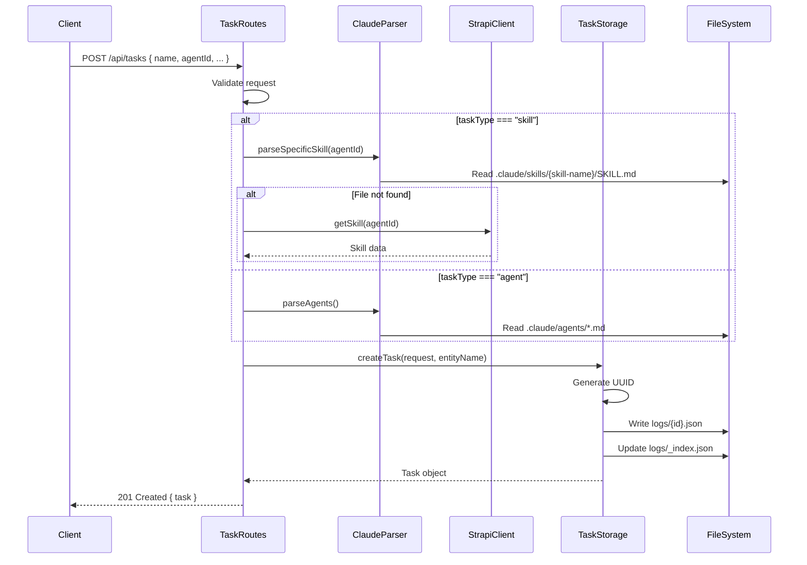

# 1. Task Oluşturma (POST /api/tasks)

Task oluşturma, skill execution sürecinin ilk adımıdır. Bu adımda kullanıcı hangi skill'i hangi input'larla çalıştırmak istediğini backend'e bildirir.

## 📍 Endpoint

```
POST /api/tasks
Content-Type: application/json
```

## 📥 Request Format

### Request Body

```json
{
  "name": "Task Name",
  "description": "Optional task description",
  "agentId": "skill-id-or-agent-id",
  "taskType": "skill",
  "userPrompt": "User input or prompt",
  "inputValues": {
    "paramKey1": "value1",
    "paramKey2": "value2"
  },
  "permissionMode": "bypass",
  "directory": "/path/to/project"
}
```

### Alan Açıklamaları

| Alan | Tip | Zorunlu | Açıklama |
|------|-----|---------|----------|
| `name` | string | ✅ | Task'ın görünen adı (UI'da gösterilir) |
| `description` | string | ❌ | Task açıklaması (isteğe bağlı) |
| `agentId` | string | ✅ | Skill veya Agent'ın Strapi document ID'si |
| `taskType` | string | ❌ | `"skill"` veya `"agent"` (default: `"agent"`) |
| `userPrompt` | string | ✅ | Kullanıcının input'u / prompt'u |
| `inputValues` | object | ❌ | Skill template parametreleri (key-value pairs) |
| `permissionMode` | string | ❌ | `"default"`, `"bypass"`, veya `"auto"` (default: `"default"`) |
| `directory` | string | ❌ | Çalışma dizini (default: `process.cwd()`) |

### Task Type Farkları

#### `taskType: "skill"` (Forced Execution)
- Kullanıcı önceden bir skill seçer
- SADECE bu skill çalıştırılır
- Claude başka skillleri göremez
- Isolation level: **full**

#### `taskType: "agent"` (Autonomous Execution)
- Agent birden fazla skill kullanabilir
- Claude ihtiyacına göre skill seçer
- Daha esnek ama daha az kontrollü

## 📤 Response Format

### Success Response (201 Created)

```json
{
  "task": {
    "id": "8326d695-33ca-4915-a31f-2eaeeb8b3ba1",
    "name": "Task Name",
    "description": "Optional task description",
    "agentId": "s59hc06euvds718iniq307mh",
    "agentName": "web-to-markdown-ts",
    "taskType": "skill",
    "status": "pending",
    "userPrompt": "User input or prompt",
    "inputValues": {
      "paramKey1": "value1",
      "paramKey2": "value2"
    },
    "permissionMode": "bypass",
    "createdAt": "2025-11-02T07:28:37.928Z",
    "directory": "C:/Users/Ali/Documents/Projects/claude_agent_ui"
  }
}
```

### Error Responses

#### 400 Bad Request - Eksik Alan

```json
{
  "error": "Missing required fields: name, agentId, userPrompt"
}
```

#### 404 Not Found - Skill Bulunamadı

```json
{
  "error": "Skill not found"
}
```

#### 500 Internal Server Error

```json
{
  "error": "Internal server error",
  "message": "Error details..."
}
```

## 🔄 Kod Akışı

### Kod Referansı
**Dosya:** `src/routes/task.routes.ts`
**Satırlar:** 264-329

### Step 1: Request Validation

**Kod:** Lines 268-272

```typescript
if (!request.name || !request.agentId || !request.userPrompt) {
  res.status(400).json({
    error: 'Missing required fields: name, agentId, userPrompt'
  });
  return;
}
```

**Kontroller:**
- ✅ `name` var mı?
- ✅ `agentId` var mı?
- ✅ `userPrompt` var mı?

### Step 2: Determine Task Type

**Kod:** Line 274

```typescript
const taskType = request.taskType || 'agent';  // Default: 'agent'
```

**Seçenekler:**
- `"skill"` → Forced execution (tek skill)
- `"agent"` → Autonomous execution (multi-skill)

### Step 3: Resolve Entity (Skill or Agent)

#### 3A: Skill Type (taskType === "skill")

**Kod:** Lines 279-304

```typescript
// SKILL ISOLATION: Parse ONLY the selected skill
let skill = await parser.parseSpecificSkill(projectPath, request.agentId);
let strapiSkill: StrapiSkill | null = null;

// If not found in filesystem, try Strapi
if (!skill) {
  logger.info('Skill not found in filesystem, trying Strapi');
  strapiSkill = await strapiClient.getSkill(request.agentId);
}

// Skill must exist in either filesystem or Strapi
if (!skill && !strapiSkill) {
  res.status(404).json({ error: 'Skill not found' });
  return;
}

entityName = skill ? skill.name : strapiSkill!.name;
```

**Akış:**
1. Filesystem'de skill ara → `parseSpecificSkill(projectPath, agentId)`
2. Bulunamadıysa Strapi'den fetch et → `strapiClient.getSkill(agentId)`
3. Hala yoksa 404 dön
4. Entity name'i al

**Önemli:** `parseSpecificSkill()` kullanıldığı için SADECE seçili skill parse edilir (diğerleri değil).

#### 3B: Agent Type (taskType === "agent")

**Kod:** Lines 306-318

```typescript
// Get agent details
const agents = await parser.parseAgents(projectPath);
const agent = agents.find(a => a.id === request.agentId);

if (!agent) {
  res.status(404).json({ error: 'Agent not found' });
  return;
}

entityName = agent.name;
```

**Akış:**
1. Tüm agentları parse et
2. İlgili agent'ı bul
3. Yoksa 404 dön
4. Entity name'i al

### Step 4: Create Task Object

**Kod:** Line 321

```typescript
const task = await taskStorage.createTask(request, entityName);
```

**Task Storage Service'e gider →** `src/services/task-storage-service.ts:159-191`

```typescript
async createTask(request: CreateTaskRequest, agentName: string): Promise<Task> {
  const task: Task = {
    id: randomUUID(),                          // UUID oluştur
    name: request.name,
    description: request.description,
    agentId: request.agentId,
    agentName,                                 // Resolved name
    taskType: request.taskType || 'agent',
    status: 'pending',                         // İlk durum: pending
    userPrompt: request.userPrompt,
    inputValues: request.inputValues,
    permissionMode: request.permissionMode || 'default',
    createdAt: new Date().toISOString(),      // ISO 8601 timestamp
    directory: request.directory,
  };

  // Save to logs/{task-id}.json
  await this.saveTask(task);

  // Update index file (_index.json)
  await this.updateIndex(task);

  return task;
}
```

**Yapılan İşlemler:**
1. UUID oluştur (`id`)
2. Task objesi yarat
3. `logs/{task-id}.json` dosyasına yaz
4. `logs/_index.json` dosyasını güncelle
5. Task objesini return et

### Step 5: Return Response

**Kod:** Lines 325-327

```typescript
res.status(201).json({
  task
});
```

**HTTP Status:** 201 Created
**Response:** `{ "task": {...} }`

## 📋 Örnek Senaryolar

### Örnek 1: Web-to-Markdown Skill

**Request:**

```bash
curl -X POST http://localhost:3001/api/tasks \
  -H "Content-Type: application/json" \
  -d '{
    "name": "Download Google Homepage",
    "agentId": "s59hc06euvds718iniq307mh",
    "taskType": "skill",
    "userPrompt": "google.com",
    "inputValues": {
      "url": "https://google.com"
    },
    "permissionMode": "bypass"
  }'
```

**Response:**

```json
{
  "task": {
    "id": "abf080eb-95be-4573-9554-e407f597d401",
    "name": "Download Google Homepage",
    "agentId": "s59hc06euvds718iniq307mh",
    "agentName": "web-to-markdown-ts",
    "taskType": "skill",
    "status": "pending",
    "userPrompt": "google.com",
    "inputValues": {
      "url": "https://google.com"
    },
    "permissionMode": "bypass",
    "createdAt": "2025-11-02T06:51:04.732Z",
    "directory": "C:/Users/Ali/Documents/Projects/claude_agent_ui"
  }
}
```

**Oluşturulan Dosya:**
`logs/abf080eb-95be-4573-9554-e407f597d401.json`

### Örnek 2: JMeter Expert Skill

**Request:**

```bash
curl -X POST http://localhost:3001/api/tasks \
  -H "Content-Type: application/json" \
  -d '{
    "name": "Create Load Test Plan",
    "agentId": "h63g01tdvd41r5v7e2qpqdob",
    "taskType": "skill",
    "userPrompt": "Create a load test plan for REST API with 100 users",
    "permissionMode": "default"
  }'
```

**Response:**

```json
{
  "task": {
    "id": "f3a21c5d-8b4e-4a1f-9c2d-7e6f5a4b3c2d",
    "name": "Create Load Test Plan",
    "agentId": "h63g01tdvd41r5v7e2qpqdob",
    "agentName": "jmeter-expert",
    "taskType": "skill",
    "status": "pending",
    "userPrompt": "Create a load test plan for REST API with 100 users",
    "permissionMode": "default",
    "createdAt": "2025-11-02T08:15:22.641Z",
    "directory": "C:/Users/Ali/Documents/Projects/claude_agent_ui"
  }
}
```

### Örnek 3: Agent (Multi-Skill) Execution

**Request:**

```bash
curl -X POST http://localhost:3001/api/tasks \
  -H "Content-Type: application/json" \
  -d '{
    "name": "Full Stack Development Task",
    "agentId": "agent-fullstack-dev",
    "taskType": "agent",
    "userPrompt": "Build a REST API with authentication",
    "permissionMode": "auto"
  }'
```

**Response:**

```json
{
  "task": {
    "id": "e2b4f6a8-1c3d-4e5f-9a7b-6c8d0e2f4a6b",
    "name": "Full Stack Development Task",
    "agentId": "agent-fullstack-dev",
    "agentName": "fullstack-developer",
    "taskType": "agent",
    "status": "pending",
    "userPrompt": "Build a REST API with authentication",
    "permissionMode": "auto",
    "createdAt": "2025-11-02T08:20:15.892Z",
    "directory": "C:/Users/Ali/Documents/Projects/claude_agent_ui"
  }
}
```

## ⚙️ Dosya Sistem Değişiklikleri

Task oluşturulduğunda yapılan dosya operasyonları:

### 1. Task Log Dosyası Oluşturulur

**Konum:** `logs/{task-id}.json`

```json
{
  "id": "abf080eb-95be-4573-9554-e407f597d401",
  "name": "Download Google Homepage",
  "agentId": "s59hc06euvds718iniq307mh",
  "agentName": "web-to-markdown-ts",
  "taskType": "skill",
  "status": "pending",
  "userPrompt": "google.com",
  "inputValues": {
    "url": "https://google.com"
  },
  "permissionMode": "bypass",
  "createdAt": "2025-11-02T06:51:04.732Z",
  "directory": "C:/Users/Ali/Documents/Projects/claude_agent_ui"
}
```

### 2. Index Dosyası Güncellenir

**Konum:** `logs/_index.json`

```json
[
  {
    "id": "abf080eb-95be-4573-9554-e407f597d401",
    "name": "Download Google Homepage",
    "status": "pending",
    "taskType": "skill",
    "agentName": "web-to-markdown-ts",
    "createdAt": "2025-11-02T06:51:04.732Z",
    "completedAt": null
  }
]
```

**Index Dosyası Amacı:**
- Hızlı task listesi için (tüm dosyaları okumadan)
- Task sayısı çok olduğunda performans
- Sadece özet bilgiler içerir

## 🔍 Debug & Logging

Task oluşturma sırasında backend logları:

```
[10:51:04 AM] [TaskRoutes] Creating new task: {
  name: 'Download Google Homepage',
  agentId: 's59hc06euvds718iniq307mh',
  taskType: 'skill'
}

[10:51:04 AM] [ClaudeStructureParser] Parsing specific skill: s59hc06euvds718iniq307mh

[10:51:04 AM] [TaskStorageService] Creating task with ID: abf080eb-95be-4573-9554-e407f597d401

[10:51:04 AM] [TaskStorageService] Saved task to: logs/abf080eb-95be-4573-9554-e407f597d401.json

[10:51:04 AM] [TaskStorageService] Updated index file: logs/_index.json

[10:51:04 AM] [TaskRoutes] Task created successfully: abf080eb-95be-4573-9554-e407f597d401
```

## 📊 Sequence Diagram



## 🎯 Sonraki Adım

Task oluşturulduktan sonra execute etmek için:

```bash
POST /api/tasks/{task-id}/execute
```

→ Detaylar için: [03-task-execution.md](./03-task-execution.md)

---

**Kod Referansları:**
- Task Routes: `src/routes/task.routes.ts:264-329`
- Task Storage: `src/services/task-storage-service.ts:159-191`
- Skill Parser: `src/services/claude-structure-parser.ts:252-273`
- Strapi Client: `src/services/strapi-client.ts:306-354`
