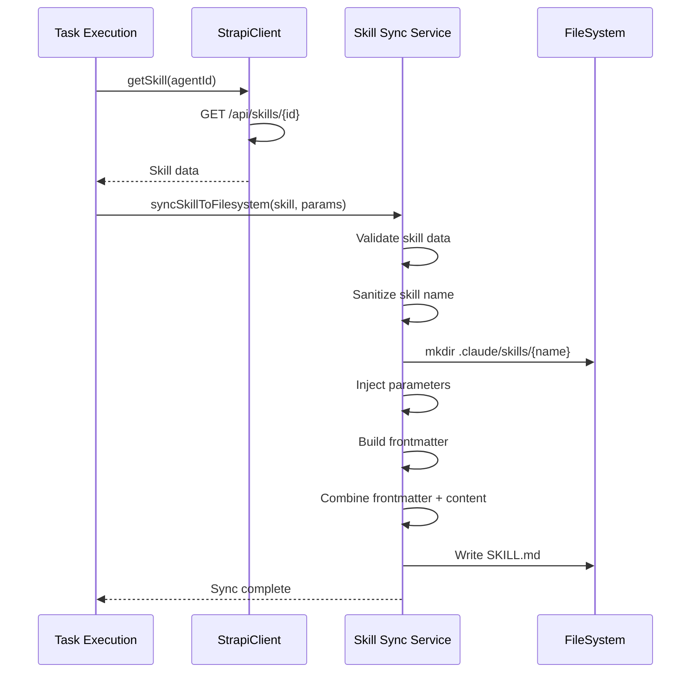

# 2. Skill Senkronizasyonu (Strapi → Filesystem)

Skill execution'dan önce, Strapi'deki skill verileri filesystem'e sync edilir. Bu işlem her execution'da tekrarlanır (single source of truth: Strapi).

## 🎯 Amaç

- Strapi'deki güncel skill verisini filesystem'e yaz
- Template parametrelerini inject et
- Claude Agent SDK'nın okuyabileceği formatta SKILL.md oluştur

## 📍 Tetiklenme Noktası

**Kod:** `src/routes/task.routes.ts:370-392`

```typescript
// Task execution başladığında (POST /api/tasks/:id/execute)

// ALWAYS fetch from Strapi first (single source of truth)
const strapiSkill = await strapiClient.getSkill(task.agentId);

// Sync to filesystem before execution
const { skillSyncService } = await import('../services/skill-sync-service.js');
const inputValues = task.inputValues || {};

await skillSyncService.syncSkillToFilesystem(strapiSkill, inputValues);
```

**Önemli:** Her execution'da yeniden sync edilir (caching yok).

## 🔄 Sync İşlemi Adımları

### 1️⃣ Strapi'den Skill Fetch

**Kod:** `src/services/strapi-client.ts:306-354`

#### HTTP Request

```http
GET https://localhost:1337/api/skills/{skillId}?populate=*
```

> **Note:** Strapi 5'te `populate=deep` yerine `populate=*` kullanılır. `populate=deep` parametresi Strapi 5'te desteklenmemektedir.

#### Response Örneği

```json
{
  "data": {
    "id": "s59hc06euvds718iniq307mh",
    "documentId": "s59hc06euvds718iniq307mh",
    "name": "web-to-markdown-ts",
    "displayName": "Web To Markdown Ts",
    "description": "Download websites and convert them to markdown format using TypeScript...",
    "skillmd": "# Web to Markdown Converter\n\nThis skill downloads web pages...",
    "experienceScore": 0,
    "category": "custom",
    "isPublic": true,
    "version": "1.0.0",
    "createdAt": "2025-10-31T11:02:32.949Z",
    "updatedAt": "2025-10-31T11:59:01.294Z"
  }
}
```

**Strapi Client Transformation:**

```typescript
return {
  id: data.documentId,
  name: data.name,
  displayName: data.displayName,
  description: data.description,
  skillmd: data.skillmd,
  experienceScore: data.experienceScore,
  category: data.category,
  isPublic: data.isPublic,
  version: data.version,
  // ... other fields
};
```

### 2️⃣ Validate Skill Data

**Kod:** `src/services/skill-sync-service.ts:70-93`

```typescript
private validateSkill(skill: StrapiSkill): void {
  // Check required fields
  if (!skill.name) {
    throw new Error('Skill name is required');
  }

  if (!skill.skillmd) {
    throw new Error('Skill content (skillmd) is required');
  }

  // Size limits
  const MAX_SKILL_SIZE = 5 * 1024 * 1024; // 5MB
  if (skill.skillmd.length > MAX_SKILL_SIZE) {
    throw new Error(`Skill content exceeds maximum size of ${MAX_SKILL_SIZE} bytes`);
  }

  // Name validation (alphanumeric, hyphens, underscores only)
  const namePattern = /^[a-zA-Z0-9-_]+$/;
  if (!namePattern.test(skill.name)) {
    throw new Error('Skill name must contain only alphanumeric characters, hyphens, and underscores');
  }
}
```

**Kontroller:**
- ✅ `name` alanı var mı?
- ✅ `skillmd` alanı var mı?
- ✅ `skillmd` boyutu 5MB'dan küçük mü?
- ✅ `name` sadece alphanumeric, `-`, `_` içeriyor mu?

### 3️⃣ Sanitize Skill Name

**Kod:** `src/services/skill-sync-service.ts:164-171`

```typescript
private sanitizeSkillName(name: string): string {
  return name
    .toLowerCase()
    .replace(/[^a-z0-9-_]/g, '-')  // Özel karakterleri - ile değiştir
    .replace(/--+/g, '-')           // Birden fazla - varsa tek - yap
    .replace(/^-|-$/g, '');         // Başta veya sondaki - 'leri kaldır
}
```

**Örnekler:**
- `"Web to Markdown (TS)"` → `"web-to-markdown-ts"`
- `"Motadata Problem Management"` → `"motadata-problem-management"`
- `"JMeter_Expert!!!"` → `"jmeter_expert"`

### 4️⃣ Create Skill Directory

**Kod:** `src/services/skill-sync-service.ts:34-35`

```typescript
const skillDir = path.join(this.skillsDir, sanitizedName);
await fs.mkdir(skillDir, { recursive: true });
```

**Oluşturulan Dizin:**

```
.claude/skills/
└── {sanitized-skill-name}/     # Örnek: web-to-markdown-ts
```

### 5️⃣ Parameter Injection

**Kod:** `src/services/skill-sync-service.ts:38-42, 123-136`

```typescript
let content = skill.skillmd;

if (parameters && Object.keys(parameters).length > 0) {
  content = this.injectParameters(content, parameters);
}
```

#### Injection Mekanizması

```typescript
private injectParameters(content: string, parameters: Record<string, any>): string {
  let result = content;

  Object.entries(parameters).forEach(([key, value]) => {
    // Mustache-style template: {{key}}
    const regex = new RegExp(`\\{\\{\\s*${key}\\s*\\}\\}`, 'g');
    result = result.replace(regex, String(value));
  });

  return result;
}
```

#### Örnek

**Skill Template (skillmd):**
```markdown
# Download URL to Markdown

Download the website from {{url}} and save to {{outputDir}}.

Use the following tools:
- WebFetch for {{url}}
- Write to save file
```

**Parameters:**
```json
{
  "url": "https://google.com",
  "outputDir": "./downloads"
}
```

**Inject Edilmiş Sonuç:**
```markdown
# Download URL to Markdown

Download the website from https://google.com and save to ./downloads.

Use the following tools:
- WebFetch for https://google.com
- Write to save file
```

### 6️⃣ Build YAML Frontmatter

**Kod:** `src/services/skill-sync-service.ts:45-50`

```typescript
const frontmatter = {
  name: skill.name,
  description: skill.description,
  version: skill.version || '1.0.0',
  category: skill.category || 'custom',
};
```

**Örnek Frontmatter:**
```yaml
---
name: web-to-markdown-ts
description: Download websites and convert them to markdown format using TypeScript...
version: 1.0.0
category: web-scraping
---
```

### 7️⃣ Create SKILL.md File

**Kod:** `src/services/skill-sync-service.ts:53-57`

```typescript
const matter = require('gray-matter');

const skillMd = matter.stringify(content, frontmatter);
const skillPath = path.join(skillDir, 'SKILL.md');
await fs.writeFile(skillPath, skillMd, 'utf-8');
```

**Oluşturulan Dosya Yapısı:**

```markdown
---
name: web-to-markdown-ts
description: Download websites and convert them to markdown format using TypeScript...
version: 1.0.0
category: web-scraping
---

# Web to Markdown Converter

This skill downloads web pages and converts them to clean markdown format.

## Recommended Usage

Use this skill when you need to:
- Download web page content
- Convert HTML to markdown
- Save web content for offline reading

## Implementation

...
```

## 📁 Oluşturulan Dosya Yapısı

### Tek Skill Örneği

```
.claude/skills/
└── web-to-markdown-ts/
    └── SKILL.md                # Frontmatter + Content
```

### Çoklu Skill Örneği

```
.claude/skills/
├── web-to-markdown-ts/
│   └── SKILL.md
├── jmeter-expert/
│   └── SKILL.md
├── motadata-problem-management/
│   └── SKILL.md
└── working-with-docker/
    └── SKILL.md
```

### Skill ile Birlikte Ek Dosyalar (İsteğe Bağlı)

Bazı skillilerde ek dosyalar da olabilir:

```
.claude/skills/
└── advanced-skill-example/
    ├── SKILL.md                # Ana skill dosyası
    ├── package.json            # Dependencies (eğer skill npm paketi kullanıyorsa)
    ├── scripts/                # Yardımcı scriptler
    │   ├── helper.ts
    │   └── utils.ts
    └── templates/              # Şablon dosyalar
        └── template.md
```

**Not:** Şu anki implementasyonda sadece `SKILL.md` oluşturuluyor. Ek dosyalar gelecek güncellemelerde eklenebilir.

## 🔍 Gerçek Örnekler

### Örnek 1: web-to-markdown-ts

**Strapi Skill Data:**
```json
{
  "id": "s59hc06euvds718iniq307mh",
  "name": "web-to-markdown-ts",
  "displayName": "Web To Markdown Ts",
  "description": "Download websites and convert them to markdown format using TypeScript...",
  "skillmd": "# Web to Markdown Converter\n\nDownload {{url}} and save to markdown...",
  "version": "1.0.0",
  "category": "web-scraping"
}
```

**Parameters:**
```json
{
  "url": "https://example.com"
}
```

**Oluşturulan Dosya:**
`.claude/skills/web-to-markdown-ts/SKILL.md`

```markdown
---
name: web-to-markdown-ts
description: Download websites and convert them to markdown format using TypeScript...
version: 1.0.0
category: web-scraping
---

# Web to Markdown Converter

Download https://example.com and save to markdown...
```

### Örnek 2: jmeter-expert (Parametresiz)

**Strapi Skill Data:**
```json
{
  "id": "h63g01tdvd41r5v7e2qpqdob",
  "name": "jmeter-expert",
  "displayName": "JMeter Expert",
  "description": "Apache JMeter expert for performance testing...",
  "skillmd": "# JMeter Expert\n\nCreate and run JMeter test plans...",
  "experienceScore": 70,
  "version": "1.0.0",
  "category": "testing"
}
```

**Parameters:** `{}` (boş)

**Oluşturulan Dosya:**
`.claude/skills/jmeter-expert/SKILL.md`

```markdown
---
name: jmeter-expert
description: Apache JMeter expert for performance testing...
version: 1.0.0
category: testing
---

# JMeter Expert

Create and run JMeter test plans...
```

## 📊 Sequence Diagram



## 🐛 Error Handling

### Skill Validation Hataları

```typescript
// Missing name
throw new Error('Skill name is required');

// Missing content
throw new Error('Skill content (skillmd) is required');

// Size limit exceeded
throw new Error('Skill content exceeds maximum size of 5242880 bytes');

// Invalid name format
throw new Error('Skill name must contain only alphanumeric characters, hyphens, and underscores');
```

### File System Hataları

```typescript
// Directory creation failed
throw new Error('Failed to create skill directory: ...');

// File write failed
throw new Error('Failed to write SKILL.md: ...');
```

### Strapi Fetch Hataları

```typescript
// Skill not found
throw new Error('Skill not found in Strapi: {skillId}');

// Network error
throw new Error('Failed to fetch skill from Strapi: ...');
```

## 📝 Logging

Sync işlemi sırasında backend logları:

```
[10:51:34 AM] [SkillExecution] Fetching skill from Strapi: s59hc06euvds718iniq307mh

[10:51:34 AM] [StrapiClient] GET /api/skills/s59hc06euvds718iniq307mh

[10:51:34 AM] [SkillSyncService] Validating skill: web-to-markdown-ts

[10:51:34 AM] [SkillSyncService] Sanitized name: web-to-markdown-ts

[10:51:34 AM] [SkillSyncService] Creating directory: .claude/skills/web-to-markdown-ts

[10:51:34 AM] [SkillSyncService] Injecting parameters: { url: "https://google.com" }

[10:51:34 AM] [SkillSyncService] Writing SKILL.md: .claude/skills/web-to-markdown-ts/SKILL.md

[10:51:34 AM] [SkillSyncService] Sync completed successfully
```

## 🎯 Sonraki Adım

Skill sync edildiğinde artık execute edilmeye hazır:

→ Detaylar için: [03-task-execution.md](./03-task-execution.md)

---

**Kod Referansları:**
- Sync Service: `src/services/skill-sync-service.ts:22-65`
- Parameter Injection: `src/services/skill-sync-service.ts:123-136`
- Sanitization: `src/services/skill-sync-service.ts:164-171`
- Validation: `src/services/skill-sync-service.ts:70-93`
- Strapi Client: `src/services/strapi-client.ts:306-354`
