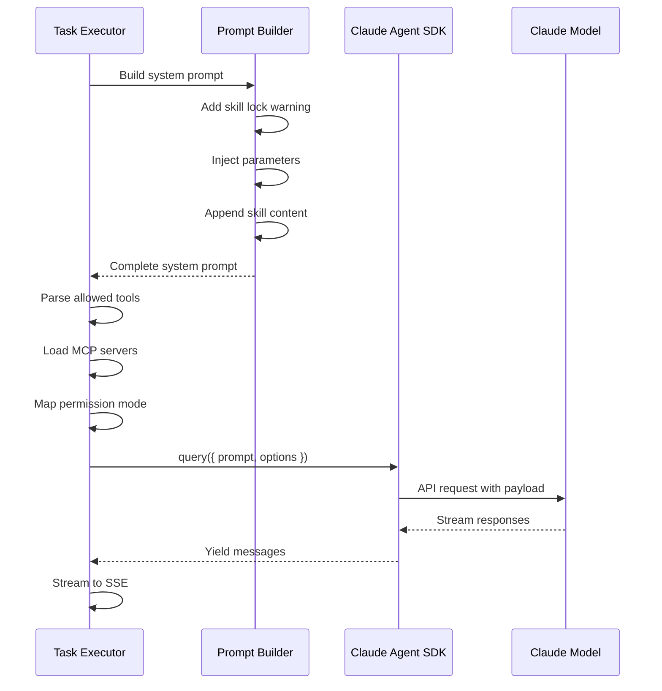

# 6. Claude Agent SDK Payload - Detaylı Analiz

Bu doküman, backend'in Claude Agent SDK'yı nasıl tetiklediğini ve tam payload yapısını açıklar.

## 🎯 SDK Çağrısı Konumu

**Kod:** `src/routes/task.routes.ts:124-138`

## 📦 Claude SDK Query Payload

### Tam SDK Çağrısı

```typescript
const queryInstance = query({
  prompt: task.userPrompt,
  options: {
    systemPrompt: systemPrompt,
    model: 'claude-sonnet-4-5',
    cwd: projectPath,
    allowedTools: allowedTools && Array.isArray(allowedTools) ? allowedTools : undefined,
    mcpServers: mcpServers as any,
    permissionMode: (cliPermissionMode || 'default') as any,
    stderr: (data: string) => {
      stderrOutput += data;
      logger.error('Skill execution stderr', { skillId: skill.id, stderr: data });
    },
  },
});
```

### Payload Parametreleri

| Parameter | Tip | Kaynak | Açıklama |
|-----------|-----|--------|----------|
| `prompt` | string | `task.userPrompt` | Kullanıcının girdiği prompt |
| `systemPrompt` | string | Constructed | Skill lock warning + parameters + skill content |
| `model` | string | Hardcoded | `'claude-sonnet-4-5'` |
| `cwd` | string | `projectPath` | Çalışma dizini (.claude/skills/) |
| `allowedTools` | string[] | `skill.metadata.allowedTools` | İzin verilen tool listesi |
| `mcpServers` | object | `.mcp.json` | MCP server konfigürasyonu |
| `permissionMode` | string | `task.permissionMode` | `'bypass'` veya `'default'` |
| `stderr` | function | Callback | Error logging callback |

## 🔧 System Prompt Oluşturma

### 1️⃣ Skill Lock Warning (Forced Execution)

**Kod:** `src/routes/task.routes.ts:78-88`

```typescript
const skillLockWarning = `# ⚠️ FORCED SKILL EXECUTION MODE

You are executing ONLY the "${skill.name}" skill.
- Do NOT attempt to use any other skills or commands.
- Do NOT look for other skills in the filesystem.
- Follow ONLY the instructions defined in this skill.
- Use ONLY the tools specified in this skill's configuration.

---

`;
```

**Amaç:** Claude'un sadece seçili skill'i kullanmasını garanti etmek.

### 2️⃣ Parameter Injection

**Kod:** `src/routes/task.routes.ts:66-74`

```typescript
let processedContent = skill.content;
const parameters = task.inputValues || {};

if (Object.keys(parameters).length > 0) {
  Object.entries(parameters).forEach(([key, value]) => {
    const regex = new RegExp(`\\{\\{\\s*${key}\\s*\\}\\}`, 'g');
    processedContent = processedContent.replace(regex, String(value));
  });
}
```

**Format:** Mustache-style `{{parameterName}}`

**Örnek:**
```markdown
# Before injection
Download {{url}} and save to {{outputPath}}

# After injection (with parameters: {url: "https://google.com", outputPath: "./downloads"})
Download https://google.com and save to ./downloads
```

### 3️⃣ Final System Prompt

**Kod:** `src/routes/task.routes.ts:90-97`

#### Parametresiz:
```typescript
systemPrompt = skillLockWarning + processedContent;
```

#### Parametreli:
```typescript
const paramContext = Object.entries(parameters)
  .map(([key, value]) => `- ${key}: ${value}`)
  .join('\n');
systemPrompt = skillLockWarning + `# Skill Parameters\n${paramContext}\n\n${processedContent}`;
```

#### Örnek Final System Prompt:

```markdown
# ⚠️ FORCED SKILL EXECUTION MODE

You are executing ONLY the "web-to-markdown-ts" skill.
- Do NOT attempt to use any other skills or commands.
- Do NOT look for other skills in the filesystem.
- Follow ONLY the instructions defined in this skill.
- Use ONLY the tools specified in this skill's configuration.

---

# Skill Parameters
- url: https://google.com
- format: markdown
- outputDir: ./downloads

# Web to Markdown Converter

This skill downloads web pages and converts them to clean markdown format.

## Usage
1. Provide the URL to download
2. Specify output directory (optional)
3. Choose markdown flavor (optional)

## Implementation
Use WebFetch tool to download {{url}} and save to {{outputDir}}.

...
```

## 🛡️ Skill Isolation Mechanism

### Metadata

**Kod:** `src/routes/task.routes.ts:37-44`

```typescript
const skillExecutionMetadata: SkillExecutionMetadata = {
  selectedSkillId: skill.id,
  selectedSkillName: skill.name,
  source: 'strapi',
  isolationLevel: 'full',
  systemPromptSource: 'skill.content',
  otherSkillsAccessible: false,
};
```

### Isolation Levels

| Level | Açıklama | Kullanım |
|-------|----------|----------|
| `full` | Sadece seçili skill yüklenir | Skill task execution (default) |
| `partial` | Tüm skilliler yüklenir ama öncelik verilir | Agent task execution |
| `none` | Hiç skill yüklenmez | Raw Claude query |

**Şu anki implementasyon:** `full` (Forced execution mode)

## 🔧 Allowed Tools Parsing

**Kod:** `src/routes/task.routes.ts:99-106`

```typescript
let allowedTools = skill.metadata?.allowedTools;

// Fallback: MCP tools
if (!allowedTools && skill.metadata?.mcpTools) {
  allowedTools = Object.values(skill.metadata.mcpTools).flat();
}

// String to array conversion
if (allowedTools && typeof allowedTools === 'string') {
  allowedTools = (allowedTools as any).split(',').map((t: string) => t.trim());
}
```

### Örnekler

#### SKILL.md Frontmatter:
```yaml
---
name: web-to-markdown-ts
allowed-tools:
  - WebFetch
  - WebSearch
  - Write
  - Read
---
```

#### Parsed allowedTools:
```typescript
["WebFetch", "WebSearch", "Write", "Read"]
```

#### String Format (legacy):
```yaml
---
allowed-tools: "WebFetch, Write, Read"
---
```

#### Parsed allowedTools:
```typescript
["WebFetch", "Write", "Read"]
```

## 🌐 MCP Servers

**Kod:** `src/routes/task.routes.ts:189-205`

```typescript
async function loadMcpConfig(projectPath: string): Promise<Record<string, any> | undefined> {
  try {
    const mcpConfigPath = path.join(projectPath, '.mcp.json');
    const content = await fs.readFile(mcpConfigPath, 'utf-8');
    const config = JSON.parse(content);

    if (config.mcpServers && typeof config.mcpServers === 'object') {
      return config.mcpServers;
    }

    return undefined;
  } catch (error) {
    logger.debug('No MCP config found', { projectPath });
    return undefined;
  }
}
```

### .mcp.json Örneği:

```json
{
  "mcpServers": {
    "playwright": {
      "command": "node",
      "args": [
        "C:/Users/Ali/AppData/Roaming/npm/node_modules/@automatalabs/mcp-server-playwright/dist/index.js"
      ]
    },
    "filesystem": {
      "command": "npx",
      "args": [
        "-y",
        "@modelcontextprotocol/server-filesystem",
        "C:/Users/Ali/Documents/Projects"
      ]
    }
  }
}
```

### SDK'ya Geçilen Format:

```typescript
{
  playwright: {
    command: "node",
    args: ["C:/Users/Ali/AppData/Roaming/npm/node_modules/@automatalabs/mcp-server-playwright/dist/index.js"]
  },
  filesystem: {
    command: "npx",
    args: ["-y", "@modelcontextprotocol/server-filesystem", "C:/Users/Ali/Documents/Projects"]
  }
}
```

## 📊 Permission Mode Mapping

**Kod:** `src/routes/task.routes.ts:113`

```typescript
const cliPermissionMode = task.permissionMode === 'bypass' ? 'bypassPermissions' : task.permissionMode;
```

| UI Mode | SDK Mode | Açıklama |
|---------|----------|----------|
| `bypass` | `bypassPermissions` | Tüm tool'lara izin ver |
| `default` | `default` | Normal permission flow |
| `ask` | `ask` | Her tool kullanımında sor |

## 🔍 Gerçek Payload Örnekleri

### Örnek 1: web-to-markdown-ts (Parametreli)

#### Task Request:
```json
{
  "name": "Download Google",
  "agentId": "s59hc06euvds718iniq307mh",
  "taskType": "skill",
  "userPrompt": "google.com",
  "permissionMode": "bypass",
  "inputValues": {
    "url": "https://google.com",
    "outputDir": "./downloads"
  }
}
```

#### SDK Payload:
```typescript
query({
  prompt: "google.com",
  options: {
    systemPrompt: `# ⚠️ FORCED SKILL EXECUTION MODE

You are executing ONLY the "web-to-markdown-ts" skill.
- Do NOT attempt to use any other skills or commands.
- Do NOT look for other skills in the filesystem.
- Follow ONLY the instructions defined in this skill.
- Use ONLY the tools specified in this skill's configuration.

---

# Skill Parameters
- url: https://google.com
- outputDir: ./downloads

# Web to Markdown Converter

Download https://google.com and save to ./downloads.

...
`,
    model: "claude-sonnet-4-5",
    cwd: "C:/Users/Ali/Documents/Projects/claude_agent_ui",
    allowedTools: ["WebFetch", "Write", "Read"],
    mcpServers: {
      playwright: { command: "node", args: [...] },
      filesystem: { command: "npx", args: [...] }
    },
    permissionMode: "bypassPermissions",
    stderr: (data) => { ... }
  }
})
```

### Örnek 2: simple-test-execution (Parametresiz)

#### Task Request:
```json
{
  "name": "Test Execution",
  "agentId": "tdmp8k61l983u333eww6zxg9",
  "taskType": "skill",
  "userPrompt": "Run a simple test",
  "permissionMode": "default"
}
```

#### SDK Payload:
```typescript
query({
  prompt: "Run a simple test",
  options: {
    systemPrompt: `# ⚠️ FORCED SKILL EXECUTION MODE

You are executing ONLY the "simple-test-execution" skill.
- Do NOT attempt to use any other skills or commands.
- Do NOT look for other skills in the filesystem.
- Follow ONLY the instructions defined in this skill.
- Use ONLY the tools specified in this skill's configuration.

---

# Simple Test Execution

This skill performs a simple test execution to validate the task execution system.

## Usage
Provide any test prompt to execute.

## Implementation
1. Read a test file
2. Write test results
3. Return success message
`,
    model: "claude-sonnet-4-5",
    cwd: "C:/Users/Ali/Documents/Projects/claude_agent_ui",
    allowedTools: ["Read", "Write", "Bash"],
    mcpServers: { ... },
    permissionMode: "default",
    stderr: (data) => { ... }
  }
})
```

## 📈 Execution Flow



## 🎓 Önemli Notlar

### Skill Lock Enforcement

- **System Prompt Level:** Skill lock warning ekleyerek
- **Filesystem Level:** Sadece seçili skill'i sync ederek
- **Metadata Level:** `otherSkillsAccessible: false` ile

### Parameter Security

- **Injection:** Mustache-style `{{key}}` replacement
- **Sanitization:** `String(value)` ile güvenli dönüşüm
- **Validation:** `task.inputValues` tipinde

### Tool Restrictions

- **allowedTools:** SKILL.md frontmatter'dan gelir
- **Fallback:** MCP tools kullanılabilir
- **Override:** Task level override YOK (güvenlik)

## 🚨 Error Handling

### SDK Execution Errors

```typescript
catch (error) {
  logger.error('Skill task execution error', error, {
    taskId: task.id,
    skillId: skill.id,
    stderr: stderrOutput
  });

  const errorEvent = {
    type: 'error',
    error: errorMessage,
    stderr: stderrOutput ? `\n\nStderr output:\n${stderrOutput}` : ''
  };
}
```

### Stderr Capture

```typescript
stderr: (data: string) => {
  stderrOutput += data;
  logger.error('Skill execution stderr', { skillId: skill.id, stderr: data });
}
```

## 📚 Referanslar

- Claude Agent SDK: `@anthropic-ai/claude-agent-sdk`
- Task Router: `src/routes/task.routes.ts:22-184`
- Skill Sync: `src/services/skill-sync-service.ts`
- MCP Config: `.mcp.json`

---

**Son Güncelleme:** 2025-11-02
**Backend Version:** 1.0.0
**SDK Version:** @anthropic-ai/claude-agent-sdk@latest
