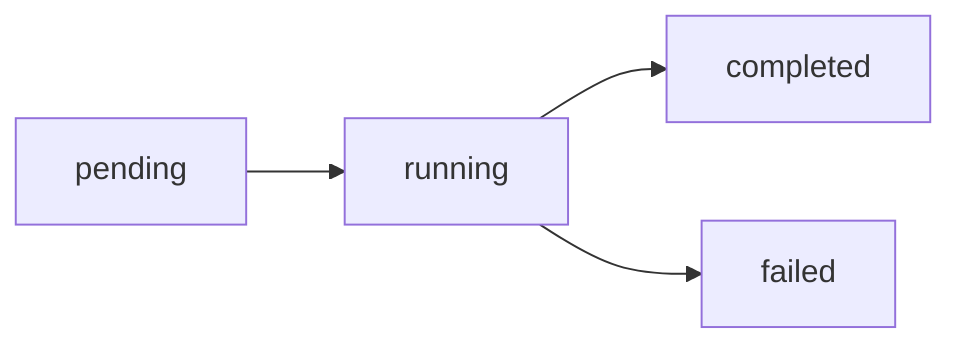

# Skill Execution Process - Genel Bakış

Backend'de bir skill'in nasıl çalıştırıldığına dair kapsamlı dokümantasyon.

## 📚 Dokümantasyon İçeriği

1. **[Task Oluşturma](./01-task-creation.md)** - POST /api/tasks
   - Request/Response formatları
   - Task creation flow
   - Validasyon kuralları

2. **[Skill Senkronizasyonu](./02-skill-sync.md)** - Strapi → Filesystem
   - Skill sync mekanizması
   - Parameter injection
   - SKILL.md dosya yapısı

3. **[Task Execution](./03-task-execution.md)** - POST /api/tasks/:id/execute
   - SSE stream formatı
   - Event tipleri
   - Claude SDK integration

4. **[Sonuç Saklama](./04-result-storage.md)** - logs/ klasörü
   - Log dosya formatı
   - Index yapısı
   - Metadata alanları

5. **[Tam Örnek](./05-complete-example.md)** - End-to-End
   - Gerçek senaryo: web-to-markdown-ts
   - Tüm HTTP request/response'lar
   - Complete flow

6. **[Claude SDK Payload](./06-claude-sdk-payload.md)** - SDK Detayları
   - SDK query() çağrısı
   - System prompt oluşturma
   - Skill isolation mekanizması
   - Parameter injection detayları

## 🎯 Hızlı Referans

### API Endpoints

| Endpoint | Method | Açıklama |
|----------|--------|----------|
| `/api/tasks` | POST | Yeni task oluştur |
| `/api/tasks/:id` | GET | Task detaylarını getir |
| `/api/tasks/:id/execute` | POST | Task'ı çalıştır (SSE) |
| `/api/tasks` | GET | Tüm taskleri listele |

### Dosya Yapısı

```
project/
├── .claude/skills/                    # Sync edilmiş skilliler
│   └── {skill-name}/
│       └── SKILL.md
├── logs/                              # Task execution logs
│   ├── _index.json                    # Hızlı listing için index
│   └── {task-id}.json                 # Her task için ayrı log
└── .mcp.json                          # MCP server konfigürasyonu
```

### Task Yaşam Döngüsü



## 🔄 Complete Flow Özeti

```
1. POST /api/tasks
   ↓
2. Task oluşturulur (pending)
   ↓
3. POST /api/tasks/:id/execute
   ↓
4. Strapi'den skill fetch
   ↓
5. Filesystem'e sync (.claude/skills/)
   ↓
6. Skill parse edilir
   ↓
7. System prompt oluşturulur
   ↓
8. Claude SDK execute
   ↓
9. SSE stream (events)
   ↓
10. Sonuç kaydedilir (logs/)
    ↓
11. Status: completed
```

## 📊 Event Flow (SSE)

```
status:starting
   ↓
system:init
   ↓
assistant:message (text)
   ↓
assistant:message (tool_use)
   ↓
user:message (tool_result)
   ↓
... (multiple turns)
   ↓
result:success
   ↓
status:completed
   ↓
done
```

## 🔗 Kod Referansları

| Bileşen | Dosya | Satır | Açıklama |
|---------|-------|-------|----------|
| Task Creation | `src/routes/task.routes.ts` | 264-329 | POST /api/tasks endpoint |
| Task Execution | `src/routes/task.routes.ts` | 334-630 | POST /api/tasks/:id/execute |
| Skill Execution | `src/routes/task.routes.ts` | 22-184 | executeSkillTask function |
| **Claude SDK Query** | `src/routes/task.routes.ts` | 124-138 | SDK query() call with payload |
| **System Prompt Builder** | `src/routes/task.routes.ts` | 78-97 | Skill lock warning + parameters |
| Skill Sync | `src/services/skill-sync-service.ts` | 22-65 | syncSkillToFilesystem |
| Task Storage | `src/services/task-storage-service.ts` | 159-191 | createTask method |
| Skill Parser | `src/services/claude-structure-parser.ts` | 252-273 | parseSpecificSkill |
| Strapi Client | `src/services/strapi-client.ts` | 306-354 | getSkill method |

## 🎓 Örnek Kullanım

### Task Oluşturma

```bash
curl -X POST http://localhost:3001/api/tasks \
  -H "Content-Type: application/json" \
  -d '{
    "name": "Download Google",
    "agentId": "s59hc06euvds718iniq307mh",
    "taskType": "skill",
    "userPrompt": "google.com",
    "permissionMode": "bypass"
  }'
```

### Task Çalıştırma

```bash
curl -N -X POST http://localhost:3001/api/tasks/{task-id}/execute
```

## 📝 Önemli Notlar

### Strapi API Parameters
- ⚠️ **Önemli:** Strapi 5'te `populate=deep` parametresi desteklenmez
- ✅ **Doğru kullanım:** `populate=*` veya parametresiz kullanın
- Skill fetch işlemlerinde: `GET /api/skills/{id}?populate=*`

### Skill Isolation
- Her skill execution'da **SADECE seçili skill** parse edilir
- `parseSpecificSkill()` kullanılır (tüm skilliler değil)
- Claude diğer skillleri göremez (isolation level: **full**)

### Forced Execution Mode
- Task type: `"skill"` → Forced execution
- Task type: `"agent"` → Autonomous execution
- Forced mode'da system prompt'a **skill lock warning** eklenir

### Execution Metadata
Her skill execution'da metadata kaydedilir:
```json
{
  "selectedSkillId": "...",
  "selectedSkillName": "...",
  "source": "strapi",
  "isolationLevel": "full",
  "systemPromptSource": "skill.content",
  "otherSkillsAccessible": false
}
```

## 🚀 Başlarken

1. İlk olarak [Task Oluşturma](./01-task-creation.md) belgesini okuyun
2. Skill sync mekanizmasını anlamak için [Skill Senkronizasyonu](./02-skill-sync.md)
3. SSE stream'i anlamak için [Task Execution](./03-task-execution.md)
4. Tam bir örnek için [Complete Example](./05-complete-example.md)

## 📧 İletişim

Sorular veya iyileştirme önerileri için issue açın.

---

**Son Güncelleme:** 2025-11-02
**Backend Version:** 1.0.0
**Claude SDK Version:** @anthropic-ai/claude-agent-sdk@latest
